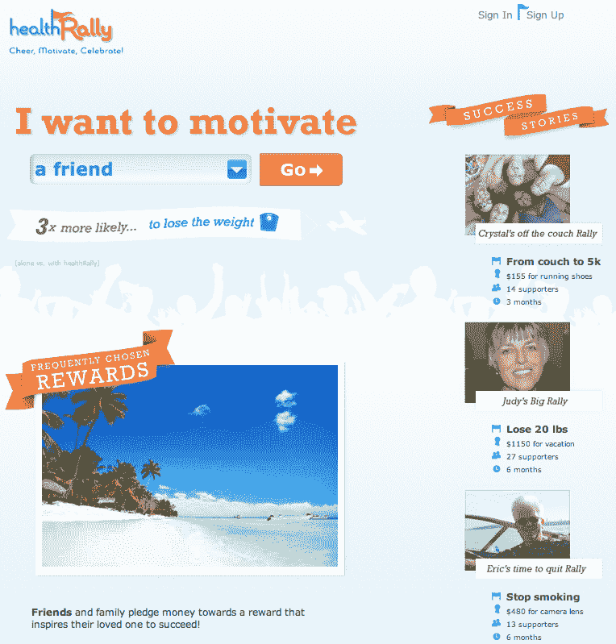

# HealthRally 推出，帮助你通过健身获得报酬 TechCrunch

> 原文：<https://web.archive.org/web/http://techcrunch.com/2012/01/12/healthrally-launches-to-help-you-get-paid-for-getting-in-shape/>

12 月， [HealthRally](https://web.archive.org/web/20230204093859/http://www.healthrally.com/) ，一家为个人健康动机建立众筹平台的社交健康科技初创公司，[从埃丝特·戴森、Isy Goldwasser、Dick Sass、Ty Danco 和 Jeff Thiel 等知名天使投资人那里筹集了 40 万美元的种子资金。](https://web.archive.org/web/20230204093859/https://techcrunch.com/2011/12/01/healthrally-raises-400k-from-esther-dyson-angels-to-help-you-get-in-shape-with-real-rewards/)

这家初创公司当时处于私人测试阶段，冒险将行为经济学与社交网络分析相结合，以解决如何最好地激励人们保持身材和健康的老问题。有无数初创公司争夺我们微不足道的健身注意力持续时间，每个公司都有略微不同的价值主张，比如[skible](https://web.archive.org/web/20230204093859/https://techcrunch.com/2012/01/09/skimble-passes-2-million-downloads-launches-multimedia-workout-plans-to-help-get-you-in-shape/)、Runkeeper、Fitbit、Gain Fitness 和 gym pact——仅举几例。GymPact 也采用行为经济学的方法来激励健康，要求人们预付资金，如果他们没有达到健身目标就付钱(顺便说一下，付钱给那些达到目标的人)。

今天，HealthRally 正式推出公测服务——这种服务认为，像胡萝卜一样摆在我们面前的金钱奖励是开启这种动力的关键，可以帮助我们实现个人健康目标。这家初创公司从 Kickstarter 获得了众筹的启示，并添加了越来越重要的社交网络元素，用户可以通过它与朋友、家人和同事分享他们的健康目标，然后他们会为满足健身检查点提供真正的奖励。(有点像之前的 Fitango 或者 HealthyWage。)

HealthRally 认为，朋友和亲人的社会支持是无与伦比的动力来源，他们有权投资于你的成功。这种支持网络效应几乎让人想起干预组织和匿名戒酒会固有的支持网络——当然，在这种情况下是匿名戒酒会。

指导这家初创公司掌握最新医学进展的是一个咨询小组，其中包括科学家保罗·扎克(Paul Zak)，他在克莱尔蒙特研究生大学(Claremont Graduate University)开发了世界上第一个神经经济学博士项目，以及南加州大学凯克医学院预防医学研究所(Institute for Preventive Medicine)公共卫生硕士项目主任汤姆·瓦伦特(Tom Valente)。与其他一些人一起，这些顾问帮助 HealthRally 开发了其专有平台，旨在更好地激励人们更好地实现他们的健康目标。

至于 HealthRally 现在如何工作，帷幕已经拉开了一点？HealthRally 的联合创始人兼首席执行官扎克林奇(Zack Lynch)表示，有两种简单的方法可以使用这项服务。一个人可以通过组织一次支持者集会来激励朋友，并选择一种奖励来激励他们的朋友健身，或者通过建立一个啦啦队来激励自己。

无论是谁带头冲锋，都要设定一个可衡量的成就和最后期限，然后踏上征程；例如，一个人可能会选择在 5 月 1 日之前为了一台新的 iPad 减掉 20 磅。朋友和家人加入这项事业，承诺增加财政支持以支付奖励，这样一旦健康寻求者达到他们的目标，他们就会得到那袋硬币。

正如林奇所说(通过发表在《美国医学协会杂志》上的一项研究)，受到金钱激励的减肥者达到目标的可能性比那些纯粹由意志力激励的人高近五倍。在某种程度上，这听起来几乎很悲哀，几乎太容易了，但是，再一次，很难反驳冷酷无情的经济学在起作用。毕竟，研究表明，平均而言，接受经济奖励的人在 16 周内减掉了超过 13 磅，而没有接受经济奖励的人减掉了 3.9 磅。

医学界似乎也越来越多地承认，社交网络可以有很大的激励力量，特别是在健康方面，因为这里似乎有点“攀比”的心态。由于健康目标和回报可以在脸书分享，社交网络效应正在发挥作用，因为那些向社区或几个人承诺目标的人，更有可能坚持到底，实现他们设定的目标。显然，当你不是唯一一个关注的人时，推卸责任要困难得多——努力去做总比冒着被你骨瘦如柴的兄弟姐妹当众嘲笑的风险要好。目标共享是一个巨大的动力，也是鼓励重复参与服务的好方法。

很高兴看到 HealthRally 提供一些独家健康设备或具有极客吸引力的产品，因为独家性可能是推动参与的另一种好方法。

至于怎么赚钱？HealthRally 对认捐收取 7%的费用，外加高达 3%的信用卡交易费。如果承诺的金额足够大，HealthRally 可以赚一些钱，但在达到规模之前，很难看到它赚很多钱。而且，看到 HealthRally 避开企业赞助，或许成为企业健康计划的一部分，也不是不可能的。

这是一个有趣的方法，也是一个很有分量的方法。这里没有游戏化徽章，只有真正的奖励。请参与进来，让我们知道您的想法。更多信息，请参见 [HealthRally 的常见问题解答(此处为](https://web.archive.org/web/20230204093859/http://www.healthrally.com/pages/faq))。(移动应用仍在开发中，这家初创公司目前正在筹集 a 轮融资。)

【T2