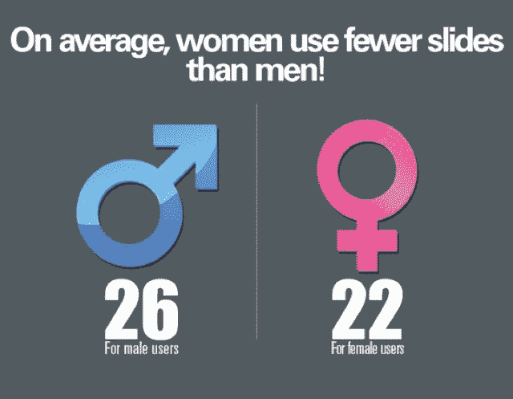

# 读者喜欢幻灯片(以及来自 SlideShare 的其他数据)

> 原文：<https://web.archive.org/web/https://techcrunch.com/2012/01/17/techcrunch-readers-love-slideshare/>

# TechCrunch 的读者喜欢幻灯片(以及来自 SlideShare 的其他数据)

好吧，这是正式的。TechCrunch 的读者喜欢幻灯片。我们偶尔会嵌入来自 SlideShare 的幻灯片，如下图所示(其中充满了 2011 年的[时代精神](https://web.archive.org/web/20221010231628/http://www.slideshare.net/rashmi/slideshare-zeitgeist-2011)统计数据)。2011 年，TechCrunch 为 SlideShare 创造了比任何其他科技博客都多的幻灯片流量——这是一个可疑的荣誉，但我们会接受它。

既然你们都如此热爱幻灯片，这里还有一些来自 SlideShare 的事实。

*   女性平均使用的幻灯片(每张幻灯片 22 张)少于男性(26 张)。
*   热门演示文稿包含的图像(平均 37 个)比其他演示文稿(平均 21 个)多。
*   演讲中提到的最受欢迎的科技公司是脸书(39.9%)、推特(28.6%)、谷歌(19.1%)、微软(5.7%)和苹果(3.8%)
*   只有 1.7%的演示是在苹果的 Keynote 软件中完成的，但 Keynote 占了最受欢迎的演示的 8.2%。
*   日本人和中国人平均使用的幻灯片比任何其他语言的幻灯片都多。

[slide share id = 11078523 & doc = zeitgeist 2011-120116062709-PHP app 01]