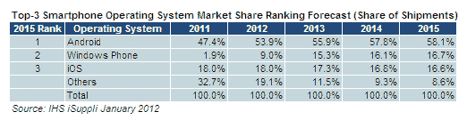

# iSuppli 同意 IDC 和 Gartner 的观点:Windows Phone 将在 2015 年超越 iOS

> 原文：<https://web.archive.org/web/https://techcrunch.com/2012/01/19/isuppli-agrees-with-idc-gartner-windows-phone-to-surpass-ios-by-2015/>

# iSuppli 同意 IDC 和 Gartner 的观点:Windows Phone 将在 2015 年超越 iOS

除了罗宾和一大群分析师，没人想给 Windows Phone 一个机会。早在 9 月份， [IDC 和 Gartner 预测](https://web.archive.org/web/20230305195717/https://techcrunch.com/2011/09/02/gartner-idc-windows-phone-to-steal-second-place-from-ios-by-2015/)到 2015 年，Windows 将取代 iOS 成为市场第二名，Windows Phone 营销负责人 Achim Berg 称这一预测是保守的。

现在 [iSuppli](https://web.archive.org/web/20230305195717/http://www.isuppli.com/Mobile-and-Wireless-Communications/News/Pages/Lumia-900-Introduction-to-Trigger-Smartphone-Renaissance-for-Nokia-and-Microsoft.aspx) 也加入进来，预测到 2015 年，Windows Phone 将占据 16.7%的市场份额，而苹果的市场份额预计将在 2015 年从 18%下降到 16.6%。

也许“超越”不是最好的词，因为我们正在看的*预测*提供了 0.1 个百分点的差异。尽管如此，Windows Phone 也不应该掉以轻心。诺基亚和微软之间的伙伴关系是强大的，即使诺基亚最近过得不太好。

Lumia 900 预计将是迄今为止最可靠的 Windows Phone 产品，迄今为止我玩过的每一款 Windows Phone 都远远超出了我的预期。

然而，有趣的是，iSuppli 根本没有看到 Android 失去多少份额。事实上，预计 2015 年安卓系统的份额将从 47.4%增长到 58.1%。你可能会认为，随着 Android 阵营中碎片化的盛行和令人愤怒的缓慢更新，Windows Phone 将会像苹果一样攫取谷歌的份额。

与此同时，我们必须永远不要忘记，苹果一次推出一种型号，而每年有数百款安卓手机上市。除此之外，iPhone 是一种高端产品，很多安卓手机售价都不到一个本杰明。

在任何情况下，第三个移动生态系统进入市场都没有坏处。更多的竞争意味着我们都赢了。

[通过 [WMPowerUser](https://web.archive.org/web/20230305195717/http://wmpoweruser.com/isuppli-predicts-eventual-windows-phone-victory-over-iphone/?utm_source=feedburner&utm_medium=feed&utm_campaign=Feed%3A+WmPowerUser+%28WM+Power+User%29&utm_content=Google+Reader)