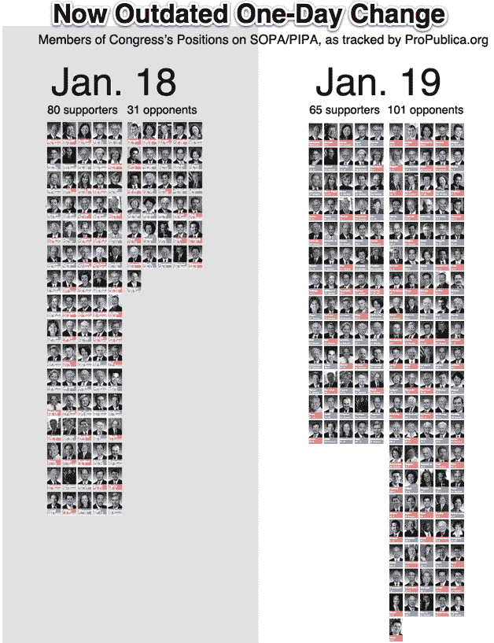

# SOPA 抗议动摇国会:昨天 31 名反对者，现在 122 名

> 原文：<https://web.archive.org/web/https://techcrunch.com/2012/01/19/sopa-opponents-supporters/>

# SOPA 抗议动摇国会:昨天 31 个反对者，现在 122 个

昨天，互联网上爆发了抗议 PIPA 琵琶的呼声，国会也清楚响亮地听到了我们的声音。1 月 18 日开始时，有 80 名国会议员支持这项立法，31 名反对。根据 ProPublica 的数据，现在只有 63 人支持 SOPA-PIPA，反对者激增至 122 人。

不幸的是，在参议院中，公开表态的支持者仍然多于反对者。在那里，PIPA 需要 100 个支持者中的 60 个支持者才能通过，并需要三分之二的多数(67 票)才能阻止奥巴马总统否决。照这样下去，琵琶也就及格了。

[ProPublica，一个独立的非营利新闻室](https://web.archive.org/web/20230111211431/http://projects.propublica.org/sopa/)根据“一个成员是否是拟议法案的发起人，以及每个成员对当前法案的前身和替代方案的投票记录”来定义支持者和反对者。“它一直在对国会的支持和反对进行实时统计。

抗议之前，许多国会议员没有表明自己的立场。作为对教育努力和选民意见的回应，许多人现在站出来反对。与此同时，一些支持者改变了主意。

以下是截至 1 月 19 日太平洋标准时间下午 5:15，ProPublica 在 SOPA 的支持和反对情况。

*   总数:63 名支持者，122 名反对者
*   参议院:37 票支持，22 票反对
*   众议院:26 名支持者，100 名反对者
*   民主党(参众两院):40 名支持者，55 名反对者
*   共和党人(参众两院):22 名支持者，67 名反对者

其他一些重要事实:

*   两位加州参议员都支持 PIPAn 皮潘，可能是因为他与娱乐业有关联。谢天谢地，反对的加州众议员比支持的多。
*   37 名参议院支持者中有 25 名是民主党人
*   对手往往更年轻，尤其是在众议院。所以是的，老年人不懂互联网。

如果目前支持者和反对者的比例保持不变，PIPA 将在参议院获得 62 票并通过。即使奥巴马仍然有权力否决它，这意味着我们的工作还没有完成。使用[电子前沿基金会的“反对审查”页面](https://web.archive.org/web/20230111211431/https://action.eff.org/o/9042/p/dia/action/public/?action_KEY=8173)给你的代表打电话或发电子邮件。

*关于抗议及其影响的更多信息，请查看 [TechCrunch 的 SOPA 之流-琵琶报道](https://web.archive.org/web/20230111211431/https://techcrunch.com/tag/sopa/)*
