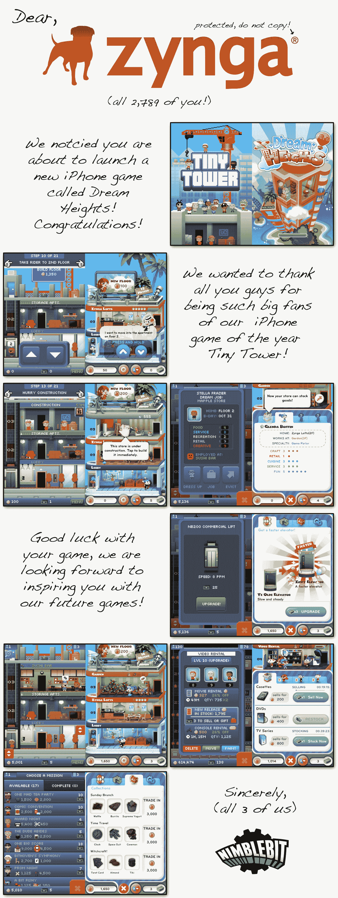

# 小塔开发者称 Zynga 抄袭他们的游戏(在他们拒绝被收购之后)

> 原文：<https://web.archive.org/web/https://techcrunch.com/2012/01/24/tiny-tower-developers-call-out-zynga-for-their-look-alike-game/>

# 小塔开发商指责 Zynga 抄袭他们的游戏(在他们拒绝被收购之后)

NimbleBit(苹果精心挑选的年度 iOS 游戏的[游戏*小塔*的开发者)的家伙们今晚有点疯狂，在几个小时内爆了两大知识宝石。](https://web.archive.org/web/20221224163516/https://techcrunch.com/2011/12/08/apple-picks-instagram-as-the-iphone-app-of-the-year/)

首先:Zynga 刚刚发布了一款新的 iOS 游戏，它看起来很像《小塔》中的*游戏。第二点(这一点让第一点变得更加有趣):Zynga 据称曾试图收购 NimbleBit，但 NimbleBit 拒绝了他们。*

这款名为*梦幻高地*的新游戏目前似乎只在加拿大发售。也许 Zynga 认为那些边境北部的好人不知何故还没有听说过《小塔》？这不像是一个非常受欢迎的游戏，有大量的粉丝基础，对吗？

随着 Zynga 最新版本的消息传到他们那里，NimbleBit 的大卫·马什暗示了被拒绝的收购:

> 即使你拒绝为 Zynga 工作，有时你最终还是会为 Zynga 工作。

几分钟后，联合创始人伊恩·马什(Ian Marsh)突然出现，并给出了确认:

> 他们确实走了诚实的路线，试图先收购我们。

综合所有这些因素，NimbleBit 的研究人员将两者进行了对比，得出了下图。

灵感是一回事——但这……相当明目张胆。有人可能会说《小塔》本身受到了过去游戏的影响，比如《模拟塔》(SimTower)(T15)，但说真的，*看看*:

我们已经向 Zynga 寻求评论，但还没有听到任何关于此事的回复。