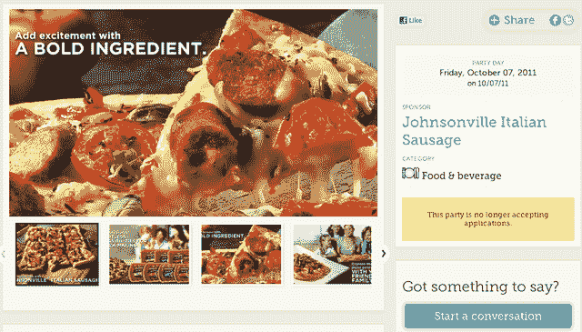

# 家庭聚会是一项严肃的业务，收入 530 万美元 TechCrunch

> 原文：<https://web.archive.org/web/https://techcrunch.com/2012/01/26/house-party-is-a-serious-business-scores-5-3-million/>

# 家庭聚会是个严肃的行业，收入 530 万美元

[HouseParty.com](https://web.archive.org/web/20221005155245/http://www.houseparty.com/)，一个[帮助](https://web.archive.org/web/20221005155245/http://www.houseparty.com/tips/guide/step1)人们举办[品牌赞助的家庭聚会](https://web.archive.org/web/20221005155245/http://www.houseparty.com/event/index)的网站，已经[筹集了](https://web.archive.org/web/20221005155245/http://www.businesswire.com/news/home/20120126005099/en/House-Party-Raises-5.3-Million-Series-Funding)530 万美元的 C 轮融资，由总部位于纽约的 [Acadia Woods Partners](https://web.archive.org/web/20221005155245/http://www.crunchbase.com/financial-organization/acadia-woods-partners) 牵头。

参加派对的人需要在网上申请，说明他们计划的家庭活动类型，并负责向他们的朋友和亲戚宣传。一旦被选中参加家庭聚会，他们就会收到来自赞助品牌的产品包——[“派对包”](https://web.archive.org/web/20221005155245/http://www.houseparty.com/pages/display/party_pack)过去包括食品、婴儿玩具、健康美容产品和活动人偶。

这个想法是品牌通过聚集现实生活中的人(他们这样做是为了换取免费赠品)来获得一些相对便宜的口碑营销，希望各方能够引发关于品牌的对话，并最终将出现的人变成客户甚至倡导者。

人们还可以在 HouseParty.com 上购买聚会用品。

迄今为止，该公司已经筹集了大约 800 万美元。

