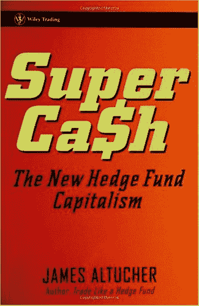
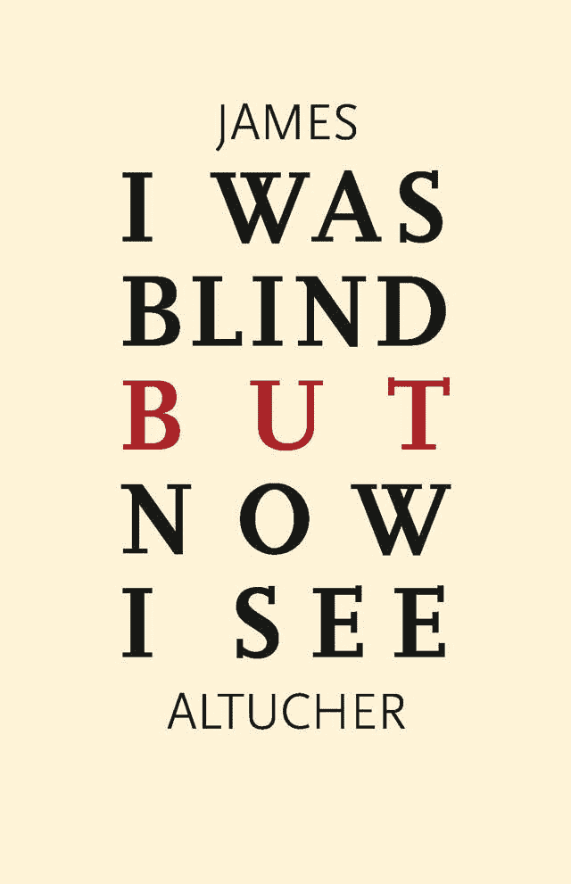

# 为什么每个企业家都应该自己出书

> 原文：<https://web.archive.org/web/https://techcrunch.com/2012/01/28/why-every-entrepreneur-should-self-publish-a-book/>

在过去的七年里，我已经出版了八本书，五本由传统出版商出版(威利出版社、企鹅出版社、哈珀柯林斯出版社)，一本漫画书，最后两本是我自己出版的。在这篇文章中，我给了[我所有的销售数据的具体细节，以及传统出版商的预付款](https://web.archive.org/web/20230326051124/http://www.jamesaltucher.com/2011/02/why-i-write-books-even-though-ive-lost-money-on-every-book-ive-written/)。尽管评审团仍未对我的自助出版的书籍做出评价，但我可以告诉你，这两本书的销量已经超过了我与传统出版商合作的五本书的总和，这两本书分别是《T4》、《如何成为最幸运的人》、《T5》、《T6》、《T7》、《我曾是盲人，但现在我能看见了》。

如果你，企业家，自己出版一本书，你会脱颖而出，你会赚更多的钱，你会把你的竞争对手踢出局，你会在鸡尾酒会上看起来非常酷。我知道这一点，因为我很少冷静，但在鸡尾酒会上，有了我自己的漫画书，我基本上可以和房间里的任何人做爱。但是不要相信我，它不花你一分钱，而且几乎没有时间让你自己去尝试。

本文的其余部分实际上是三个讨论:**为什么自己出版**而不是使用传统的出版商，**为什么企业家**应该自己出版，最后，**如何**自己出版。

**为什么:**

**A)预付款将为零。图书出版商越来越受到衰落的书商的挤压，因此他们不得不反过来压榨作家。由于互联网上有如此多的免费内容，每单位内容的价值将为零，除非你已经是一个知名的品牌作者。**

B)滞后时间。当你自助出版时，你可以在几天内将你的书放在亚马逊上，平装本和 kindle。当你和传统出版商一起出版时，这是一个令人精疲力尽的过程:书籍提案、代理、律师、会议、编辑、包装、目录等，确保你的书直到一年后才真正出版。实际上，当我写这篇文章的时候，我的一个朋友刚刚给我发来了他刚刚与一家主流出版商达成的出书协议的细节。出版日期:2014 年。

C)市场营销。出版商声称他们为你做了很多营销工作。那太可笑了。我给你讲一个非常具体的故事。当我在企鹅出版社出版时，他们会见了我的一个朋友，他们想出版他的书。他们没有意识到她是我的朋友。她问他们，“你们为詹姆斯·阿尔图切的书做了什么营销”。他们说，“嗯，我们在《金融时报》上给他写了一篇评论，我们在《华尔街日报》上看到了他关于美国消费者新闻与商业频道的书的一个片段和一个摘录。”

有趣的是。我在《金融时报》上有一个每周专栏。我写了自己的评论。当做笑话。在美国消费者新闻与商业频道，我每周都有一个关于美国消费者新闻与商业频道的节目。所以我很自然地在我的常规部分谈到了我的书。对于 thestreet.com 节选，我刚刚把上一家公司卖给了 thestreet.com。所以我没有像往常一样为他们写文章，而是做了一个摘录。换句话说，**出版商什么也没做，却把一切都归功于自己**。最终，作者(除非你是斯蒂芬·金等)不得不为书籍做他们自己的营销。甚至在他们看你的提议之前，出版商问的第一个问题是，“你的平台有多大？”他们想知道你如何营销这本书，以及他们是否能靠你自己的营销努力赚钱。

更好的版税。也就是说，当我自己出版时，我可以获得 70%的版税，而不是传统出版商的 15%。我也拥有 100%的外国权利，而不是 50%。我雇人出售外国权利，他们得到 20%(没有前期费用)。

对内容和设计的更多控制。看看这个由传统出版商为我设计的“超级现金”封面(这是我的第三本书)。太可怕了。

现在看看我上一本书(自助出版)的封面*“我曾是盲人，但现在我能看见了”。你可能喜欢也可能不喜欢，但这正是我想要的。出版商甚至在合同中包括他们对封面有最终决定权，这是他们不会协商的一个细节。*

你也没有任何十几岁的实习生给你发回你完全不同意的编辑评论。你控制你自己的内容。

现在，

**企业家为什么要自助出版**

**A)你有内容。现在，我的博客里有足够的材料(包括我的“草稿”文件夹，里面有 75 篇未发表的文章),可以在明年再出版五本书。我敢肯定，随着我写更多的帖子，这个数字在明年还会增加。你是一个企业家，因为你觉得你有一个产品或一个想法或一个愿景在你的竞争对手中脱颖而出(如果你没有脱颖而出，就把它打包，提出一个新的想法)。**

你比世界上任何人都知道如何做得更好。如何让世界知道你更好？一张名片是不够的。人们会把它扔掉。每个人都有一个带“关于”按钮的网站。

在一本书里给出你的部分(或全部)想法。你是一个全新的社交媒体机构？社交媒体应该如何运作？写下来。你是新的 CRM 软件包？CRM 应该怎么做比较好？告诉我。网上约会服务应该如何工作？讲一些故事。见鬼，让他们尽可能的性感。

没时间写了。然后把它告诉一个你几乎免费外包给它的代笔人。不需要 6 万字。用两万字来做。放几张照片进去。去做吧。然后，当你遇到某人，他们要你的名片时，如果你能说:“给，拿我的书吧”，那该多好啊

你还有更多要说的。越来越多的公司拥有博客。博客上的很多帖子都是“常青树”。也就是说，它们永远存在，没有时间限制。如果你只是发表这些帖子(上面提到的)，人们会说，“他只是在发表一系列帖子”。对此我有几点看法。

**1。那又怎样？如果你在整理你认为最好的帖子，那没问题。花很少的钱，人们就可以得到这个策展，并以不同的格式阅读。那里有价值。**

**2。不要只是收集你的帖子。**一篇博文一般 500-2000 字。通常接近 500。为每篇文章多做一点研究。为每篇文章做介绍和结尾。把这些章节写成 3000-4000 字。通过使用原始材料来解释为什么这本书，包括这些章节，以这种方式呈现是一种不同于博客的阅读方式，从而为这本书画一个更大的弧线。有一章专门解释这本书和博客有什么不同。

我的上一本书， [*【我是盲人，但现在我能看见】*](https://web.archive.org/web/20230326051124/http://www.amazon.com/Was-Blind-But-Now-ebook/dp/B005VPXXVM/ref=tmm_kin_title_0?ie=UTF8&m=AG56TWVU5XWC2) 我在每一章都有原创材料，有几章完全是原创的。这不是一个帖子的集合，整本书是关于我们如何在社会中被洗脑，以及如何揭露洗脑和使用我描述的技术可以带来快乐。尽管这些材料受到了我几篇文章的启发，但它的内容比博客要详细得多。

亚马逊是你推广博客的额外平台。反之亦然。你不会因为你的书赚到一百万美元(嗯，也许你会——永远不要说永远),但是当你现在出去卖书、在其他地方联合你的博客或得到演讲邀请等时，只要能够说“我是一个出版的作者”就能扩大你作为作家/演讲者/企业家的可信度。当你做演讲的时候，你可以分发一些东西——你的书！所以亚马逊和出版成为你整体写作/演讲/咨询职业的强大营销平台。

没人在乎。有人要“企鹅出版我”这种说法的可信度。我可以凭经验告诉你——当企鹅出版社是我的出版商时，从来没有人问我谁是我的出版商。顺便说一下，企鹅出版社是我遇到过的最差的出版商。

我如何进入书店？不知道。你会怎么做？传统出版商也无法让你达到目的。书店通常会看看亚马逊上有什么热门书籍，然后从出版商那里批发订购。在许多情况下，传统出版商会选择他们最著名的作家(所以如果你属于这一类，恭喜你！)并付钱让它们在书店里展示。就我的经验而言，我的传统出版商会在大城市的书店(比如纽约，仅此而已)买到几本我的书，仅此而已。

**好吧，我服了。我如何自助发布**

有许多方法可以做这件事，但我会告诉你我的经验。

**A)先写书。**如上所述，在我最后两本自助出版的书中，我写了一些博客文章，重写了其中的部分内容，添加了原创材料，增加了新的章节，并提供了这本书的整体轮廓，而不仅仅是随机收集的文章。但是，也就是说，你可能已经有了基本的材料。

B)Createspace.com**。**我使用 createspace 是因为它们属于亚马逊，并且拥有出色的客户服务。他们让你选择你的书的大小，然后有你下载的微软 Word 模板来格式化你的书。对于我的第一本书，我是自己完成的，对于我的第二本书，我花了很少的费用，雇了 Alexanderbecker.net 来设计这本书的格式，设计这本书，并制作我上传的最终 PDF。他还检查语法，对字体(无衬线而不是有衬线)提出积极的建议，非常有帮助。

**C)上传 PDF。Createspace 批准它，挑选一个 ISBN 号，给你发送一个证明，然后你批准这个证明。**

几天之内，它就可以在亚马逊上买到。它是按需印刷的平装本。顺便说一下，此时你的总成本是:0 美元。或者你用来设计封面的东西。

**E) Kindle。以上所有内容(来自 Createspace)都是免费的。如果我没有雇佣 Alex 来做封面，我可以使用超过 1 毫米的 Createspace 可能的封面(我为我的第一本书做了这个)，并且整个平装本的出版将是免费的。但对于 Kindle，Createspace 的收费是 70 美元，他们会负责一切，直到它被上传到 Kindle 商店。现在你可以买到平装本和 kindle。**

营销。

1.我博客的读者向我索取了前 20 本，而且是免费的。他们中的许多人随后在亚马逊上发布了好评，以此开始行动。

2.我一直在演讲活动上分发书籍。总之，我将做大约 10 次演讲，分发我的新书。

3.我写了一篇关于 bo0k 和博客有什么不同以及为什么我选择走这条路的博文。

4.为 Techcrunch 这样的博客写客座博文很有帮助，我非常感激。

5.Twitter、脸书、Linkedin、Google+也很有帮助。

**G)促销**。你负责自己的促销活动(而不是图书出版商)。).例如，[在最近的一篇博客文章中，我讨论了我的新书和我的博客之间的差异](https://web.archive.org/web/20230326051124/http://www.jamesaltucher.com/2011/10/why-i-was-blind-but-now-i-see-is-my-best-book-ever-and-now-on-kindle/),并且我还提供了一个关于如何免费获得我的下一本自己出版的书(《不良行为》，预计将于 2012 年在 Q1 出版)的推广。

企业家总是在寻找方法脱颖而出，推广他们的服务，并让他们的产品得到认可。写一本书会让你成为这个领域的专家。最起码，当你把自己写的书递给别人时，比递名片更让人印象深刻。说明你有足够的专业知识来写这本书。这也表明你足够重视与潜在客户的关系，愿意给他一些有价值的东西。你创造的东西。

你不能说“我没有时间，我在做生意”这样的借口企业家创造时间。他们有想法，所以，再一次，至少你可以用 elance.com 雇一个代笔人。

在接下来的一年里，我计划写五本不同的书。都是关于不同的主题。我对他们超级兴奋，因为我被允许在我感兴趣的每个领域突破障碍，没有人阻止我。我不需要任何人的认可。我可以选择自己。

你也可以这样做。现在，你应该去做。在这种环境下没有更多的借口。祝你好运，如果有任何问题，请随时写信给我。

—

[在 Twitter 上关注我](https://web.archive.org/web/20230326051124/http://twitter.com/jaltucher)

同样，参见[成为伟大作家的 33 种不同寻常的方式](https://web.archive.org/web/20230326051124/http://www.jamesaltucher.com/2011/03/33-unusual-tips-to-being-a-better-writer/)