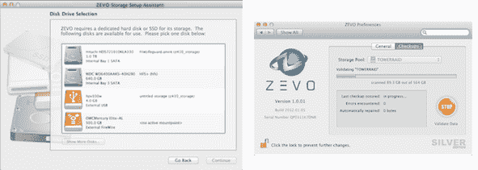

# 在被抛弃多年后，ZFS 找到了重返 Mac TechCrunch 的道路

> 原文：<https://web.archive.org/web/http://techcrunch.com/2012/01/31/after-four-years-zfs-finds-its-way-to-the-mac/>

# 被抛弃多年后，ZFS 找到了回归 Mac 的路

两周前，卓越构建 Windows 8 博客发布了一篇关于即将到来的操作系统新文件系统的深入研究， [ReFS](https://web.archive.org/web/20230204100734/http://blogs.msdn.com/b/b8/archive/2012/01/16/building-the-next-generation-file-system-for-windows-refs.aspx) 。这让我想起了多年前[的承诺](https://web.archive.org/web/20230204100734/https://techcrunch.com/2007/06/06/leopard-will-use-zfs-file-system-sun/)，OS X 将把它的文件系统从 HFS+改为 ZFS。当时许多人都不记得或甚至不关心这个承诺，但事实上，它很重要。

由于开发和法律问题，[放弃了对 ZFS 的支持，但苹果文件系统过渡团队的负责人唐·布雷迪离开了，继续独立发展。现在他发布了一款软件，](https://web.archive.org/web/20230204100734/https://techcrunch.com/2009/08/30/oh-come-on-snow-leopard-doesnt-have-zfs/) [Zevo](https://web.archive.org/web/20230204100734/http://tenscomplement.com/) ，最终为任何运行 10.6.6 或更高版本的英特尔 Mac 增加了 ZFS 支持。

你们中的大多数人可能都想知道，为什么还要担心像文件系统这样对普通用户来说不可见的东西。这是一个公平的问题，简而言之，HFS+植根于非常古老的计算实践(想想运行 OS 9 的 PowerPC 处理器)，并且缺少一些每年都变得越来越重要的功能。约翰·锡拉库扎在 Ars Technica 上的 10.7 分评论中有一个长版本[，他逐一分析了 HFS+的不足之处。](https://web.archive.org/web/20230204100734/http://arstechnica.com/apple/reviews/2011/07/mac-os-x-10-7.ars/12#file-system)

Zevo 有四种版本:银色(20 美元)、金色(40 美元)和白金(还没有价格)，外加一个还没有详细说明的开发者版本。每一个都增加了更多的功能，但是 ZFS 的许多基本优点都是从这里开始的，比如比特级错误检测。不幸的是，您现在不能从 ZFS 卷启动，所以您需要创建一个 ZFS 分区，并将您的数据保存在那里。这并不奇怪，但有点令人失望。这不是人们所希望的完全转换，但只有苹果能提供这一点，他们似乎也不想这样做。

该不该买？你至少应该问问你的 IT 人员。但是很高兴看到这位极客的小宝贝在被打入冷宫这么多年后重新露面。如果我今年买了一台新的 MacBook Pro([一台高分辨率的，当然是](https://web.archive.org/web/20230204100734/https://techcrunch.com/2011/12/16/little-ipads-little-pixels-and-resolution-independence-an-apple-rumor-medley/))，我可能会把它放在那里寻求刺激。在这个价格上，它真的不算什么，而且对我的信誉有很大帮助。

[via [MacRumors](https://web.archive.org/web/20230204100734/http://www.macrumors.com/2012/01/31/zfs-comes-to-os-x-courtesy-of-apples-former-chief-zfs-architect/)