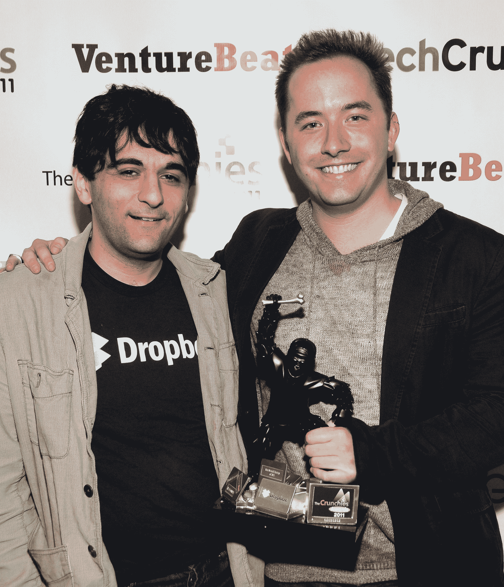

# 恭喜脆饼干赢家！Dropbox 是最优秀的创业公司

> 原文：<https://web.archive.org/web/https://techcrunch.com/2012/01/31/crunchies-dropbox/>

# 恭喜脆饼干赢家！Dropbox 是整体上最好的创业公司

今年的第五届年度嘎吱嘎吱奖刚刚在旧金山优雅的戴维斯交响乐厅结束，并取得了巨大的成功。我们取笑#humblebraggers，被 Siri 骂，向前 TechCrunch 首席执行官希瑟·哈德致敬，并向科技领域最伟大的创新者颁发野生猴子奖。如果你错过了这次活动或我们的[直播](https://web.archive.org/web/20230326030059/https://techcrunch.com/events/crunchies-2011/video/)，请查看下面提名者和获奖者的完整名单。

世界应该感谢“年度创始人”、推特(Twitter)领袖、“最大社会影响”奖得主杰克·多西。他的沉着和奉献帮助微博服务保持在线，因此它可以帮助革命。祝贺 Dropbox 获得“最佳整体创业公司”奖。该公司的年轻创始人德鲁·休斯顿和阿拉什·菲尔多西(下图从右至左)展示了免费增值模式的力量，并有勇气拒绝 9 位数的收购报价。

**以下是提名者和获奖者:**

**最佳技术成就**
[Lytro](https://web.archive.org/web/20230326030059/http://www.crunchbase.com/company/lytro) **(亚军)**
[NFC](https://web.archive.org/web/20230326030059/https://techcrunch.com/tag/nfc/)
[OnLive](https://web.archive.org/web/20230326030059/http://www.crunchbase.com/company/onlive)
[Siri](https://web.archive.org/web/20230326030059/http://www.crunchbase.com/product/siri)**(冠军)**
[特斯拉平板包电池](https://web.archive.org/web/20230326030059/https://techcrunch.com/2011/11/14/tesla-flat-pack/)

**最佳社交应用**
[脸书时间轴](https://web.archive.org/web/20230326030059/https://techcrunch.com/2011/12/15/its-here-facebook-timeline-now-available-to-users-worldwide/)
[Instagram](https://web.archive.org/web/20230326030059/http://www.crunchbase.com/company/instagram) **(亚军)**
[Google+](https://web.archive.org/web/20230326030059/http://www.crunchbase.com/product/google) **(冠军)**
[新推新推](https://web.archive.org/web/20230326030059/https://techcrunch.com/2011/12/20/fly-or-die-the-new-new-twitter/)
[路径 2.0](https://web.archive.org/web/20230326030059/https://techcrunch.com/2011/12/16/with-winds-down/)

**最佳购物应用**
[birch box](https://web.archive.org/web/20230326030059/http://www.crunchbase.com/company/birchbox)
[Fab](https://web.archive.org/web/20230326030059/http://www.crunchbase.com/company/fab-com)**(赢家)**
[Gilt Groupe](https://web.archive.org/web/20230326030059/http://www.crunchbase.com/company/gilt-groupe)
[lot 18](https://web.archive.org/web/20230326030059/http://www.crunchbase.com/company/lot18)
[Warby Parker](https://web.archive.org/web/20230326030059/http://www.crunchbase.com/company/warby-parker)**(亚军)**

**最佳移动应用**
[Evernote](https://web.archive.org/web/20230326030059/http://www.crunchbase.com/product/evernote)**(赢家)**
[Flipboard](https://web.archive.org/web/20230326030059/http://www.crunchbase.com/company/flipboard)**(亚军)**
[Pandora](https://web.archive.org/web/20230326030059/http://www.crunchbase.com/product/pandora)
[Spotify](https://web.archive.org/web/20230326030059/http://www.crunchbase.com/company/spotify)
[Square](https://web.archive.org/web/20230326030059/http://www.crunchbase.com/company/square)
[task rabbit](https://web.archive.org/web/20230326030059/http://www.crunchbase.com/company/taskrabbit)

**最佳位置应用**
[Airbnb](https://web.archive.org/web/20230326030059/http://www.crunchbase.com/company/airbnb)
[four square](https://web.archive.org/web/20230326030059/http://www.crunchbase.com/company/foursquare)
[Grindr](https://web.archive.org/web/20230326030059/http://www.crunchbase.com/company/grindr)**(赢家)**
[run keeper](https://web.archive.org/web/20230326030059/https://techcrunch.com/2011/06/26/runkeeper-adds-new-integration-to-its-health-graph-in-hopes-of-building-the-facebook-of-fitness/)**(亚军)**
[优步](https://web.archive.org/web/20230326030059/http://www.crunchbase.com/company/uber-2)

**最佳平板应用**
[djay](https://web.archive.org/web/20230326030059/http://www.algoriddim.com/)
[门口的 Eventbrite](https://web.archive.org/web/20230326030059/https://techcrunch.com/2011/06/07/eventbrite-ipad-box-office/)
[Fotopedia](https://web.archive.org/web/20230326030059/http://www.crunchbase.com/company/fotopedia)**(赢家)**
[GarageBand](https://web.archive.org/web/20230326030059/https://techcrunch.com/2011/11/01/garageband-arrives-on-the-iphone-and-ipod-touch/)
[网飞](https://web.archive.org/web/20230326030059/http://www.crunchbase.com/company/netflix) **(亚军)**
[StumbleUpon](https://web.archive.org/web/20230326030059/http://www.crunchbase.com/company/stumbleupon)

**最佳设计**
[Gojee](https://web.archive.org/web/20230326030059/http://www.crunchbase.com/company/gojee)
[乐团](https://web.archive.org/web/20230326030059/http://www.crunchbase.com/company/orchestra)
[路径 2.0](https://web.archive.org/web/20230326030059/https://techcrunch.com/2011/12/16/with-winds-down/) **(赢家)**
[Pinterest](https://web.archive.org/web/20230326030059/http://www.crunchbase.com/company/pinterest)**(亚军)**
[Quora](https://web.archive.org/web/20230326030059/http://www.crunchbase.com/company/quora)

**最佳自举创业** (2010 年赢家:addmired)
[Github](https://web.archive.org/web/20230326030059/http://www.crunchbase.com/company/github)**(亚军)**
[Imgur](https://web.archive.org/web/20230326030059/http://www.crunchbase.com/company/imgur) **(赢家)**
[Instapaper](https://web.archive.org/web/20230326030059/http://www.crunchbase.com/company/instapaper)
[one sheet](https://web.archive.org/web/20230326030059/http://www.crunchbase.com/company/onesheet)
[Tap Tap(Camera+)](https://web.archive.org/web/20230326030059/http://www.crunchbase.com/company/camera)

**最佳云服务**
[Asana](https://web.archive.org/web/20230326030059/http://www.crunchbase.com/company/asana)
[Box](https://web.archive.org/web/20230326030059/http://www.crunchbase.com/company/box-net)**(亚军)**
[Cloud flare](https://web.archive.org/web/20230326030059/http://www.crunchbase.com/company/cloudflare)
[Dropbox](https://web.archive.org/web/20230326030059/http://www.crunchbase.com/company/dropbox)**(冠军)**
[Okta](https://web.archive.org/web/20230326030059/http://www.crunchbase.com/company/okta)
[Twilio](https://web.archive.org/web/20230326030059/http://www.crunchbase.com/company/twilio)

**最佳国际创业公司**
[Badoo](https://web.archive.org/web/20230326030059/http://www.crunchbase.com/company/badoo)
[Klarna](https://web.archive.org/web/20230326030059/http://www.crunchbase.com/company/klarna)**(亚军)**
[Peixe Urbano](https://web.archive.org/web/20230326030059/http://www.crunchbase.com/company/peixe-urbano)**(冠军)**
[Rovio](https://web.archive.org/web/20230326030059/http://www.crunchbase.com/company/rovio-mobile)
[SoundCloud](https://web.archive.org/web/20230326030059/http://www.crunchbase.com/company/soundcloud)
[Wonga](https://web.archive.org/web/20230326030059/http://www.crunchbase.com/company/wonga)

**最佳清洁科技创业公司**
[阿尔塔能源](https://web.archive.org/web/20230326030059/https://techcrunch.com/tag/alta-wind-energy-center/)
[阵列电源](https://web.archive.org/web/20230326030059/http://www.crunchbase.com/company/arraypower) **(亚军)**
[EcoATM](https://web.archive.org/web/20230326030059/http://www.crunchbase.com/company/ecoatm) **(冠军)**
[eco motors](https://web.archive.org/web/20230326030059/http://www.crunchbase.com/company/ecomotors)
[Hara](https://web.archive.org/web/20230326030059/http://www.crunchbase.com/company/hara)

**最佳新设备**
[Galaxy Nexus](https://web.archive.org/web/20230326030059/https://techcrunch.com/2011/12/14/iphone-galaxy-nexus-review/)
[iPad 2](https://web.archive.org/web/20230326030059/http://www.crunchbase.com/product/ipad-2)
[iPhone 4S](https://web.archive.org/web/20230326030059/http://www.crunchbase.com/product/iphone-4s)
[Kindle Fire](https://web.archive.org/web/20230326030059/http://www.crunchbase.com/product/kindle-fire)**(亚军)**
[巢](https://web.archive.org/web/20230326030059/https://techcrunch.com/tag/nest/) **(胜利者)**

**最好的时光沉沦**
[现代战争 3](https://web.archive.org/web/20230326030059/https://techcrunch.com/2011/11/17/modern-warfare-3-sets-new-sales-record-775-million-in-five-days/)
[Quora](https://web.archive.org/web/20230326030059/http://www.crunchbase.com/company/quora)
[sky rim](https://web.archive.org/web/20230326030059/https://techcrunch.com/2011/11/20/review-skyrim/)**(亚军)**
[turntable . FM](https://web.archive.org/web/20230326030059/http://www.crunchbase.com/company/turntable-fm)
[与朋友的话](https://web.archive.org/web/20230326030059/http://www.crunchbase.com/product/words-with-friends) **(冠军)**

**社会影响最大**
[慈善:水](https://web.archive.org/web/20230326030059/http://www.crunchbase.com/company/charity-water) **(亚军)**
[可汗学院](https://web.archive.org/web/20230326030059/http://www.crunchbase.com/company/khan-academy)
[Kickstarter](https://web.archive.org/web/20230326030059/http://www.crunchbase.com/company/kickstarter)
[修行融合](https://web.archive.org/web/20230326030059/http://www.crunchbase.com/company/practice-fusion)
[推特](https://web.archive.org/web/20230326030059/http://www.crunchbase.com/company/twitter) **(赢家)**

**年度天使**
[罗恩·康韦](https://web.archive.org/web/20230326030059/http://www.crunchbase.com/person/ron-conway)
[保罗·格拉厄姆](https://web.archive.org/web/20230326030059/http://www.crunchbase.com/person/paul-graham)
[雷德·霍夫曼](https://web.archive.org/web/20230326030059/http://www.crunchbase.com/person/reid-hoffman) **(冠军)**
[凯斯·拉布瓦](https://web.archive.org/web/20230326030059/http://www.crunchbase.com/person/keith-rabois)
[海军拉维坎特](https://web.archive.org/web/20230326030059/http://www.crunchbase.com/person/naval-ravikant)和[巴巴克·尼维](https://web.archive.org/web/20230326030059/http://www.crunchbase.com/person/babak-nivi) **(亚军)**
[凯文·罗斯](https://web.archive.org/web/20230326030059/http://www.crunchbase.com/person/kevin-rose)

**年度 VC**
[马克·安德森](https://web.archive.org/web/20230326030059/http://www.crunchbase.com/person/marc-andreessen) & [本·霍洛维茨](https://web.archive.org/web/20230326030059/http://www.crunchbase.com/person/ben-horowitz) **【胜利者】**
[马特·科勒](https://web.archive.org/web/20230326030059/http://www.crunchbase.com/person/matt-cohler) **【亚军】**
[维诺德·科斯拉](https://web.archive.org/web/20230326030059/http://www.crunchbase.com/person/vinod-khosla)
[艾琳·李](https://web.archive.org/web/20230326030059/http://www.crunchbase.com/person/aileen-lee)
[尤里·米尔纳](https://web.archive.org/web/20230326030059/http://www.crunchbase.com/person/yuri-milner)
[大卫·司达](https://web.archive.org/web/20230326030059/http://www.crunchbase.com/person/david-sze)

**年度创始人**
[莉亚·布斯克](https://web.archive.org/web/20230326030059/http://www.crunchbase.com/person/leah-busque)(任务兔)
[布莱恩·切斯基](https://web.archive.org/web/20230326030059/http://www.crunchbase.com/person/brian-chesky) (Airbnb)
[杰克·多西](https://web.archive.org/web/20230326030059/http://www.crunchbase.com/person/jack-dorsey) (Square，Twitter)**(Winner)**
[苏珊·费尔德曼](https://web.archive.org/web/20230326030059/http://www.crunchbase.com/person/susan-feldman) & [阿里·平卡斯](https://web.archive.org/web/20230326030059/http://www.crunchbase.com/person/ali-pincus)(一王巷)
[德鲁·休斯顿](https://web.archive.org/web/20230326030059/http://www.crunchbase.com/person/drew-houston) (Dropbox) **(亚军)**

**年度 CEO**
[迪克·科斯特罗](https://web.archive.org/web/20230326030059/http://www.crunchbase.com/person/dick-costolo) (Twitter)
[丹尼尔·埃克](https://web.archive.org/web/20230326030059/http://www.crunchbase.com/person/daniel-ek) (Spotify) **(亚军)**
[菲尔·利宾](https://web.archive.org/web/20230326030059/http://www.crunchbase.com/person/phil-libin) (Evernote)
[马克·平卡斯](https://web.archive.org/web/20230326030059/http://www.crunchbase.com/person/mark-pincus) (Zynga)
[杰夫·韦纳](https://web.archive.org/web/20230326030059/http://www.crunchbase.com/person/jeff-weiner) (LinkedIn) **(赢家)**

**2011 年度最佳新创公司**
[Codecademy](https://web.archive.org/web/20230326030059/http://www.crunchbase.com/company/codecademy)**【亚军】**
[Fab](https://web.archive.org/web/20230326030059/http://www.crunchbase.com/company/fab-com)
[Nest](https://web.archive.org/web/20230326030059/https://techcrunch.com/tag/nest/)
[Pinterest](https://web.archive.org/web/20230326030059/http://www.crunchbase.com/company/pinterest)**【赢家】**
[Turntable.fm](https://web.archive.org/web/20230326030059/http://www.crunchbase.com/company/turntable-fm)

**2011 年最佳整体创业公司**
[Dropbox](https://web.archive.org/web/20230326030059/http://www.crunchbase.com/company/dropbox) **【冠军】**
[insta gram](https://web.archive.org/web/20230326030059/http://www.crunchbase.com/company/instagram)
[Gilt Groupe](https://web.archive.org/web/20230326030059/http://www.crunchbase.com/company/gilt-groupe)
[Spotify](https://web.archive.org/web/20230326030059/http://www.crunchbase.com/company/spotify)
[Square](https://web.archive.org/web/20230326030059/http://www.crunchbase.com/company/square)**【亚军】**
[Tumblr](https://web.archive.org/web/20230326030059/http://www.crunchbase.com/company/tumblr)

感谢每一个观看、投票或参加脆饼干的人。这个颁奖典礼是关于技术社区的，我们很荣幸有你作为我们的读者。