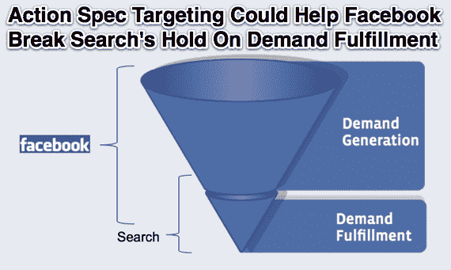

# 脸书的收入增长战略:通过应用内行为进行广告定位

> 原文：<https://web.archive.org/web/http://techcrunch.com/2012/02/01/action-spec-ad-targeting/>

对于那些想知道它将如何证明其 IPO 价格合理并随着其在关键市场的饱和保持收入增长的人，脸书有了一个答案:一个新的行为广告定位系统。脸书已经悄悄地推出了测试版的[【开放图表行动规范目标】](https://web.archive.org/web/20230404151646/http://developers.facebook.com/docs/reference/ads-api/start-action-specs/)，它允许广告商根据用户听什么、去哪里旅游、买什么以及其他应用内活动来锁定用户。

这些行为可以比用户的传记或兴趣更准确地表明转化潜力，这意味着开放图形行动规范广告定位可以将大海捞针变成桶里捞鱼。定向选项可以提高脸书广告的投资回报率，从而吸引新的广告客户，让现有的广告客户花更多的钱，并从搜索、展示和线下渠道获得收入。

由于脸书已经[耗尽了第一世界高货币化用户的大部分供应](https://web.archive.org/web/20230404151646/https://techcrunch.com/2011/12/29/2011facebookmarketsaturationus/)，它需要从每个用户身上赚更多的钱来增加收入。action spec 定向广告更高的点击率和转换率将允许脸书向广告商收取更高的每次点击费用，并减少为获得这些点击而浪费的印象。它还在扩大广告库存，在网络新闻提要中用[赞助商故事广告补充其广告边栏，并且它可能会以同样的方式从其移动用户群中获利。通过以更高的每次点击成本提供更多的广告，广告收入将随着时间的推移而增长。](https://web.archive.org/web/20230404151646/https://techcrunch.com/2012/01/10/featured-news-feed-ads/)

在 action spec targeting 推出之前，希望锁定那些有购买意向的广告客户的广告客户通常会去搜索或广告网络，利用 cookie 重定向来抓取用户的浏览历史。脸书只提供传记、社交和兴趣定位。这些对于机构品牌广告和需求挖掘是有效的，但对于接触购买漏斗中的用户却没那么有用。广告客户有时不得不购买大量的点击来推动一次转化。

Open Graph action spec 定向将帮助这些脸书广告客户接触到那些已经或计划进行相关购买的用户。这可能有助于它突破购买漏斗的需求生成阶段，进入更有利可图的需求满足阶段，目前谷歌搜索广告占主导地位。一些脸书广告专家告诉我，行动规范定位可以让广告转换率翻倍。

在 f8 上，脸书宣布，使用脸书广告 API 购买大型活动的广告商可以将现有的目标参数[分层，目标用户是已经通过](https://web.archive.org/web/20230404151646/http://www.insidefacebook.com/2011/09/22/what-f8-means-for-advertisers-the-ability-to-target-users-based-on-media-consumption/) [Spotify](https://web.archive.org/web/20230404151646/https://techcrunch.com/2012/01/06/spotifyfunnel/) 、华盛顿邮报社交阅读器和 Hulu 等应用采取了三种官方发布行动:“听”、“读”和“看”中的任何一种。例如，广告可以针对任何在 Spotify 上“听”了“Lady Gaga”或“The Rolling Stones”的人。这对来自这些垂直行业的广告商很有用，如唱片公司、音乐会推广商、图书出版商和电视网。

现在 [60 个新的合作应用已经推出](https://web.archive.org/web/20230404151646/https://techcrunch.com/2012/01/18/open-graph-websites/)，脸书已经开始批准非合作应用及其行为，更广泛的广告客户将能够利用行为定位。航空公司可以瞄准那些通过 Gogobot 表示“希望购买”巴塞罗那的人，时尚零售商可以瞄准那些通过 Payvment“购买”特定钱包的人，餐馆可以瞄准任何通过 Foodspotting 在竞争对手的餐馆“想要”汉堡的人。

拥有自己的 Open Graph 应用程序的广告商受益最大。例如，Groupon 已经在脸书开展了大规模的广告活动，但现在有了一个应用程序，用户可以通过它采取“购买”交易的行动。Groupon 现在可以针对任何已经通过其应用程序购买了交易的用户重新定向广告。先前购买者的受众可能比其脸书页面粉丝或任何传记人口统计的转化率高得多。

开放图形动作定位仍处于测试阶段，所以技术方面有点棘手。没有可浏览的 Open Graph 应用程序、动作和目标对象的数据库，因此广告商需要通过在现有的活动故事中点击它们来找到他们的 Open Graph ID 号。脸书广告 API 平台和服务的第三方开发商，如 [Nanigans](https://web.archive.org/web/20230404151646/http://blog.nanigans.com/2012/01/31/nanigans-closes-2011-with-explosive-growth/) 、 [TBG 数码](https://web.archive.org/web/20230404151646/http://www.crunchbase.com/company/tbg-london)和[adparle](https://web.archive.org/web/20230404151646/http://www.crunchbase.com/company/adparlor)正试图通过创建广告商可以瞄准的预定义受众群体来使其变得更容易。

行为定位需要几年时间才能开始增加收入。更多的开放图形应用需要推出并获得牵引力，因此有一些目标，广告 API 平台需要适应，行为目标的好处需要在广告支出开始转向系统之前得到证明。一些用户可能不会因为成为他们应用活动的目标而感到兴奋。然而，他们选择使用这些应用程序，如果他们无论如何都要看的话，还不如看相关的广告。

最终，脸书、广告商和用户都将获得胜利。脸书将增加收入，广告商将能够更好地接触他们的客户，用户将会看到更多基于他们自愿安装的应用程序中的活动的相关广告，而不是未经允许就向他们投放的 cookies。

*【图片来源:[认知行为疗法](https://web.archive.org/web/20230404151646/http://www.cognitive-behavioral-therapy.org/)，[获取](https://web.archive.org/web/20230404151646/http://www.acquisio.com/ppc/adding-value-through-facebook-advertising/)，*