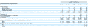

# 脸书的利润:10 亿美元，收入 37 亿美元 TechCrunch

> 原文：<https://web.archive.org/web/https://techcrunch.com/2012/02/01/facebook-1-billion-profit/>

# 脸书的利润:10 亿美元，收入 37 亿美元

脸书刚刚[提交了](https://web.archive.org/web/20221204132110/https://beta.techcrunch.com/2012/02/01/facebook-files-for-5-billion-ipo/)它的首次公开募股登记( [SEC 文件在此](https://web.archive.org/web/20221204132110/http://www.sec.gov/Archives/edgar/data/1326801/000119312512034517/d287954ds1.htm#toc287954_8))，它的财务状况令人震惊。脸书的 IPO 文件首次让人得以一窥其财务状况。

该公司 2011 年实现收入 37 亿美元，T4 利润 10 亿美元。没错。净收入为 10 亿美元。事实上，确切地说，是 10 亿美元(我认为这不是巧合)。利润从 2010 年的 6.06 亿美元增长到去年的 65%。收入增长了 88%。收入主要来自广告(85%)，以及对虚拟商品的支付(15%)和平台开发费(可以忽略不计)。去年仅支付业务就达到了 5 . 57 亿美元，这一数字是我们的埃里克·埃尔登在 12 月份完成的。

该公司拥有非常健康的 27%的净利润率(其营业利润率为 47%)。这与谷歌 26%的净利润率完全一致。软件利润是一件美好的事情。

脸书的生意产生了大量的现金。2011 年净营运现金为 15 亿美元，比 2010 年增长了 122%。2011 年，自由现金流(相关指标)为 4.7 亿美元。该公司年底拥有 39 亿美元现金。

**以下是我们关于申请的一些附加报道:**

单击下面的图表放大:

