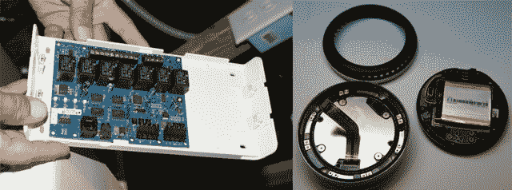

# 霍尼韦尔 vs Nest:当权势集团起诉硅谷 TechCrunch

> 原文：<https://web.archive.org/web/https://techcrunch.com/2012/02/07/honeywell-vs-nest-when-the-establishment-sues-silicon-valley/>

霍尼韦尔[昨天对 Nest Labs 和百思买提起多项专利侵权诉讼](https://web.archive.org/web/20221005224413/https://beta.techcrunch.com/remote-login.php?login=c20986038afbbec3cfd60b181ca642d6&id=24588526&u=5046291a3f8852736dbbebe0105cc7af&h=)。该诉讼称 Nest Labs 侵犯了霍尼韦尔的七项专利。霍尼韦尔不寻求许可费。这家消费电子集团希望 Nest Labs 停止使用该技术，并实际上正在寻求收集侵权造成的损害赔偿。损害赔偿？扯淡。这是为了扼杀竞争。

周一早上，这起诉讼对硅谷和科技界造成了沉重打击。Nest Labs 现在是硅谷的明星。这家由 iPod 教父创立的公司，两年多前在帕洛阿尔托的一个车库里成立，成功地颠覆了一个陈旧的行业，以至于似乎导致了一场重大诉讼。该公司在 CES 2012 上赢得了最佳创新奖，就在上周，[获得了最佳新设备](https://web.archive.org/web/20221005224413/https://beta.techcrunch.com/2012/01/31/best-new-device-nest/)。人爱窝。现在这些人中的大多数都讨厌霍尼韦尔。

霍尼韦尔有权保护他们的知识产权。在他们的辩护中，Nest Labs 显然抄袭了霍尼韦尔标志性的圆形恒温器设计。霍尼韦尔的 T87 恒温器是不可否认的，立即识别为恒温器。但面巾纸盒也是。和一个飞盘。如果 Nest Learning 恒温器是故意从霍尼韦尔的知识产权开发的，那么 Nest Labs 应该感到羞耻。但在我看来，Nest Labs 只是试图在一个熟悉的设计中使用新的功能来推动恒温器的发展。

诉讼称 Nest Labs 侵犯了霍尼韦尔涉及恒温器的多项专利。几个，像 [7159789](https://web.archive.org/web/20221005224413/http://www.google.com/patents?id=OKB-AAAAEBAJ&printsec=frontcover&dq=7159789&hl=en&sa=X&ei=zlUwT6rBLsTs2QXF7PmODw&ved=0CDQQ6AEwAA) 和 [7159790](https://web.archive.org/web/20221005224413/http://www.google.com/patents?id=OaB-AAAAEBAJ&printsec=frontcover&dq=7159790&hl=en&sa=X&ei=xVUwT-i2H4fg2AXZoYjoDg&ved=0CDQQ6AEwAA) ，涉及圆形硬件机制，旋转转盘和中心屏幕位置。其他，即 [7142948](https://web.archive.org/web/20221005224413/http://www.google.com/patents?id=OUJ9AAAAEBAJ&printsec=frontcover&dq=7142948&hl=en&sa=X&ei=K1YwT6KfK8eW2gXztfX5Dg&ved=0CDQQ6AEwAA) 和 [7634504](https://web.archive.org/web/20221005224413/http://www.google.com/patents?id=cdLKAAAAEBAJ&printsec=frontcover&dq=7,634,504&hl=en&sa=X&ei=G14wT-TcI7T4sQL894TXDw&ved=0CDQQ6AEwAA) ，覆盖用户界面。控制器( [7634504](https://web.archive.org/web/20221005224413/http://www.google.com/patents?id=cdLKAAAAEBAJ&printsec=frontcover&dq=7634504&hl=en&sa=X&ei=c1QxT6zSFYvtgge755CiBQ&ved=0CDQQ6AEwAA) )的自然语言安装程序设置允许通过一系列简单问题设置设备的图形用户界面，如“在工作日，有人整天在家吗？”以及“夏天舒适的睡眠温度是多少？”你看，Nest 也有一个友好的用户界面。显然，霍尼韦尔是唯一一家被允许拥有圆形、可旋转的傻瓜恒温器的公司。

霍尼韦尔多年来一直在销售恒温器，但包括该公司非常昂贵的 Prestige 系列在内，没有一款能与 Nest 的制造质量或用户界面相媲美。去年我花了相当多的时间购买恒温器。在我试过的六个左右的霍尼韦尔型号中，所有型号都是廉价制造，用户界面都很差。在对其中一个声望模型如此失望后，我真的打了我的墙。

霍尼韦尔恒温器和 Nest 之间的差异是惊人的。一个是廉价的，显然是大量生产的塑料块，另一个是你会为拥有它而自豪的东西。这种感觉正是这场诉讼充满贪婪的原因。霍尼韦尔对一家试图让人们对恒温器感到兴奋的新贵感到尴尬，甚至有点害怕。

霍尼韦尔显然知道他们在做什么。虽然很容易让人感到厌恶，但霍尼韦尔是在他们的权利范围内运营的。快速浏览一下专利就可以发现，Nest Learning 恒温器似乎侵犯了所有七项专利。有些就像前面提到的四个专利一样微不足道，但其他的则更加具体和详细。专利 [7476988](https://web.archive.org/web/20221005224413/http://www.google.com/patents?id=BsayAAAAEBAJ&printsec=frontcover&dq=Power+Stealing+Control+Devices&hl=en&sa=X&ei=82QwT4PvIoj30gHRhejcCg&ved=0CDQQ6AEwAA) 窃电控制装置列出了从另一个来源吸取恒温器的电力并将其储存在电池、电容器或类似装置中所需的过程。但我的工作不是决定哪个主张有价值。现在是法院的事了。

| 【YouTube http://www.youtube.com/watch?v=JJOI0BDyCzg&w=315&h=190] | [YouTube http://www.youtube.com/watch?v=5thQRIX3Rio&w=315&h=190] |

关于霍尼韦尔的索赔，我与 PLLC 米切尔律师事务所的马修·米切尔先生进行了交谈。他指出，Nest 可能只是忽略了这里列出的专利。或者，他认为更有可能的是，该公司意识到了这些，并已经准备好了诉讼策略，主张专利无效。

专利旨在保护非显而易见的想法，同时推进总体创新。米切尔后来指出，“专利是最大的均衡器。专利使车库发明家和小型创业公司(其中一些被贬损为:非执业实体或‘巨魔’)能够与霍尼韦尔这样的大公司竞争。”如果这个案子反过来，如果 Nest 起诉霍尼韦尔，科技媒体的下意识反应会有所不同，但仍然可能站在这个小家伙一边。

霍尼韦尔的索赔是否有价值以及该公司是否应得到损害赔偿将取决于法院，但不幸的是，这起案件中唯一的赢家将是法律团队。Nest Labs 可能会将 R&D/营销专项资金用于防御。霍尼韦尔的形象受损。

但更糟糕的是，如果像 Nest Labs 这样的新兴公司被起诉，消费者将损失最大。