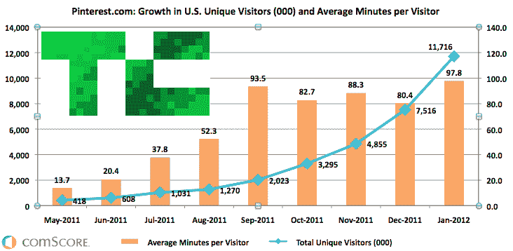
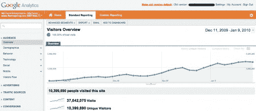
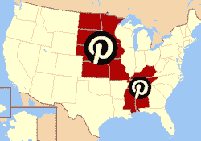
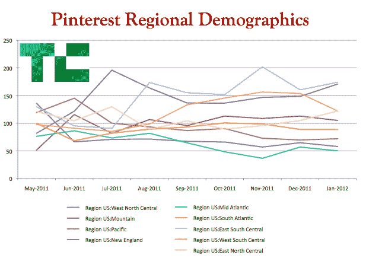

# Pinterest 每月在美国的点击率达到 1000 万，比任何独立网站都快

> 原文：<https://web.archive.org/web/https://techcrunch.com/2012/02/07/pinterest-monthly-uniques/>

它很美，令人上瘾，现在 [Pinterest](https://web.archive.org/web/20230327053408/http://pinterest.com/) 正迎来它辉煌的曲棍球棒时刻。TechCrunch 从 comScore 获得的独家数据显示，Pinterest 的美国独立月访问量刚刚达到 1170 万，比历史上任何其他独立网站都更快地突破了 1000 万大关。

事实上，用户花太多时间分享他们最喜欢的图片，现在只有脸书和 Tumblr 比 Pinterest 有更多的社交媒体时间。谁在推动它的崛起？来自美国中心地带的 18-34 岁高收入女性。也许我们应该称之为吹风机式增长。
T3

根据 comScore 的数据，Pinterest 用户平均每月在网站上花费 98 分钟，相比之下 Tumblr 为 2.5 小时，脸书为 7 小时。如果不算像 Google+或新雅虎频道这样已经建立了用户基础的网站，comScore 的数据显示，Pinterest 将会是美国任何一种网站中单月点击量达到 1000 万的最快网站

更新:comScore 向我们报告说，Pinterest 是美国月活跃用户数达到 1000 万的最快的独立网站，根据它的数据，Formspring 在美国的月活跃用户数从未达到 1000 万，而是达到了 800 多万。

[Formspring](https://web.archive.org/web/20230327053408/http://www.formspring.me/) 的创始人 [Ade Olonoh](https://web.archive.org/web/20230327053408/https://twitter.com/adeolonoh/statuses/167069692152913920) 显示[根据](https://web.archive.org/web/20230327053408/http://thenextweb.com/insider/2012/02/08/formspring-beat-pinterest-to-10-million-active-users-by-months/) Google Analytics，Formspring 在 2 个月内达到 1000 万的月全球唯一数，比 Pinterest 还快。

不幸的是，[不可能直接比较](https://web.archive.org/web/20230327053408/https://techcrunch.com/2012/02/06/those-millions-on-facebook-they-actually-visit-and-its-not-a-huge-deal-anyway/)comScore 和 Google Analytics 等独立的流量测量服务，因为它们经常不同。comScore 之外的其他数据来源可能会显示 Pinterest 和 Formspring 的增长有所不同。这篇文章基于 comScore 仅在美国的数据，标题和文章已经更新以反映这一点，因为一开始并不完全清楚。]

这证明了兴趣图的力量，并可能说服更多的创业公司围绕人们关心的东西而不是他们关心的人的社交图来建立。

 与大多数网络初创公司不同，Pinterest 的核心用户群并不是来自美国东西海岸的典型早期采用者。虽然太平洋和东北地区在 5 月份拥有最多的 Pinterest 用户，但现在它的大本营在东南中和西北中各州，如堪萨斯州、密苏里州、明尼苏达州和密西西比州。

接下来，问题将是 Pinterest 应该什么时候开始真正的货币化。[品牌别针和品牌页面](https://web.archive.org/web/20230327053408/http://www.quora.com/Pinterest/How-does-Pinterest-generate-revenue)都是选项，网站可能已经通过附属链接赚钱了。突然间，投资者似乎在传言的 2 亿美元估值，特别是 9 月份的 4000 万美元估值中锁定了一个真正的赢家。

*【图片来源:[电梯样式](https://web.archive.org/web/20230327053408/https://elevatestyles.com/p/hair-dryers/471-red-ceramic-2000-turbo-blow-dryer.html)*