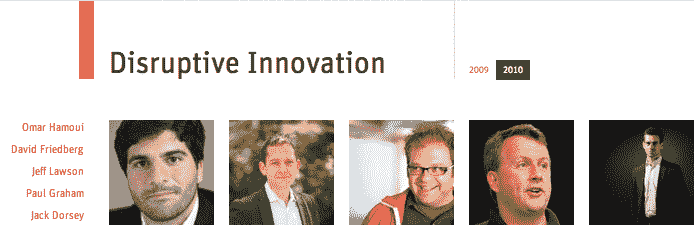

# Thiel、Zuck、Conway 将选出 10 万美元的 TechFellow 奖获奖者| TechCrunch

> 原文：<https://web.archive.org/web/https://techcrunch.com/2012/02/08/founders-fund-techfellow-awards/>

# Thiel、Zuck、Conway 将选出 10 万美元的 TechFellow 奖获奖者

TechFellow 奖是高科技企业家的奥斯卡奖。正如评选委员会成员肖恩·帕克所说，“我们把聚光灯对准了那些站在为我们带来革命性东西的风口浪尖上的人。”2 月 22 日，在旧金山现代艺术博物馆，20 名创新者将获得 10 万美元的资助，用于投资他们选择的创业公司。提名将于 2 月 17 日在 [TechFellows 网站](https://web.archive.org/web/20230405234235/http://techfellows.com/)上公开。

今天，TechFellow Awards 宣布，艾美奖获奖的书呆子英雄吉姆·帕森斯，热播电视剧《生活大爆炸》的主演，将主持颁奖典礼。玛丽莎·梅耶尔、戴夫·麦克卢尔和特里·塞梅尔也将加入全明星评选委员会，成员包括马克·扎克伯格、彼得·泰尔、雷德·霍夫曼和罗恩·康韦。

【T2

TechFellow 奖由 [Founders Fund](https://web.archive.org/web/20230405234235/http://www.foundersfund.com/) 、TechCrunch 和[新企业协会(NEA)](https://web.archive.org/web/20230405234235/http://www.nea.com/) 颁发，旨在表彰有远见的技术领导者，为他们提供支持下一代创新者的机会。每个类别将选出 5 名获奖者— [工程领导力](https://web.archive.org/web/20230405234235/http://techfellows.com/engineering-leadership/2010/)、[产品设计和营销](https://web.archive.org/web/20230405234235/http://techfellows.com/product-design-marketing/2010/)、[综合管理](https://web.archive.org/web/20230405234235/http://techfellows.com/general-management/2010/)和[颠覆性创新](https://web.archive.org/web/20230405234235/http://techfellows.com/disruptive-innovation/2010/)。

除了 10 万美元的奖金，获奖者还将加入一个精英技术社区智囊团，其中包括 Twitter 的联合创始人杰克·多西；Etsy 前首席执行官玛利亚·托马斯(Maria Thomas)、Quora 联合创始人、脸书前首席技术官亚当·德安杰洛(Adam D'Angelo)以及 Y Combinator 联合创始人兼合伙人保罗·格拉厄姆。他们将参加季度晚宴、直播活动和问答环节，从中获得专业知识和洞察力，帮助他们通过投资和自己的项目塑造未来。

[现在访问 TechFellows 网站提名](https://web.archive.org/web/20230405234235/http://techfellows.com/)你认为谁是科技界最具颠覆性的人物，并于 2 月 22 日回来查看颁奖典礼的现场报道和采访。以下是今年奖项评选委员会成员的完整名单:

*   马克·安德森(网景公司联合创始人安德森·霍洛维茨)
*   迈克尔·阿灵顿(TechCrunch 创始人)
*   约翰·巴特利(联合媒体创始人/董事长/首席执行官)
*   罗恩·康韦(SV 天使基金管理合伙人)
*   克里斯·德沃夫(Myspace 联合创始人)
*   埃丝特·戴森(EDventure 董事长)
*   卡特琳娜·法克(Flickr 联合创始人，Hunch)
*   肖恩·范宁(创始人，Napster，SNOCAP，破裂，播出时间)
*   雷德·霍夫曼(LinkedIn 联合创始人)
*   Joi Ito(麻省理工学院媒体实验室主任；知识共享组织董事会主席)
*   麦克斯·拉夫琴(Slide 创始人/CEO；PayPal 联合创始人)
*   玛丽莎·梅耶尔(谷歌位置和本地服务副总裁)
*   戴夫·麦克卢尔(创始人基金 500 Startups 创始人兼合伙人)
*   约翰·麦金利(OurParents 创始人/首席执行官)
*   乔纳森·米勒(新闻集团数字媒体首席执行官)
*   蒂姆·奥莱利(奥莱利媒体创始人)
*   肖恩·帕克(联合创始人，Napster，Plaxo，Causes，Airtime 创始主席，脸书；创始人基金管理合伙人)
*   杰夫·罗尔斯顿(雅虎前首席产品官！；前 CEO 拉拉)
*   Terry Semel(温莎传媒董事长/首席执行官；雅虎前董事长兼首席执行官！)
*   丹尼·沙利文(搜索引擎公司创始人)
*   彼得·泰尔(创始人基金管理合伙人；Palantir Technologies 董事长兼联合创始人；PayPal 前董事长、首席执行官和联合创始人)
*   杰夫·韦纳(LinkedIn 首席执行官)
*   迈克尔·扬诺夫(创意艺术家机构业务发展部)
*   马克·扎克伯格(脸书创始人/首席执行官)