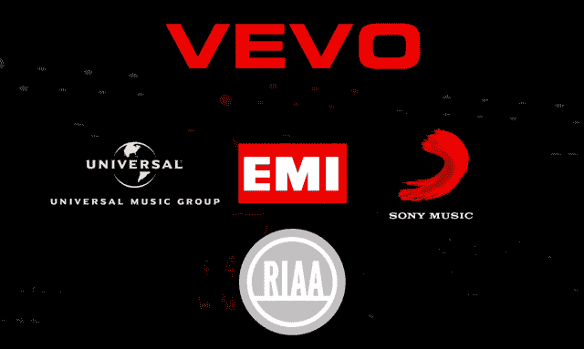
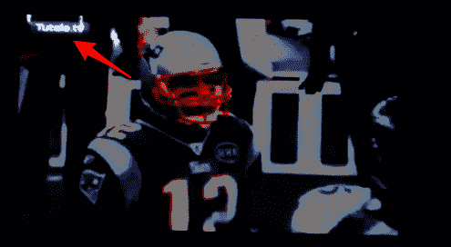

# 唱片公司的合资企业 VEVO 在 Sundance TechCrunch 展示盗版 NFL 游戏

> 原文：<https://web.archive.org/web/https://techcrunch.com/2012/02/09/music-labels-joint-venture-vevo-shows-pirated-espn-game-at-sundance/>

[https://web.archive.org/web/20221231002619if_/https://www.youtube.com/embed/EhJjlkpyiec?feature=oembed](https://web.archive.org/web/20221231002619if_/https://www.youtube.com/embed/EhJjlkpyiec?feature=oembed)

视频

在过去的十年里，主要的唱片公司——以及他们的贸易组织——美国唱片业协会——已经建立了一种以压制非法文件共享为名攻击消费者的重复模式。他们声称，盗版是该行业的祸根，自 1999 年以来销售额下降了 50%以上(该行业喜欢低估通过 iTunes 等服务合法下载每首歌曲音乐的影响，以及高速互联网连接的兴起带来的无数其他变化)。

他们打击盗版的努力通常是严厉的:威胁成千上万的人提起诉讼，要求高额赔偿；试图与消费者的 ISP 协调他们的威胁；最近，支持 SOPA 和 PIPA 等会破坏互联网结构的立法。见鬼，环球影业曾经在 YouTube 上撤下一个 30 秒的跳舞婴儿的视频，因为这个婴儿竟敢跟着王子的歌跳舞。

这就是为什么当我看到由世界上一些最大的唱片公司共同拥有的 VEVO 上个月在其 Sundance PowerStation 场馆播放 ESPN 足球比赛的盗版流时，我惊讶不已——在至少两台电视和两台笔记本电脑上。

首先，一些背景。VEVO 是一种“音乐视频的 Hulu ”,由环球音乐集团、索尼音乐娱乐公司和阿布扎比媒体集团所有。百代唱片公司(环球唱片公司和索尼公司正在收购其中的大部分)已经将其内容授权给该网站。这些唱片公司合起来构成了美国“四大”唱片公司中的三家——华纳音乐是唯一的坚持者。这四大银行构成了 RIAA 的绝大部分。

因此，当你听到唱片公司起诉人们，或试图让互联网服务提供商压制用户，或试图通过可能摧毁我们所知的网络的立法时，很多人都是幕后黑手。

回到故事。

VEVO 发电站的场景对于圣丹斯电影节来说是相当典型的。VEVO 和其他两家公司占领了当地的一个场所，用鲜红的颜色在墙上装饰他们的标识，用一系列名字巧妙的调制饮料取代正常的饮料菜单，旨在帮助你忘记你在下午三点钟啜饮烈酒。名人每隔一段时间就漫步走过，在酒吧里转了一圈，然后去一个房间挑选他们的毛绒 Sorel 靴子礼物。

至少对记者来说，这一事件的挽回因素是美味的汉堡和 ESPN 爱国者队对乌鸦队的季后赛，比赛在整个场地进行。直到比赛被粗鲁地打断——不是因为商业广告，而是因为一个奇怪的*缓冲*警告。

事后看来，我应该立即注意到这一点。劣质的视频质量和抖动显然不属于高清视频，尽管右下角有 ESPN America *HD* 的标志。还有一个事实是，ESPN *美国*甚至在美国市场都买不到(这是一个总部设在英国的电台)。

但是在嘈杂的音乐和詹姆斯·麦斯登([独眼巨人](https://web.archive.org/web/20221231002619/https://techcrunch.com/wp-content/uploads/2012/02/jamesmarsten.png))之间！)站在我面前三英尺的地方，直到海盗旗完全展开，我才终于注意到他们。首先出现了缓冲信息，然后鼠标光标——由看不见的力量控制——飞到电视上，退出全屏模式并刷新页面。我想它可能也关闭了一些 popover 广告。

此时，我试图找出提要的来源。据我所知，视频流本身来自一个名为 TuTele.tv 的西班牙语直播网站。但这个视频显然是通过一个名为 Frontrow.tv 的网站获得的，该网站本身就是一个体育直播流的聚合网站。乍一看，这两个网站都不太可信。

但是网络版权是一个众所周知的复杂问题，所以我去了来源处核实我的怀疑:ESPN。这证实了两个网站都无权播放其内容。换句话说，是的——那个游戏确实被盗版了。事实上，Frontrow.tv 显然已经关闭，这可能是联邦当局最近对含有盗版内容的体育网站进行打击的结果。

鉴于场地可能有有线电视订阅(或者天线，因为这是空中广播)，我不知道为什么它会决定走盗版路线。但我强烈怀疑这主要是出于方便。

第二天，当我回访 VEVO 发电站时，足球比赛显然没有开始。这一次，电视屏幕正在播放 VEVO 的音乐视频，这些视频正在被协调以匹配房间里当前的任何名人——托米·李走进来，他的音乐视频意外地开始播放，然后当 Deadmau5 出现时，同样的事情发生了。

我的直觉是，该团队在整个场地的电视上连接了一台计算机，以便他们可以完成这种同步的明星爱抚——然后，他们没有仅仅为了玩几个小时的足球比赛而重新设计他们的整个设置，而是选择了更简单的路线，并在网络上寻找流媒体。

这完美地强调了媒体行业对待盗版的方式的所有错误。他们一直认为海盗是无法无天的小偷，认为他们有权免费获得一切。

但现实远非黑白分明。当然，有些人会在可能的时候逃避账单——但是他们中的许多人一开始就不会去购买他们下载的内容。大量的“盗版者”被驱使走上他们的道路，因为通过非法网站更容易播放或下载一些东西，而不是因为他们不愿意为内容付费。在他们已经付费的媒体前贴上一堆数字版权管理和广告，下次他们可能会选择阻力最小的途径。

哦，如果场地*想要合法地在线播放足球比赛，他们会很难做到这一点:唯一提供流媒体游戏的 NFL 授权商是 DirectTV，它要求你购买一整季的“NFL 周日门票”才能从网上播放比赛。仅售 350 美元。*

当被联系到进行评论时，VEVO 不出所料地试图转移任何责任:它说这个活动是由一家名为 Continuum Entertainment 的创意机构制作的，还有其他几家公司参与其中。然而，场地被分成了不同的部分，有问题的电视显然是属于 VEVO 发电站的——VEVO 证实，这些电视本来是用来展示 VEVO 的视频和“原创内容”的。VEVO 还声称，它不知道游戏正在播放，一旦意识到它正在播放，它就关闭了它(尽管我在那里的整个时间都在播放，至少有 30 分钟)。

至于到底是谁决定播放这个视频，或者为什么，VEVO 说公众可以接触到正在使用的电脑，所以他们不能确定到底是谁负责。这是可疑的(几乎可以肯定是骗人的)——显然有人在主动控制电脑，因为当连接中断时，他们刷新了电脑，我非常确定不是一个随机的与会者在掌舵。一定是那些讨厌的海盗中的一个。

在任何情况下，如果音乐产业站在另一边，你可以肯定他们会毫不犹豫地驳回上述所有解释。然后他们可能会评估每笔 2 万美元的损失。

我们已经联系了 ESPN，询问它是否会对 VEVO、Continuum 或任何其他与该事件有关的公司采取法律行动。

2010 年 2 月 2 日更新: : ESPN 表示不会采取法律行动。一位发言人给了我们以下声明:

“我们对参展商采取这种方式感到失望，特别是在一个行业的节日上，如果我们不能减少被盗内容，这个行业的工作将面临最大的风险。”