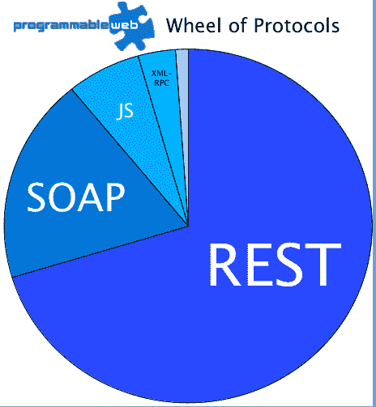

# 2011 年空气污染指数趋势:政府空气污染指数五倍；脸书、谷歌、Twitter 最受欢迎 TechCrunch

> 原文：<https://web.archive.org/web/https://techcrunch.com/2012/02/10/2011-api-trends-government-apis-quintuple-facebook-google-twitter-most-popular/>

API 和混搭的在线目录，ProgrammableWeb，本周刚刚达到了 T2 的里程碑:5000 个 API 上市。该网站在跟踪 API 领域有着悠久的历史，从 2005 年发布目录开始，也就是易贝创建第一个 web API 的五年之后。毫不奇怪，像谷歌、脸书和推特这样的大公司现在在提供的 API 数量、用途和受欢迎程度方面都处于领先地位。在网站上追踪 API 的开发者中，脸书现在拥有最受欢迎的 API，其次是谷歌地图和 Twitter。

然而，根据 ProgrammableWeb 执行编辑 Adam DuVander 的说法，在最近添加到目录中的 1000 个 API 中也发现了一些新趋势，包括越来越多的政府 API 变得可用。

在 ProgrammableWeb 目录中列出的 [231 个政府 API](https://web.archive.org/web/20221007120329/http://www.programmableweb.com/apitag/government)中，超过一半是在过去四个月中添加的。虽然 2009 年至 2010 年经常被宣传为政府开始拥抱透明度的时候，但这主要是在开放数据访问方面，有时只是以 Excel 电子表格的形式。DuVander 解释说，直到 2011 年，政府才真正开始通过编程方式提供这些数据。

值得注意的是，他提到了 2011 年纽约市的年度[大型应用程序竞赛是如何添加 API](https://web.archive.org/web/20221007120329/http://blog.programmableweb.com/2011/10/17/new-york-city-gets-an-api-for-big-apps-contest/) 的。另外， [NYC 开放数据 API](https://web.archive.org/web/20221007120329/http://www.programmableweb.com/api/nyc-open-data) 现在可以访问超过 750 个公共数据集。旧金山道德委员会说客 API 是要求说客披露声明透明的法律的一部分，可编程网站称之为[第一个道德 API](https://web.archive.org/web/20221007120329/http://blog.programmableweb.com/2012/01/23/today-in-apis-picnik-replacement-ethics-api-and-11-new-apis/) 。在世界其他地方，像 Socrata 和 CKAN 这样的平台也使得访问公共数据变得更加容易。

2010 年，网站上只有 28 个政府 API，但 2011 年，有 130 个。因此，尽管 API 的数量在过去一年翻了一番，但政府 API 的数量却增加了近五倍。

虽然政府 API 呈上升趋势，但另外两个热门类别也保持着人气:互联网和社交。网站上有 [500 个互联网 API](https://web.archive.org/web/20221007120329/http://www.programmableweb.com/apitag/internet)，包括许多云和平台即服务 API。现在还有近 600 个社交 API，这一类别在过去一年中增长了 35%。

与此同时，该网站提供了 [96 个谷歌 API](https://web.archive.org/web/20221007120329/http://www.programmableweb.com/apis/directory/1?company=Google)、 [8 个脸书 API](https://web.archive.org/web/20221007120329/http://www.programmableweb.com/apis/directory/1?company=Facebook)、Twitter 的 3 个官方 API 和 [100 个](https://web.archive.org/web/20221007120329/http://www.programmableweb.com/apitag/twitter) +衍生 API，这代表了从 Twitter 数据中创建新 API 的趋势，例如 [Klout API](https://web.archive.org/web/20221007120329/http://www.programmableweb.com/api/klout) 和[托普斯 API](https://web.archive.org/web/20221007120329/http://www.programmableweb.com/api/topsy) 。大多数 API 都是 REST，但是 SOAP 仍然在企业中流行。

ProgrammableWeb 表示，预计 2012 年将达到 1000 多个 API 里程碑。DuVander 认为，在某个时候，每个公司都会有一个 API。

“回想一下 1995 年的网络。有很多公司没有网站。很快，所有这些公司都意识到他们需要一个网站来竞争，”他说。“我们在社交媒体上看到了同样的事情，这就是 API 的发展方向。”