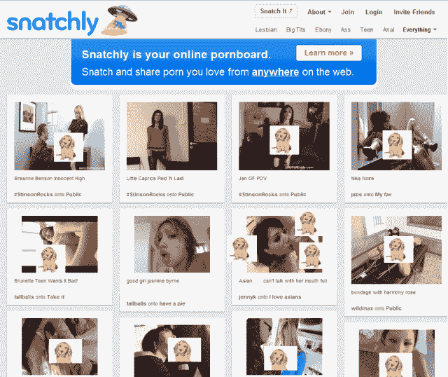

# 孤独情人节的完美之选:看看 Pinterest 色情克隆(NSFW)

> 原文：<https://web.archive.org/web/https://techcrunch.com/2012/02/13/perfect-for-a-lonely-valentines-day-behold-the-pinterest-porn-clones-nsfw/>

# 孤独情人节的完美之选:看看 Pinterest 色情克隆版(NSFW)

我与自己辩论这是否应该是一个帖子，然后决定我应该在 Twitter 上大声问一下这是不是一个好主意。

因为有三个人立刻告诉我答案是肯定的(我可以补充一下，其中两个是聪明、有魅力的女性)，而且因为 TechCrunch 的创始人和前无畏领袖迈克尔·阿灵顿在[识别色情克隆](https://web.archive.org/web/20221225004908/https://techcrunch.com/2006/07/25/youtube-has-porn-clone/)方面有很长的历史，你现在正在阅读这篇文章(NSFW！):

[硬生生地](https://web.archive.org/web/20221225004908/http://www.snatchly.com/)是一个‘色情的 Pinterest’。关于这个网站真的没有太多可说的，除了它远不是 Pinterest 克隆[中唯一一个淫秽的 Pinterest 克隆](https://web.archive.org/web/20221225004908/https://techcrunch.com/2011/12/07/pin-down-the-pinterest-clones/)。

现在，男性使用 Pinterest 还有一个理由吗？:)

Snatchly 被称为虚拟的“色情板”，让你“从网络上的任何地方保存和分享你喜欢的所有色情内容”，包括一些最受欢迎的色情网站的内容。如果你愿意，你可以安装一个[‘抓取’](https://web.archive.org/web/20221225004908/http://www.snatchly.com/features)(咯咯)浏览器书签来抓取图片和视频。

强制截图(尽我所能让它 SFW，除非你的老板厌恶可爱的小狗):

