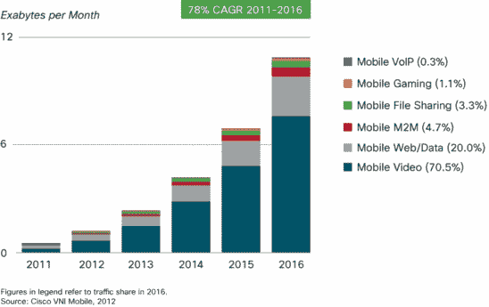
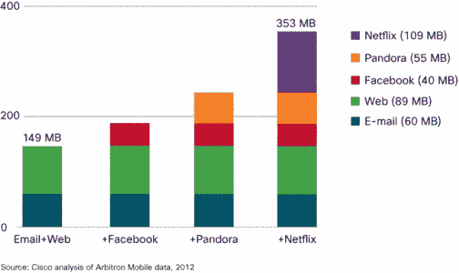
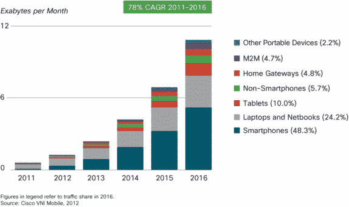
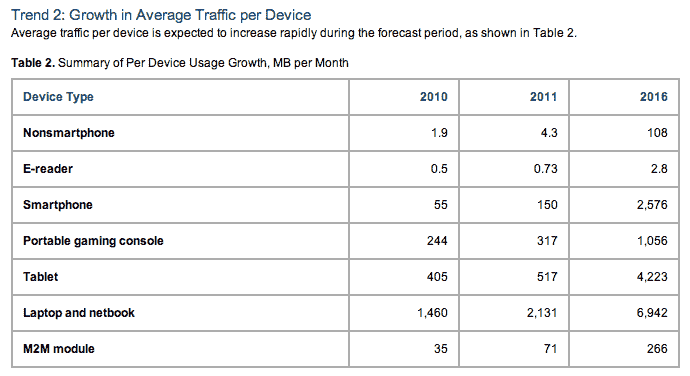
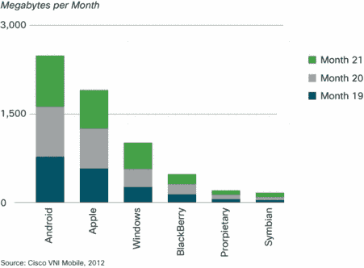

# 到 2012 年，移动设备的数量将超过世界人口数量(以及其他令人震惊的数字)

> 原文：<https://web.archive.org/web/https://techcrunch.com/2012/02/14/the-number-of-mobile-devices-will-exceed-worlds-population-by-2012-other-shocking-figures/>

尽管它的名字又长又无聊，思科的“视觉网络指数(VNI)全球移动数据流量预测更新”是你今年将读到的更有趣的充满数据的报告之一。该报告研究了我们在移动互联网领域看到的巨大增长，包括对移动数据的巨大需求、移动视频的增长以及智能手机作为网络新门户的崛起。

在全球范围内，移动数据流量在 2011 年增长了 2.3 倍，连续第四年增长了一倍多。流量的增长速度甚至超过了思科之前的预测:他们预计年增长率为 131%。实际上，流量增长了 133%。

2011 年，移动数据流量是 2000 年全球互联网总量的 8 倍(597 对 75)。那只是十几年前的事，但也可能是亿万年前的事了。

报告中一个更能说明问题的数字是，到 2012 年底，移动连接设备的数量将超过地球上的人口数量。到 2016 年，人均移动设备将达到 1.4 台。那一年，包括机器对机器(M2M)模块在内的移动连接设备将超过 100 亿台。同样，这个数字将超过当时的世界人口(73 亿)。

**视频**

移动网络的增长，以及对更多数据、更多连接和更多带宽的无止境的需求，没有显示出放缓的迹象。尤其是移动用户最喜欢的活动之一是移动视频。视频流量首次超过总流量的一半(52%)。这在一定程度上是由于网络连接和能够观看视频的手机的增加。到 2016 年，视频将超过 70%的流量。

视频的增长也可以归因于能够以更快的速度做更多事情的设备的增加，这有助于影响数据使用方面的全球底线。例证:4G 手机虽然只占移动连接的 0.2%，却已经占据了移动数据流量的 6%。到 2016 年，4G 将占所有连接的 6%，但占总流量的 36%，是非 4G 手机的 9 倍。

与此同时，前 1%的移动数据用户占据了 24%的数据流量。智能手机作为一个群体，仍然是少数，仅占今天使用的全部手机的 12%，现在占全球手机流量的 82%。

**移动云**

在某些情况下，移动云应用是视频应用(想想 YouTube 和网飞)，但其他时候它们是音乐(Pandora，Spotify)，游戏或社交网络应用。但是移动连接的增加使得原本有限的硬件设备成为媒体消费的工具。

【T2

一个拥有 8 GB 智能手机的用户在两年内播放音乐和视频会消耗更多可以存储在设备上的内容。使用网飞、潘多拉和脸书的智能手机用户产生的流量是仅使用电子邮件和网络应用的智能手机用户的两倍多。

**智能手机**

智能手机也越来越受欢迎和使用，正如该集团的数据流量需求的增长所表明的那样。2011 年，智能手机的平均使用量增加了近两倍，从去年的每月 55 MB 增加到今天的每月 150 MB。到 2012 年，超过 1 亿的智能手机用户将每月使用超过 1 GB 的数据。到 2016 年，全球智能手机每月的数据流量将超过 10eb，智能手机平均每月产生 2.6 GB 的数据，比 2011 年的平均水平增长了 17 倍。

**功能手机**

尽管像我们这样的发达市场认为智能手机无处不在，但大部分移动市场仍在使用基本手机。2011 年，这些设备占移动领域的 88%，其移动数据使用量从去年的 1.9 MB 增加到 4.3 MB，增长了 2.3 倍。换句话说，即使是“哑手机”也变得越来越智能，能够消耗更多的移动数据。

**平板电脑**

但是移动网络不再仅仅由手机访问。平板电脑也是一个不断增长的群体，有着自己的数据需求。去年，移动连接平板电脑的数量增加了两倍，达到 3400 万台，每台平板电脑产生的流量是普通智能手机的 3.4 倍(每月 517 MB，智能手机每月 150 MB)。到 2016 年，平板电脑将占全球移动数据流量的 10%。

或者，这可能是报告中我最喜欢的数字:**到 2016 年，移动互联平板电脑将产生几乎相当于 2012 年整个全球移动网络的流量**，每月 1.1 艾字节。(明年全球网络将达到 1.3 月)。想想看:平板电脑互联网将会增长如此之快，达到今年移动互联网的规模。如果你正在从事移动领域的任何工作，并且推迟了解决如何满足平板电脑用户需求的问题，那么你已经落后了。不言而喻，如果你是为网络而建，还没有解决移动，你基本上只是迷路了。

**安卓 VS IPHONE**

最后，有哪些好的移动数据可以避免参与 Android 与 iPhone 之战？就数据消耗而言，似乎安卓赢了(嗯，用了更多的数据——我不确定这是不是“赢了”)由于 Android 应用在后台运行更加自由，这个数字并不令人惊讶。但这也是 Android 全球市场份额增加的一个功能。如今，就每个连接每月使用的兆字节数而言，Android 设备的数据消耗量比苹果设备高 29%。

这份报告中还有大量的数据，我只是略知皮毛。要阅读更多内容，请点击这里的。