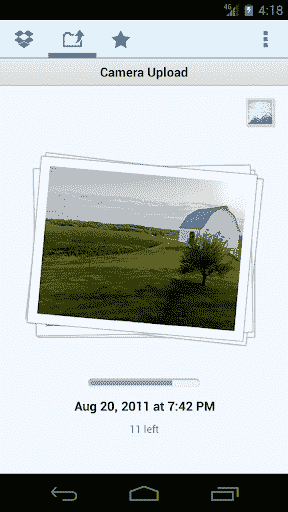

# Dropbox 现在可以自动同步你的安卓照片(它还有更多功能)

> 原文：<https://web.archive.org/web/https://techcrunch.com/2012/02/23/dropbox-introduces-automatic-image-upload-on-android-and-it-has-more-up-its-sleeve/>

去年，Dropbox 筹集了高达 2 . 5 亿美元的融资，估值约为 40 亿美元(T2)。加薪的传闻已经在[流传了几个月](https://web.archive.org/web/20230227132025/https://techcrunch.com/2011/08/30/index-leads-4-billion-valuation-round-in-dropbox/)，所以它并不令人惊讶，但它仍然引起了很多人的关注。因为虽然 Dropbox 非常棒(我每天都在使用它)，但在这一点上，人们认为它是一种在电脑之间同步文件的便捷方式——它已经做得很好了。那么这些钱是干什么用的？

今天，我们第一次尝到了下一步的滋味，联合创始人兼首席执行官德鲁·休斯顿称 Dropbox 的使命是解决人们在技术上遇到的所有“隐藏问题”，其中许多问题我们已经习惯了处理。

他们对这些隐藏问题的第一个解决方案？帮助您将所有设备上的所有照片保存在一个地方。为了开始，他们推出了新版本的桌面和 Android 客户端，可以自动将你的照片上传到你的 Dropbox 账户。在你的手机上拍几张照片，不需要连接任何电线，它们就会在一两分钟内传到你的电脑上。

我知道你在想什么，因为这是我对首席执行官德鲁·休斯顿和产品经理阿西姆·索德说的第一句话:“呃，iCloud 和 Google+不是已经让你这么做了吗？”

我很确定他们预见到了。

他们指出的第一件事是，有很多人没有使用这些服务。大多数 Dropbox 用户根本没有使用 MAC，所以 iCloud 是不可能的(实际上，如果用户安装了 iCloud 控制面板，iCloud 将与 Windows 兼容)，Google+也刚刚起步(是的，这项服务有很多用户注册，但他们中有多少人在使用它并在手机上安装了应用程序？).

Dropbox 还做了几件 Google+没有做的事情:首先，它会自动同步你的图片的全尺寸版本——Google+sync 会将图片的最长边缩小到 2048 像素。Dropbox 还可以同步它在你的电脑上检测到的任何照片:如果你将相机或 SD 卡插入你的电脑，它检测到图像，你可以选择自动将它们添加到你的 Dropbox 文件夹中。

这项新功能可能会占用你的 Dropbox 文件夹中的大量空间，因此 Dropbox 也将逐渐将免费用户的限制从 2GB 提高到 5GB(他们不会一次完成这一操作——随着你使用照片功能，你将能够逐渐积累更多的免费存储空间)。休斯顿解释说，这项功能的目标是让人们的生活更轻松，而不是让他们升级到更大的 Dropbox 存储限制，这就是为什么他们提供额外的免费空间。

这听起来很棒，我会立即启用它，但仍有一些明显的地方需要改进。同步到你的 Dropbox 帐户的图像被放在一个特殊的照片文件夹中，但它们只是按时间顺序排序——例如，没有任何关于事件或位置检测的智能。另一个潜在的问题是，Dropbox 没有提供任何管理或编辑这些照片的工具，所以将它们拖到 iPhoto 或其他照片编辑应用程序中取决于你(最好的解决方案可能是将你的 Dropbox 文件夹设为你的默认图像文件夹)。

休斯顿同意，他们只是刚刚开始触及这里可能发生的事情的表面，所以我相信我们很快就会看到改善。哦，不要担心 iOS 用户——Dropbox 将很快更新其应用程序，以包括这一功能。

值得一提的是，虽然这是 Dropbox 首次将这一功能融入其官方应用，但在 Android 上使用利用 Dropbox API 的第三方应用也可以做到这一点。当然，官方应用的安装基数要大得多。

