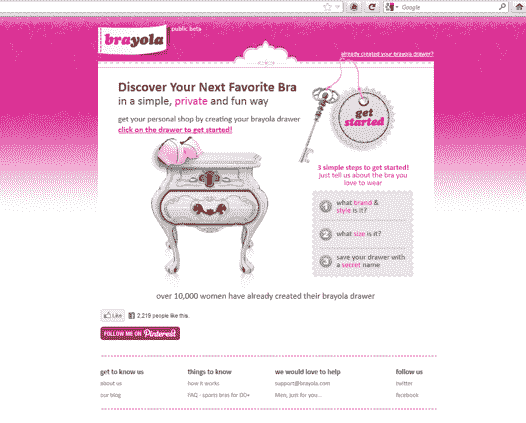

# Brayola 希望帮助女性找到完美的胸罩 TechCrunch

> 原文：<https://web.archive.org/web/https://techcrunch.com/2012/02/28/brayola-wants-to-help-women-find-the-perfect-bra/>

# 布雷奥拉希望帮助女性找到完美的胸罩

对于许多女性来说，找到合适的胸罩是一个挑战。进入以色列初创公司 Brayola，这是一个新网站，旨在让女性更容易找到她们下一个最喜欢的胸罩。Brayola 帮助女性找到完美的胸罩尺寸，并发现符合她喜欢的风格的新胸罩。

创始人 Orit Hashay 解释说，在线商店没有考虑胸罩对女性的重要性，寻找胸罩是一种高度个人化的体验。此外，不合身的胸罩会导致严重的不适，包括背痛和其他问题。结果是大多数网上购物者购买他们已经拥有的胸罩，因为他们熟悉这个品牌。

布雷奥拉采取了不同的方法。该网站通过问女性一个简单的问题来帮助她们找到胸罩:“你喜欢穿什么样的胸罩？”当 Brayola 用户第一次开始使用该服务时，她被要求创建自己的个人 Brayola 抽屉。这是她已经拥有并喜爱的胸罩系列，非常合身，符合她的个人风格。

Brayola 然后查看用户选择的胸罩，并在系统中找到拥有相同尺寸的相同胸罩的其他用户。Brayola 采用了 bra fitter 技术，这是一种智能推荐算法，根据类似女性的偏好，从电子商务网站为用户推荐新的胸罩。

Brayola 为每个用户提供了一套定制的虚拟抽屉，里面装满了不同风格和类型的胸罩。每个胸罩都是根据使用者的 Brayola 胸罩尺寸而特别挑选的。Brayola 从许多不同的网站购买胸罩，包括梅西百货、亚马逊和其他网站。你实际上是通过零售商的网站购买胸罩，但将来你可以通过 Brayola 购买。

Brayola 已经从 Roi Mor 和沙哈尔·斯米林那里获得了种子基金。

