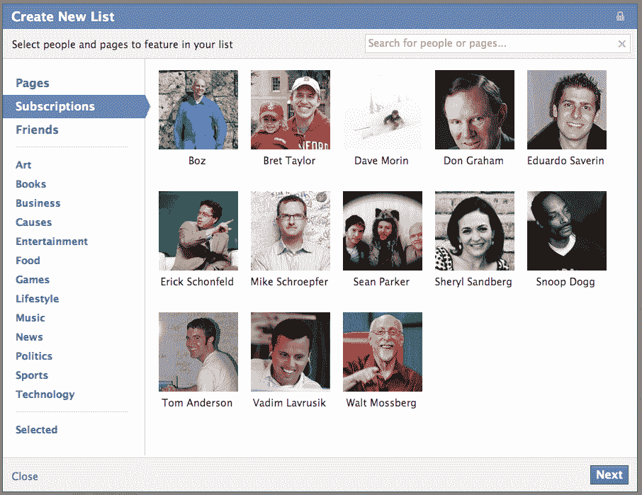
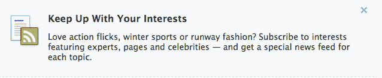

# 脸书在推特上发布新闻兴趣列表

> 原文：<https://web.archive.org/web/https://techcrunch.com/2012/03/08/facebook-interest-lists/>

为了吸引超级用户和 Twitter 忠实用户，脸书[今天让用户开始](https://web.archive.org/web/20230306080302/http://newsroom.fb.com/Announcements/Introducing-Interest-Lists-109.aspx)创建和订阅[“兴趣列表”](https://web.archive.org/web/20230306080302/https://www.facebook.com/addlist)。您可以在专门的新闻订阅源中查看这些页面和公众人物的更新。他们将通过流行列表的建议和朋友创建的建议被发现。

兴趣列表将在接下来的几周内推出，用户可以在同一个界面上关注朋友、品牌和思想领袖。此次发布延续了脸书篡夺 Twitter 对兴趣图谱控制的战斗。结合订阅的功能可能足以危及 Twitter 的长期增长。

通过主页左侧的导航侧边栏，可以点击兴趣列表切换到一个完全由列表成员的故事组成的视图——页面和启用订阅的用户的公开更新。只有创建者可以编辑列表，他们可以选择将其设为私有，或将其设为公共，以便它将出现在脸书向其他人推荐的列表中。
例如，有脸书创建的商业、体育和风格等一般列表，也有特定列表，如 [NFL 球队](https://web.archive.org/web/20230306080302/http://www.facebook.com/lists/10151033224945012)包括球队、运动员和体育新闻媒体，以及 [2012 年总统候选人](https://web.archive.org/web/20230306080302/https://www.facebook.com/lists/10100199038387324)包括竞选页面、候选人简介和政治新闻。

创建新列表时，向导会帮助用户从他们喜欢的页面、订阅、朋友以及艺术、娱乐和游戏等类别的成员中进行选择。用户还可以从页面的时间线中选择将页面添加到兴趣列表。这一功能实际上是随着网页时间线的推出而泄露的，给了我们一个提示，即兴趣列表将会推出，但脸书很快将其隐藏起来，直到现在。

不幸的是，你还会在你订阅的主要新闻源列表中看到最受欢迎的故事，你可以通过点击进入你的列表。然而，这将阻止用户添加他们可能只是想偶尔检查的列表，而不会污染他们的主要新闻提要。唯一的解决方案是当帖子出现在主新闻提要中时，从列表中逐个隐藏它们。我发现能够订阅一个合适的 Twitter 列表而不影响我的订阅非常有用，脸书应该考虑切换到这个功能或者把它作为一个选项。

脸书称这个功能为“一种新的方式来跟踪你关心的东西和整理你的经历…兴趣列表可以帮助你把脸书变成你自己的个性化报纸。”因此，除了针对 Twitter 用户，该功能还可能旨在从 Flipboard 和像 [News.me](https://web.archive.org/web/20230306080302/http://www.techmeme.com/120301/p26#a120301p26) 这样的新闻聚合器那里夺取份额。

虽然这场游戏可能已经晚了，但脸书庞大的用户群让它在兴趣图谱的战争中比 Twitter 更有优势。许多有朝一日被说服加入 Twitter 的脸书用户可能会发现[订阅和兴趣列表已经足够了](https://web.archive.org/web/20230306080302/https://techcrunch.com/2011/12/23/facebook-subscribers-follower/)。Twitter 可能总是最擅长突发新闻，但许多人可能不愿意开始一个新的社交网络。

*想试试脸书兴趣列表吗？订阅我们的 [TechCrunch 列表](https://web.archive.org/web/20230306080302/https://www.facebook.com/?sk=fl_10100180116102683)。*