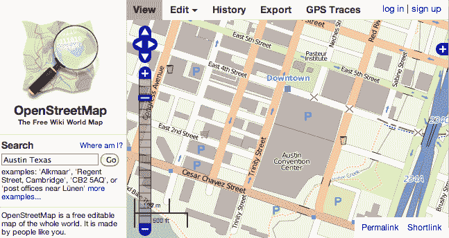

# 为什么谷歌让地图盈利的计划可能适得其反

> 原文：<https://web.archive.org/web/https://techcrunch.com/2012/03/09/google-maps-api-vs-openstreetmap/?guccounter=1>

# 为什么谷歌让地图盈利的计划会适得其反

谷歌曾经满足于让它的卫星产品，比如地图，在创业公司中赢得好感，并为他们的用户创造新的曝光率。但现在我们听说谷歌的新计划是让这些产品自给自足。它已经开始对其地图应用程序接口的大量用户收费。Foursquare 和苹果等公司不愿涨价，希望从战略上减少对谷歌的依赖，因此他们转向 OpenStreetMap。

这种短期的收入游戏可能会变成长期的灾难，因为 [OpenStreetMap](https://web.archive.org/web/20221210002103/http://www.openstreetmap.org/) 用户必须贡献他们对其数据所做的改进，所以有一天它可能会比谷歌地图更好。谁会是下一个放弃谷歌 API 的人？想到 Yelp。

谷歌地图 API 曾经是免费的，因为它试图获得人气，取代 MapQuest 和雅虎。三月初，[开始对任何一天超过 25000 次页面加载的人收费](https://web.archive.org/web/20221210002103/http://code.google.com/apis/maps/faq.html#usagelimits)，每增加 1000 次加载收费 4 美元、8 美元或 10 美元，现在还提供[高级服务](https://web.archive.org/web/20221210002103/http://www.google.com/enterprise/earthmaps/maps.html)。Foursquare 和苹果跳槽了，许多其他大公司可能也会这么做。随着 Yelp 的公开交易，投资者可能会推动它转向免费的替代品。

Digtal Trends 今天早上发布了一些关于地图行业的背景和分析。它解释了 Foursquare 如何利用一家名为 [MapBox](https://web.archive.org/web/20221210002103/http://mapbox.com/) 的公司来改善它从 OpenStreetMap 获取的数据，而苹果可能会利用包括 C3 技术公司在内的被收购公司来添加 3D 图形。

这就是谷歌的长期问题所在。OpenStreetMap，或 OSM，在任何卷上都是完全免费的，但如果用户自己改进了它的数据，他们必须将这些改进反馈给 OSM。如果有人用卫星、街景、评论或其他混搭来增强 OSM，每个人的地图都会受益。随着越来越多的大地图用户转向它，它会越来越好，随着时间的推移，它会越来越有吸引力，从而产生雪球效应。

虽然谷歌目前拥有最好的地图，但这些贡献意味着它可能不会保持这种状态。就像众包维基百科篡夺了传统百科全书一样，同样的事情也可能发生在地图上。有一天，即使是少量的免费客户端也可能会转向 OpenStreetMap，最终用户可能会更喜欢它。这可能会伤害安卓，而安卓是谷歌的未来。这个搜索和广告巨头有很多赚钱的方法。对谷歌地图 API 收费似乎是一个错误的转变。