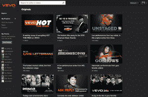
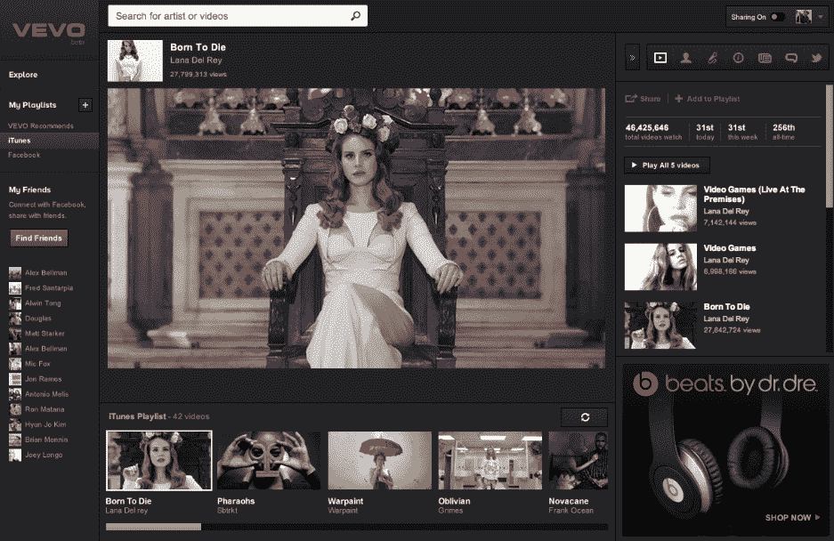

# 新 VEVO:音乐视频巨头增加个性化、脸书播放列表和连续播放 TechCrunch

> 原文：<https://web.archive.org/web/https://techcrunch.com/2012/03/09/the-new-vevo-music-video-giant-adds-personalization-facebook-playlists-continuous-play/>

[VEVO](https://web.archive.org/web/20221207075108/http://www.vevo.com/) 于 2009 年 12 月正式向全球推出，同月[成为美国访问量最大的音乐网站](https://web.archive.org/web/20221207075108/http://blog.vevo.com/vevo-launches-as-1-music-network-in-the-us/)，这仅仅是两年前的事，今天 VEVO 已经成长为仅次于 YouTube 的第二大网络视频网站，根据 comScore 的数据，一月份有大约 5150 万独立观众收看 VEVO 的内容。

VEVO 背后的理念是让它成为音乐视频的 Hulu，由于该公司是索尼音乐、环球音乐和阿布扎比媒体的合资公司，百代授权其音乐给 VEVO，它拥有“四大”唱片公司中三家的内容，因此有能力将其推向前台。它的视频通过网络整合，其中许多出现在 YouTube 上，这要归功于该公司与谷歌/YouTube 的协议，两家公司分享这些视频产生的大量广告收入。

然而，正如《CNET》上个月报道的那样，据报道，VEVO 正在与脸书就将其视频转移到社交网络进行谈判，因为脸书有兴趣与 VEVO 达成与 YouTube 类似的协议，但是 VEVO 与 YouTube 的合同还有一年，所以这些谈判仍然是初步的。

然而，上周，管理层以电子邮件的形式向 VEVO 用户透露，从现在开始，VEVO 用户将开始完全通过脸书登录该网站。这些邮件包括“新 VEVO 即将到来”的消息，这一消息今天得到了证实，因为 VEVO 正式宣布对其音乐视频平台体验进行自两年前推出以来最大的重新设计。在新的重新设计中，脸书无疑占有重要的位置。

在给 VEVO 用户的一篇博客文章中，该公司的产品 SVP 迈克尔·切尔达(Michael cara eff)表示，他已经与首席执行官里奥·卡拉夫(Rio Caraeff)就将 VEVO 从一个网站转变为“一种体验”进行了长期对话，这已经在重新设计中形成，旨在增强该网站的个性化功能和社交功能，并使其成为一个长期播放视频的目的地。

 根据新的重新设计，当用户使用脸书登录 VEVO 时，该网站会扫描你的新闻订阅和每日脸书数据，以创建个性化的脸书播放列表。这意味着，如果你之前在脸书上喜欢过某个艺术家或分享过音乐，VEVO 会自动将该艺术家的视频添加到你的播放列表中。顺便说一下，登录仅限于脸书，但用户不需要登录或注册就可以无限制地观看/收听。

SVP 表示，VEVO 的 iTunes Match 还会扫描你的 iTunes 资料库，创建一个与你最常听的艺术家匹配的音乐视频播放列表，此外还可以搜索视频，观看视频，并让 VEVO 创建一个“基于你选择的内容的长时间观看体验”。

该公司还宣布，它已经与音乐智能平台 [The Echo Nest](https://web.archive.org/web/20221207075108/http://the.echonest.com/) 合作，帮助用户寻找和发现符合他们个人偏好的个性化音乐视频。Echo Nest 的音乐数据平台集成到 VEVO，现在允许粉丝从其超过 45，000 个视频的目录中创建个性化的音乐视频播放列表。

粉丝还可以通过使用网络链接扫描他们的音频音乐集来进一步定制他们的收听体验，此时 VEVO 和 Echo Nest 将该网站变成一种主题音乐视频平台，根据用户最喜欢的音乐播放内容。

最重要的是，该公司还更新了播放器，现在更大了，而且(根据我短暂的经验)播放视频更快，更连续。VEVO 平台的另一个重大更新来自其上下文的变化。当听音乐时，尤其是发现新音乐时，我们的体验会因为能够查看更多关于艺术家、传记或其他方面的信息而显著增强。

VEVO 的观看体验现在包括在观看时查看视频中歌曲的歌词([感谢 musiXmatch](https://web.archive.org/web/20221207075108/http://www.crunchbase.com/company/musixmatch/posts) ),浏览与艺术家相关的新闻标题，或者阅读艺术家的简历，而不必点击离开视频。酷的是，该公司不仅更新了 VEVO.com，还更新了 iPhone、Android、脸书和新的 Xbox 应用程序(仅限美国)。(一款 iPad 应用正在研发中。)所以，这意味着你可以在办公室听 VEVO 的音乐，与你的脸书朋友分享，并继续在你的智能手机上播放音乐视频，回家后将它连接到电视上。

新的 VEVO 现在为用户提供了一种视听体验，他们真的想跨平台随身携带，随时随地。这使得 Spotify 和 Pandora 的体验比以前更具竞争力，还增加了视频的好处。至于广告，一直是流媒体内容的潜在破坏者，网站上的广告继续是 VEVO.com 的预滚动、覆盖和同伴，以及移动设备的预滚动。预卷大约每 7.5 分钟的观看时间运行一次，而不是在第一个视频之前。

澄清一下，网站和 iPhone、Android 和 Xbox 的连续视频流是此次更新的一部分。

也就是说，该团队明确指出，这实际上是一个测试版，它将根据用户反馈做出进一步的更新。希望该公司是 RIAA 一些最大机构的合资企业，他们也将听取关于其对盗版有点问题的立场以及在[圣丹斯发生的事件的反馈，杰森在那里发现了不止一点可疑的活动](https://web.archive.org/web/20221207075108/https://beta.techcrunch.com/2012/02/09/music-labels-joint-venture-vevo-shows-pirated-espn-game-at-sundance/)。

