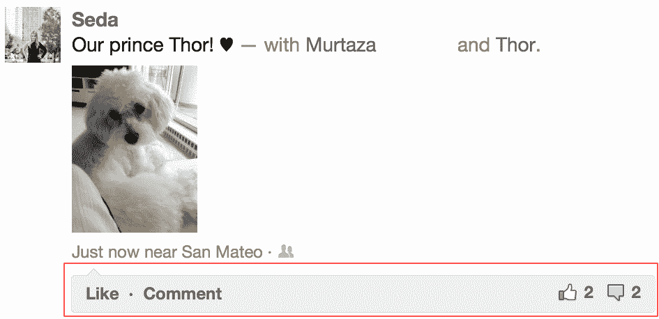
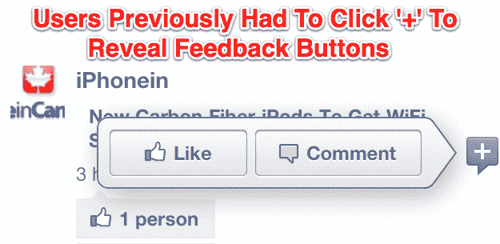

# 脸书移动放弃 2 次点击赞按钮，转而使用 1 次点击赞栏 TechCrunch

> 原文：<https://web.archive.org/web/https://techcrunch.com/2012/03/11/mobile-like-button/>

# 脸书移动放弃了 2 次点击赞按钮，转而使用 1 次点击赞栏

我本周发现，脸书正在慢慢推出一个移动界面的变化，让你只需点击一下就可以喜欢或评论帖子，该公司已经证实了这一点。通过让喜欢变得更快，[脸书](https://web.archive.org/web/20221208221217/http://www.facebook.com/)将能够收集更多的数据来完善其 feed 排序算法，同时让内容消费更快，可以说更令人愉快。以前，你必须点击帖子旁边的“+”按钮才能显示单独的喜欢和评论按钮，但很快所有用户都将点击喜欢/评论栏的不同侧面来留下反馈。

当然，这是一个微妙的变化，但它将影响每天超过 1.1 亿 iPhone 和 Android 用户的[，加上每个访问 m.facebook.com 的人。凭借其丰富的媒体提要故事，简化的提要阅读将有助于脸书与 Twitter 固有的不那么令人疲惫的纯文本移动提要竞争。](https://web.archive.org/web/20221208221217/https://beta.techcrunch.com/2011/12/17/facebook-android-iphone/)

老实说，我觉得组合的赞/评论栏有点难看，但它已经让我喜欢上了更多的帖子。我只需要暂停我贪婪的提要滚动一秒钟，就可以喜欢一个有趣的妙语或漂亮的图片，而不是必须中断我的流程来打开反馈控制。这让我更有可能在脸书上留下反馈，而不是在 Path 上，我需要在情绪或 Twitter 上做出选择，在 Twitter 上，我必须点击或滑动打开帖子，以收藏、回复或转发。这些喜欢会触发更多的通知，激发回访。

除了改善用户体验，更多的喜欢意味着脸书的 EdgeRank 新闻分类算法可以更快地了解你想更多地看到什么和谁。这些数据的缺乏使得 Google+无法在其 feed 中正确地推广和隐藏帖子。[维克·冈多特拉昨天表示，这阻止了 G+开放一个 API](https://web.archive.org/web/20221208221217/https://beta.techcrunch.com/2012/03/09/vic-gundotra-sxsw/) 让第三方应用发布内容，这是这个搜索巨头的社交网络缺乏内容的部分原因。

随着门槛的降低和[对给予](https://web.archive.org/web/20221208221217/https://beta.techcrunch.com/2011/12/25/love-scales/)多少个喜欢没有限制，你可以表达感激之情。