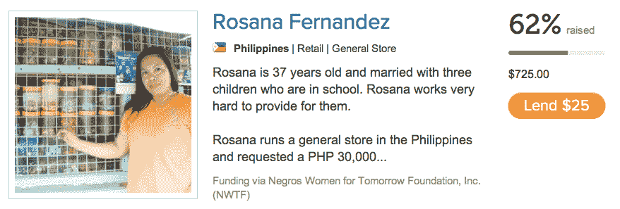

# 访问 kiva.org/free，从雷德·霍夫曼的资金中小额贷款 100 万美元

> 原文：<https://web.archive.org/web/https://techcrunch.com/2012/03/12/kiva-free-trials/>

# 去 kiva.org/free 小额贷款 100 万美元给雷德·霍夫曼

今天，你可以通过试用小额贷款平台 Kiva 来帮助某人摆脱贫困，而且不会花你一分钱。去 kiva.org/free，雷德·霍夫曼已经拿出 100 万美元，让 4 万人提供 25 美元的小额贷款，帮助那些有需要的人开办农场和杂货店，以维持他们的家庭生活。Kiva 免费试用项目希望向人们介绍小额信贷慈善事业的积极影响，并让他们下次贷出自己的钱。

TechCrunch 很荣幸与 Kiva 合作，正式宣布免费试用，我们正在挑战我们的读者，看看我们多快可以借出 250，000 美元。所以，去 kiva.org/free[和朋友们一起分享吧。让我们用企业家精神让世界变得更美好。](https://web.archive.org/web/20230323004512/http://www.kiva.org/free)

[ **更新**:感谢我们的读者和整个技术社区，自从免费试用项目启动以来，已经有 525，000 美元被借出给有需要的人。这包括在这篇文章发表后的 30 小时内赚了 225，000 美元。我们共同帮助来自 51 个国家的 21，000 名企业家实现了自力更生。Kiva 现在以正常利率的 10 倍签约新的贷款人，所以[参与](https://web.archive.org/web/20230323004512/http://www.kiva.org/free)并在最后一笔免费试用贷款发放之前邀请你的朋友。]

对于那些不太熟悉的人来说，Kiva 允许你在需要启动资金来创办小企业的借款人之间进行选择。与典型的慈善机构不同，一旦企业赚到了钱，你就可以拿回你的钱，并可以撤回或再投资给另一个借款人。Premal Shah 总裁说，今天，这甚至更容易，因为你正在投资雷德·霍夫曼的资金，所以你可以“获得 Kiva 的体验，但你不必马上掏出你的钱包”。

Kiva 已经存在了 5.5 年，Shaw 告诉我，到目前为止，70 万贷款人已经发放了超过 2.91 亿美元的小额贷款。98.9%的贷款都会归还，所以这是一种高杠杆、低风险的慈善形式，实际上通常不需要任何成本。在免费试用中，里德将是拿回他的钱的人，但你仍将获得每月更新，了解你选择的借款人是如何开始养活自己的。该计划只适用于新的 Kiva 用户。如果你已经提供了小额贷款，你仍然可以邀请朋友。

[雷德·霍夫曼](https://web.archive.org/web/20230323004512/http://www.crunchbase.com/person/reid-hoffman)告诉我他生活的[原则](https://web.archive.org/web/20230323004512/http://www.amazon.com/Start-up-You-Future-Yourself-Transform/dp/0307888908/ref=sr_1_1?ie=UTF8&qid=1328914892&sr=8-1)是“每天做一些不是为自己做的事情”。这位 LinkedIn 的联合创始人选择资助免费试验，因为他们“让许多人参与他们可以做的事情来减轻贫困，帮助企业家掌握他们的生活，你可以重复和扩大它。我们通过赋予个人权力来建设更美好的未来。”[阅读更多关于 Reid 的哲学](https://web.archive.org/web/20230323004512/https://techcrunch.com/2012/03/13/reid-hoffman-kiva/)以及他认为 Kiva 下一步该何去何从。

免费试用项目的一个试点项目在一天内借出了 20 万美元，15%的贷款人回来投入了自己的资金。我们认为 TechCrunch 的读者和整个技术社区可以在 kiva.org/free 齐聚一堂，打破这两项记录，并利用 Kiva 在未来几年改变世界。我们所有的高净值读者都可以给 development@kiva.org 发电子邮件，了解如何筹集资金来支持更多的免费试用。