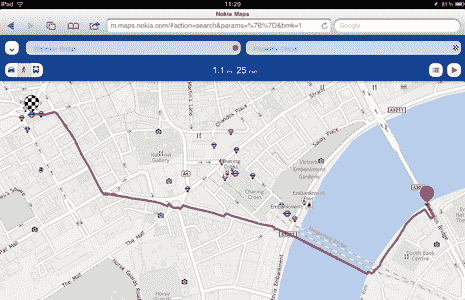

# 诺基亚地图登陆 iOS 和 Android(但仅作为一个网络应用程序)| TechCrunch

> 原文：<https://web.archive.org/web/https://techcrunch.com/2012/03/13/nokia-maps-arrives-on-ios-android-but-only-as-a-web-app/>

诺基亚刚刚宣布推出 iOS 和 Android 兼容版本的地图服务——诺基亚地图。这项服务在自己的设备上为诺基亚的本地地图应用提供动力，但并没有作为本地 iOS 和 Android 应用，而是作为基于 HTML5 的网络服务在 m.maps.nokia.com 的[可用。](https://web.archive.org/web/20230303223718/http://m.maps.nokia.com/)

除了基本的地图功能，诺基亚地图还提供导航支持，为驾车、步行或乘坐公共交通工具的人提供不同的方向。也有语音指引，但目前，这些只在你步行时提供。

在线服务还提供多种地图视图，包括显示街道和标签的默认地图视图、卫星视图、公共交通视图，甚至是实时交通视图，可以帮助您更好地规划您的路线。

然而，使用基于 web 的应用程序优于本地应用程序也有缺点。首先，该应用程序需要你的许可才能访问你的位置，以便为你提供方向——与原生应用程序不同，它不会在你下次使用该应用程序时记住你对其提示的响应。此外，当诺基亚地图提供音频方向时，你必须等待它将 2 MB 的音频文件下载到你的设备，而不是只播放音频。当然，移动网络应用程序在后台处理方面是有限的，这可能会影响你在导航过程中的多任务处理能力。

在早期测试中，在线地图服务的分辨率似乎无法与 iOS 或 Android 上的谷歌地图等原生应用程序相比，但服务本身已经足够稳定。它甚至有一个很好的、听起来像英国人的男人，他会提示你“开始你的旅程”，我不得不承认，这让开车去商店感觉像是一次冒险。

你会记得，2010 年初两家公司调整移动战略时，诺基亚地图成为了微软地图服务的核心。这就是为什么现在看到该公司试图向其他非微软平台扩张很有意思。然而，如果诺基亚真的想与谷歌地图(或许还有苹果自己即将推出的地图服务)竞争，它将需要发布一个与用户的手机和平板电脑更无缝集成的本地版本。不过，诺基亚地图的网络版将是实现这一目标的良好开端。

这款新的网络应用可以在 iPhone、iPad 或 Android (2.3+版本)设备上运行，并且可以从[m.maps.nokia.com](https://web.archive.org/web/20230303223718/http://m.maps.nokia.com/)访问。