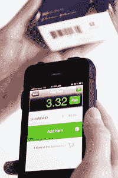

# 广场竞争对手？Cashier Live 为 iPhone 推出 POS 应用 TechCrunch

> 原文：<https://web.archive.org/web/https://techcrunch.com/2012/03/14/square-competitor-cashier-live-launches-pos-app-for-iphone/>

总部位于芝加哥、为零售商提供销售点(POS)系统的创业公司 Cashier Live 刚刚发布了一款新的 iPhone 应用程序，有点进入 Square 的领域——至少该公司是这么宣称的。该应用程序简称为[收银](https://web.archive.org/web/20221207082421/http://www.cashierlive.com/iphone-pos-app)，是 iPhone 上的一个完整的 POS 系统，旨在与 Square 自己的用于 iPad 的[收银应用程序](https://web.archive.org/web/20221207082421/https://squareup.com/register)竞争。

然而，与 [Square](https://web.archive.org/web/20221207082421/https://squareup.com/) 不同的是，它更广泛地关注中小型企业，甚至是以前负担不起信用卡的个体商户，Cashier Live 100%专注于零售商，特别是中小型零售商和特许经销商。

该公司已经有超过 15，400 家商店使用其另一款产品，一款名为 Retail Inventory 的库存管理应用程序，收银员 Live 创始人汤姆·格林豪告诉我们，因此他们也期待新的[收银员](https://web.archive.org/web/20221207082421/http://www.cashierlive.com/iphone-pos-app)应用程序的“稳固牵引力”。这家初创公司还拥有 6，630 家使用其在线收银机 Cashier Live 的企业，新款 iPhone 旨在补充或取代这一功能。他说，今天，所有这些企业客户都会收到一封电子邮件，提醒他们新的 iPhone 应用程序已经存在。

虽然格林豪承认，Square 最终很可能会将其基于 iPad 的收银机系统带到 iPhone 上(毕竟，该应用的最高评价是“请让这部 iPhone 兼容！”)，至少他对自己第一个到达那里感到兴奋。

为了处理交易，Cashier Live 与信用卡处理商 Mercury Payment Systems 合作。这项服务的交易费用各不相同，由 Mercury 设定，这意味着在某些情况下，可能会高于、低于或与 Square 持平。换句话说，它不像 Square 那样具有破坏性，每次刷卡的锁定率为 2.75%。

 然而，和 Square 一样，Cashier Live 的 app 不需要合同就可以使用，它也会提供次日存款，以便在速度上进行竞争。不过，与 Square 不同的是，Mercury 将在此时提供商户验证和承保服务，Square 在内部进行管理。

收银直播和 Square 还有一大区别:*定价*。该公司以 550.00 美元的价格出售用于 iPhone 的[这款](https://web.archive.org/web/20221207082421/http://cashierlive.com/hardware)组合条形码扫描仪/信用卡刷卡器套。与此同时，Square 的加密狗是免费发放的。当然，Square 不做条形码扫描，但 550 美元即使对于商业条形码扫描仪来说也是很高的，无线版本的条形码扫描仪通常在几百美元左右。如果该公司真的想与 Square 竞争，那么在与 Square 的免费加密狗竞争时，增加信用卡刷卡不应大幅增加成本。

格林豪承认定价可能看起来很高。“有一点我可以肯定地说，收银应用是面向实体业务的，”他解释道。“与免费加密狗相比，Linea Pro(扫描仪)看起来很贵，但它是为高容量零售店和企业打造的，他们非常愿意为这种东西付费。”

Greenhaw 还指出，这个案例将是未来的一种选择。(定价尚未确定，但计划保持在 100 美元或更低。但这款保护套不支持条形码扫描——应用程序将使用手机的摄像头。

此外，在 Square 提供无月费服务的地方，Cashier Live 有月费计划，从每月 20 美元开始，到每月 75 美元。换句话说，该公司不太专注于扰乱信用卡处理行业，而只是专注于将传统处理和条形码库存管理引入移动设备。

也就是说，收银应用程序本身有一个简单的界面，并与库存管理系统和企业客户使用的相关条形码标签相结合。它还提供了一个客户跟踪系统，企业可以在收据中使用姓名、出生日期和电子邮件地址，进行促销和查看销售历史。此外，还提供报告、Quickbooks 的集成服务以及通过 Milo 进行的本地库存营销，并计划在未来进行更多集成。

你可以在[的一个演示视频中看到这款应用。](https://web.archive.org/web/20221207082421/http://www.cashierlive.com/flv/transactions/video.html)

Cashier Live 是由汤姆·格林豪父子于 2009 年创立的。该公司于 2010 年推出，并于 2011 年 6 月推出了库存应用。创始人正在使用他们咨询公司的资金来启动这项服务，目前还没有接受外部资金。