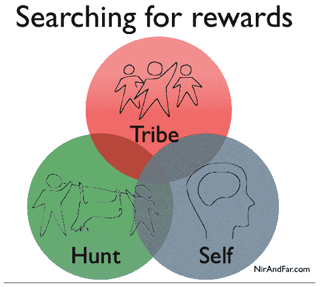

# 想勾住你的用户？把他们逼疯。

> 原文：<https://web.archive.org/web/https://techcrunch.com/2012/03/25/want-to-hook-your-users-drive-them-crazy/?guccounter=1&guce_referrer=aHR0cHM6Ly93d3cuZ29vZ2xlLmNvbS8&guce_referrer_sig=AQAAAEzvLa3ABHh88eVFNoAVAolyLBiLjr1fnZxiYlq_MHo6_B-U_3ObrFEbwGt7KSOsV5vRz3oDJF-Z1WuxSyZ8PkbscClC41gV81X_w87ows4f5RaNvpN-xhnk3oAopvZ28xdH0SX-CsQ3jcWJCh1_2gw6njY-GUBP_qaN9_R7lQFw>

**编者按:** *这篇客座博文由[尼尔·埃亚尔](https://web.archive.org/web/20230210023711/http://www.nirandfar.com/p/about-nir.html)撰写，他是两家初创公司的创始人，也是几家湾区公司和孵化器的顾问。Nir 在 NirAndFar.com[发表关于技术和行为工程的博客](https://web.archive.org/web/20230210023711/http://www.nirandfar.com/)。*

在广告中，营销人员通过承诺奖励来强化一种行为。“使用我们的产品，”他们声称，“你会得到奠定”；这是许多产品推介的要点，从[肥皂](https://web.archive.org/web/20230210023711/http://2.bp.blogspot.com/_w_RzRVebso4/SBtHs0AVVSI/AAAAAAAAAGo/MIf3wiB1n8Y/s400/axe.jpg)到[汉堡包](https://web.archive.org/web/20230210023711/http://2.bp.blogspot.com/_T3DDexShzMU/S_WmrricX7I/AAAAAAAAABc/UbEg0TdsG_o/s1600/Burger+King+Ads.jpg)。

但是在网上，反馈回路并没有起到作用。用户越来越多地被分心的事物淹没，公司发现如果他们想继续做生意，他们需要快速吸引用户。今天，公司使用的不仅仅是反馈回路。他们正在部署[欲望引擎](https://web.archive.org/web/20230210023711/http://www.nirandfar.com/2012/03/how-to-manufacture-desire.html)。

欲望引擎超越了强化行为；他们创造习惯，刺激用户自己行动，不需要像广告那样昂贵的外部刺激。欲望引擎是当今许多最容易养成习惯的技术的核心。社交媒体、在线游戏，甚至好的电子邮件都利用欲望引擎来迫使我们使用它们。

#### 无尽的寻找

欲望引擎的核心是 B.F .斯金纳在 20 世纪 50 年代描述的一种强大的认知怪癖，称为[可变奖励计划。斯金纳观察到，实验鼠对随机奖励的反应最为贪婪。老鼠会按下一个杠杆，有时它们会得到一份小礼物，有时会得到一份大礼物，有时则什么也没有。与每次接受相同奖励的老鼠不同，接受不同奖励的老鼠似乎会强迫性地按下控制杆。](https://web.archive.org/web/20230210023711/http://en.wikipedia.org/wiki/Reinforcement#Schedules_of_reinforcement)

人类，就像斯金纳盒子里的老鼠一样，渴望可预测性，努力寻找模式，即使模式并不存在。可变性是大脑认知的克星，我们的大脑将因果推理置于其他功能如自控和节制之上。

如果你曾经在某人全神贯注于电子游戏时问了他或她一个问题，得到的只是一句含糊的“当然，好吧，随便”，你就会看到这种精神状态。玩家会同意几乎任何事情来摆脱分心，继续玩下去。可变奖励似乎让大脑忙个不停，消除了它的防御，并提供了一个播种新习惯的机会。

奇怪的是，我们认为这种恍惚状态很有趣。这是因为我们的大脑会无休止地寻找下一个奖励，永远不会满足。最近的神经科学研究表明，我们的多巴胺系统不是为我们的努力提供奖励，而是通过诱导一种我们称之为欲望的半压力反应来让我们继续寻找。

虽然这有时会让我们痛苦，但正是这种精神上的努力让我们作为一个物种生存了下来。我们是这个星球上最好奇的物种，比任何其他动物都更了解我们的环境。但是，正是这种无止境、永不满足的探索冲动，从许多新技术中创造了习惯性行为。

可变奖励有三种类型，包括持续的追求:部落奖励、狩猎奖励和自我奖励。尽管工具发生了变化，但每种工具的基本动机与 20 万年前是一样的。

【T2

#### 部落的奖励

我们是相互依赖的物种。我们有特别适应的神经元来帮助我们感受他人的感受，这提供了我们通过对彼此的同情而生存的证据。我们注定是一个部落的一部分，所以我们的大脑会寻找让我们感到被接受、重要、有吸引力和被包容的奖励。

难怪社交媒体的使用在过去几年呈爆炸式增长。仅举两个最受欢迎的例子，脸书和 Twitter 在不同的时间表为超过 10 亿人提供了强大的社会回报。对于每一条推文和帖子，用户都想知道他们会得到多少社会认可。我们甚至用 Klout 来衡量我们的影响力，给我们的影响力定一个数字。

#### 狩猎的回报

尽管我们善于交际，但我们个人对食物的需求更为重要。获取食物和供应品等物质的需求是大脑操作系统的一部分，如果没有这种冲动，我们显然无法生存一千年。但是我们曾经猎取食物，今天我们猎取交易和信息。

让我们不断寻找食物的同一种冲动迫使我们打开来自 Groupon 和 Appsumo 的电子邮件。新的购物创业公司通过引入用户下一步可能发现的可变性，使寻找产品变得有趣。Pinterest 和 Wanelo 用源源不断的视觉糖果让用户继续搜索，这是一个令人垂涎的多巴胺宝库。

要了解搜索信息如何吸引用户的例子，只需看看本页的右侧。在那里，你会找到一个热门帖子的列表。这份名单使用有趣的图片和简短、引人注目的文字，是一种可变的奖励机制，旨在让你不断寻找下一个发现。

#### 自我奖励

最后，还有我们为个人满足而寻求的可变奖励。例如，从出生开始，刺激我们感官的事物就使我们着迷。婴儿把所有东西都放进嘴里的原因和拉斯维加斯闪烁的霓虹灯一样。我们喜欢新奇的感官刺激。

我们也寻求掌控我们周围的世界。游戏机制随处可见，从 Zynga 游戏到商业生产力应用程序，如待办事项，提供了一个围绕我们控制、支配和完成挑战的需求而建立的可变奖励系统。删除收件箱中的新邮件会刺激神经元，类似于玩星际争霸时所刺激的神经元。

#### 有效的混合

上面提到的几乎所有技术都结合了三种类型的可变奖励，增加了它们在创造用户习惯方面的有效性。例如，电子邮件会让人上瘾，因为它随机提供所有三种奖励类型。首先，我们有回复邮件的社会义务(部落)。我们也习惯于知道电子邮件可能会告诉我们关于潜在商业机会的信息(狩猎)。

最后，我们的电子邮件似乎要求我们完成删除未开封物品通知的任务，这是一种挑战，以获得对它(自我)的控制。有趣的是，一旦我们真正打开了所有的电子邮件，这些动机就消失了，神秘感也消失了。我们沉迷于检查电子邮件，而奖励仍然有可变性，一旦没有了，电子邮件就在我们的收件箱里萎靡不振。

正如 B.F .斯金纳在 50 多年前发现的那样，可变奖励是产生强迫行为的强大诱因。如今，科技公司正在通过一系列欲望引擎来培养用户的新习惯，而可变奖励会引发连锁反应。了解是什么促使我们采取行动，让我们能够构建符合用户兴趣的产品，并更好地控制我们自己的技术引发的行为。

图片来源:[电神经](https://web.archive.org/web/20230210023711/http://www.flickr.com/photos/65973294@N00/2688827686/)