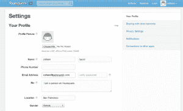

# Foursquare 将个人简介添加到个人资料页面，发展成为一个更加独立的社交网络 TechCrunch

> 原文：<https://web.archive.org/web/http://techcrunch.com/2012/03/29/foursquare-adds-bios-to-profile-pages/>

# Foursquare 将个人简介添加到个人资料页面，发展成为一个更加独立的社交网络

Foursquare 今天[推出了](https://web.archive.org/web/20230209124957/https://twitter.com/#!/foursquare/status/185467842521612289)功能，用户可以在网站的个人资料页面上添加简短的个人“简历”。这些 bios 被限制在 160 个字符或更少，可以直接从用户的 Twitter 帐户导入或从头开始编写。

这是 Foursquare 从一个插入脸书和 Twitter 等网站的有趣应用程序向一个更加独立自主的社交网络发展的又一小步。自从该公司去年夏天以 6 亿美元的估值获得[5000 万美元的融资](https://web.archive.org/web/20230209124957/https://techcrunch.com/2011/06/24/foursquare-closes-50m-at-a-600m-valuation/)以来，Foursquare 一直在稳步增加新功能，如[餐厅推荐](https://web.archive.org/web/20230209124957/https://techcrunch.com/2012/01/18/foursquare-explore-menus/)和[被动位置检测](https://web.archive.org/web/20230209124957/https://techcrunch.com/2011/10/12/foursquar-radar/)，旨在丰富应用的用户体验，增加其粘性。bios 的加入也是出于同样的原因，因为它可以让人们开始关注其他 Foursquare 用户，这些用户在现实生活中并不一定因为兴趣而认识。就像人们经常使用 Twitter 跟踪说有趣事情的陌生人一样，人们可以开始使用 Foursquare 跟踪去有趣地方的陌生人。当然，这已经发生了，但是 bios 的加入更加鼓励了它。

总的来说，这些举措似乎在起作用:它的用户数量在全球[和](https://web.archive.org/web/20230209124957/https://techcrunch.com/2012/03/02/video-dennis-crowley-says-half-of-foursquares-users-are-outside-the-u-s-tctv/)都在增长，投资者似乎对 Foursquare 的发展也很满意。正如我们自己的 Eric Eldon 本月早些时候报道的那样，据说 Spark Capital 已经从员工手中购买了超过 5000 万美元的公司股票。

但是这不是三岁的 Foursquare 公司放松的时候。社交位置移动领域的应用程序(也被称为 SoLoMo 的[)比以往任何时候都更热门，新加入的应用程序如](https://web.archive.org/web/20230209124957/https://techcrunch.com/2012/03/24/die-solomo-die/) [Highlight](https://web.archive.org/web/20230209124957/http://highlig.ht/) 和 [Glancee](https://web.archive.org/web/20230209124957/http://www.glancee.com/) 正在获得大量的关注[。像今天这样的小规模、迭代式的功能添加表明，随着竞争的不断加剧，Foursquare 仍在继续努力。](https://web.archive.org/web/20230209124957/https://techcrunch.com/2012/03/03/myhighlight/)