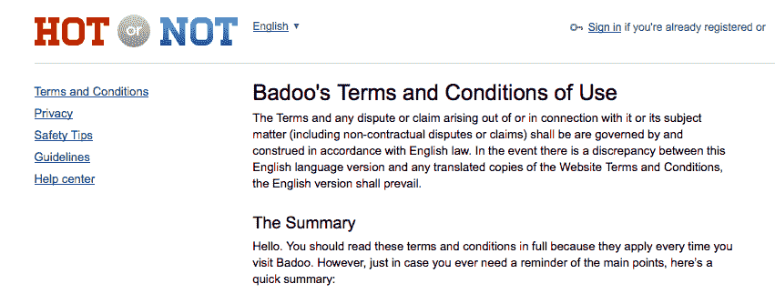

# 更新:交友网站 Badoo 有没有找到热不热形式的恋爱对象？TechCrunch

> 原文：<https://web.archive.org/web/https://techcrunch.com/2012/04/02/has-dating-site-badoo-found-a-love-match-in-the-form-of-hotornot/>

也许甚至约会网站也应该在他们人生的某个时刻找到一个特别的人……看起来英国约会网站 [Badoo](https://web.archive.org/web/20230217185339/http://www.badoo.com/) 已经与美国竞争对手[联手，Badoo 签署了一项白色标签协议，为这家较小的网站提供动力。](https://web.archive.org/web/20230217185339/http://www.hotornot.com/)

两家公司尚未发布任何形式的正式版本，但 Hot or Not 现在拥有与 Badoo 相同的注册用户数量(1.46 亿+)，Hot or Not 现在直接向用户推荐 Badoo 的条款和条件(如下图)。也有一些从用户那里观察到的迹象…

某个在 Hot or Not 上做版主的人向[雅虎回答](https://web.archive.org/web/20230217185339/http://au.answers.yahoo.com/question/index?qid=20120401162748AAlIWx9)提出了一个问题，说她的版主登录现在直接进入 Badoo。流行文化博客 PopCannon 在 Twitter 上指出,【Hot or Not“再一次”改变了，随着 Badoo 品牌在网站上的出现，收视率已经消失。

与此同时,《辣不辣》的脸书粉丝现在也是 Badoo 的粉丝了。

Badoo 是这两个网站中较大的一个，它说目前它的用户遍布 180 个国家。

虽然 Badoo 更像是一个社交网络，而不是一个直接的约会网站，而 Hot or Not 更像是一个类似游戏的评级网站，但 y  你可以看到，随着 Badoo 向用户扩展其提供的功能，这两者可能会互补。

你也可以想象，随着时间的推移，这样的网络需要扩大规模才能生存——这也是它们加入的另一个原因。

我们正在联系这两家公司，试图弄清楚到底发生了什么，并将随着我们了解的更多而更新。

**更新**:这在很大程度上是对 Badoo 和 Hot 与否的衡量。Badoo 已经向我们证实了这是一笔白标交易，在这笔交易中，它代表自己有效地支持 Hot Not 的服务。它没有披露任何财务条款。

这笔交易标志着 Badoo 的另一个发展方向:作为其他社交网络的骨干 B2B 提供商。其他也像这样使用 Badoo 服务的网站还有[gentemessenger.com](https://web.archive.org/web/20230217185339/http://gentemessenger.com/)和[clubnx.com](https://web.archive.org/web/20230217185339/http://clubnx.com/)。虽然 icq 在这个过程中保留了很多自己的品牌，但其他两家基本上都被恶搞了。Badoo 说它搞错了:它不再与 icq.com 合作。

在与热门与否的联系上，一位发言人告诉我们，这笔交易有吸引力有两个原因。首先，它让 Badoo 在美国市场取得了更多进展，因为这是 Badoo 在美国签署的第一份白标协议

第二，Badoo 已经有了一个产品，名为 Encounters，类似于热门与否的照片评级游戏。“我们认为我们可以在热门与否游戏的基础上增加额外的功能，让网站对热门与否的用户更好，”她说。

变化发生在周末，Badoo 仍在解决一些问题。“一旦我们解决了这个问题，热门或不热门的用户都会被告知这个变化，”她补充道。“虽然有些功能可能看起来有所不同，但最终，无论热门与否，用户都会获得更多的功能，比如更多的消息和搜索功能。”