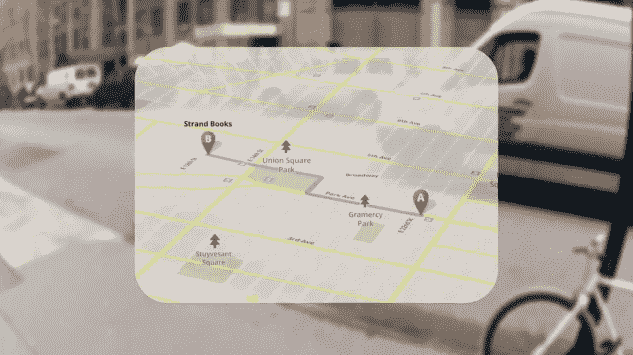
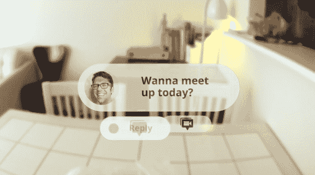

# 苹果和脸书应该害怕谷歌眼镜

> 原文：<https://web.archive.org/web/https://techcrunch.com/2012/04/04/apple-facebook-project-glass/>

[谷歌的增强现实眼镜](https://web.archive.org/web/20221205215312/https://beta.techcrunch.com/2012/04/04/google-project-glas/)即将颠覆你的面貌和商业模式。如果你甚至不需要拿出手机来拍照、指路或给朋友发信息，那你为什么还要买最新款的 iPhone 或在脸书上花这么多时间呢？

谷歌眼镜到达商店可能还需要一年时间，但这就是为什么这些公司和其他科技公司现在需要制定战略。如果他们等着看这款设备是否成功，等到他们适应的时候，世界可能已经戴上了谷歌眼镜。苹果和脸书的赌注可能是联手…

【T2

如果你还没听说，[谷歌今天宣布](https://web.archive.org/web/20221205215312/https://plus.google.com/111626127367496192147/posts)它开始公开测试代号为 Project Glass 的增强现实眼镜。一个令人垂涎的[模拟视频](https://web.archive.org/web/20221205215312/https://beta.techcrunch.com/2012/04/04/google-project-glas/)展示了该设备最终可能具备的功能，展示了某人使用语音命令发送信息、拍照、分享到 Google+、查看朋友的位置、查看地图、获取方向、设置日历提醒等等。

将所有功能塞进一副时尚的眼镜需要时间和精力，但谷歌(Google)skunk labs 正在努力。该产品有十几种失败的方式，最明显的是如果眼镜不方便、不时尚，但如果它们太重、太贵、太脆弱，或者这个世界还没有完全准备好。让我们暂时忘记这些。假设谷歌发现了这一点，谷歌眼镜的零售版本(最终可能会被称为谷歌眼)变得非常受欢迎。这将如何扰乱苹果和脸书，他们应该做些什么来保护自己？

以下是我认为他们的最佳行动方案:

#### 苹果应该参与竞争

Project Glass 将大量你用 iPhone 和 iPod 做的东西放进你的眼镜里。这款眼镜可能会运行一个版本的安卓系统，由于它们是语音控制的，它们可能会成为谷歌对 Siri 的竞争对手。人们可能会购买谷歌眼镜，而不是抢购最新的苹果设备。

【T2

但苹果是世界上最伟大的硬件公司。希望在其总部深处的某个地方，有一些科学家正在研究如何将 iPhone 变成眼镜，而不仅仅是手表。

苹果应该寻求利用谷歌缺乏硬件经验的优势，并动用部分现金储备锁定关键零部件制造商。即使谷歌眼镜项目以丑陋的混乱告终，苹果仍然可以让眼镜计算变得美好。这项技术看起来很有前途，所以苹果需要做好突袭的准备。但问题仍然是，它没有社交网络或其他关键服务来支持自己的版本……”

#### 脸书应该与苹果合作

脸书不是硬件公司，也没有大到足以成为硬件公司。没有自己的移动操作系统或设备正在伤害脸书，眼镜计算可能会进入第二轮。视频已经显示 Google+是首选的分享方式。与只能打开脸书应用的安卓手机不同，谷歌眼镜项目不一定允许第三方应用，至少在一开始是这样，而且可能会比内置的 Google+更难访问。

尽管脸书和苹果迄今关系紧张，脸书甚至还没有像 Twitter 一样直接整合到 iOS 中，但两家公司可以在谷歌眼镜项目的共同威胁下建立联系。苹果需要一个地方来分享你用它的眼镜创造的内容，或者为什么要创造它？脸书需要确保苹果让它深入人心，不管有没有 Twitter 的支持。(不过，脸书或许应该从今天的 iOS 说起)。

后记:如果苹果或脸书认为眼镜计算在未来几年将成为主流市场，今天应该会让他们大吃一惊。不过现在还为时过早，所以如果他们没有计划，他们只需要感到害怕。

##### 但是有一点很奇怪…

尽管缺乏硬件经验，谷歌是制造或至少提供眼镜电脑软件的最佳公司。它有安卓、谷歌+、地图、Gmail、Gcal、纬度等等。谷歌眼镜可能会破产，但如果不是这样，它可能会给一些缓慢的服务注入活力。这就是为什么当人们把玻璃项目称为转移注意力或浪费资源时，这是很荒谬的。在我看来，谷歌的愿景是 20/20。

*此外，请查看:*
[这里有一个有趣的、更真实的谷歌眼镜项目[视频]](https://web.archive.org/web/20221205215312/https://beta.techcrunch.com/2012/04/05/heres-a-more-realistic-look-at-googles-project-glass-video/)

[当谷歌眼镜落在你的脸上时，它可以被称为谷歌眼](https://web.archive.org/web/20221205215312/https://beta.techcrunch.com/2012/04/05/google-eye/)