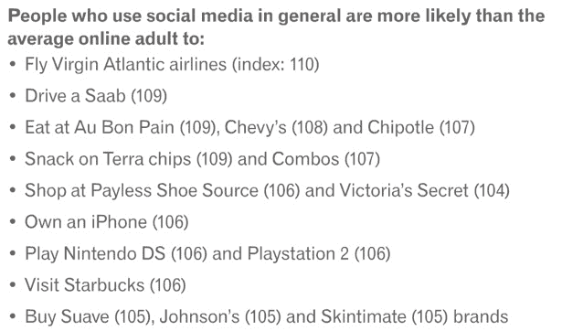
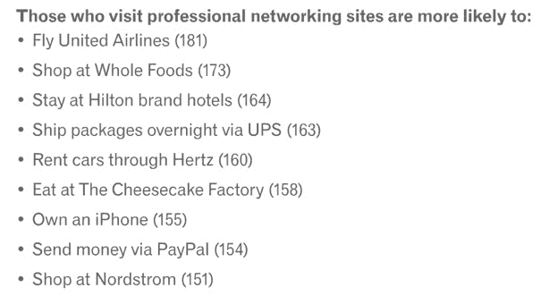

# 热爱社交媒体？你可能也是 Chipotle、萨博和维多利亚的秘密 TechCrunch 的粉丝

> 原文：<https://web.archive.org/web/https://techcrunch.com/2012/04/06/love-social-media-chances-are-youre-also-a-fan-of-chipotle-saab-and-victorias-secret/>

# 热爱社交媒体？你可能也是 Chipotle、萨博和维多利亚的秘密的粉丝

根据 Experian Hitwise 的一份新报告，91%的网络成人现在经常以某种形式使用社交媒体。这使得社交网络成为当今美国最热门的在线活动，15%的美国互联网访问都是通过社交网站进行的。益百利的报告还发现，Pinterest 现在是美国第三大最受欢迎的社交网络，仅次于脸书和 Twitter。然而，比这些排名更有趣的是，报告告诉我们关于社交媒体最狂热用户的信息。

例如，益百利发现，经常使用社交媒体的人比普通在线成人更有可能乘坐维珍航空的航班。这些社交媒体用户也更有可能驾驶萨博，拥有 iPhone，在 Au Bon Pain，Chevy's 和 Chipotle 吃饭，在 Payless Shoe Source 和维多利亚的秘密购物。

有趣的是，那些比普通互联网用户更多访问 LinkedIn 等职业社交网站的成年人实际上更喜欢联合航空公司(他们可能更感兴趣的是收集常旅客里程和获得升级)、全食超市和奶酪蛋糕工厂。不过，就像普通的社交媒体用户一样，那些经常访问专业社交网站的人也比普通美国成年人更有可能拥有 iPhone。

【T2

