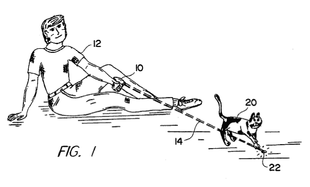

# 专利法 101:错在哪里，如何改正

> 原文：<https://web.archive.org/web/https://techcrunch.com/2012/04/08/patent-law-101-whats-wrong-and-ways-to-make-it-right/>

在最高法院对普罗米修斯诉梅奥案做出裁决后，专利博客被点燃。一些人欢呼这一决定是“[未来进步的先兆](https://web.archive.org/web/20221005214106/http://opensource.com/law/12/3/prometheus-bound-important-precedent-next-software-patent-case)”，而另一些人则谴责它揭示了“法院对科学、哲学和语言的细微差别了解得多么少——更不用说专利法本身了。用“有争议的”来形容这个决定可能是一种保守的说法。

该意见主要集中在《美国专利法》第 101 条，该条规定了符合专利条件的主题的基本类别。法令简短而甜蜜:“任何人发明或发现任何新的和有用的工艺、机器、制造或物质组成，或任何新的和有用的改进，都可以获得专利……”如此简单，对吗？

显然不是。在解释第 101 条时，法院一直坚持认为抽象概念、自然现象和自然法则没有资格获得专利保护。法院也(不太一致地)认为数学算法要么是抽象概念，要么是自然法则。软件本质上是由数学算法组成的。因此，第 101 条的司法解释可以一劳永逸地决定软件专利是否有效。如果你对软件专利很认真，你会屏住呼吸阅读普罗米修斯诉梅奥案。

案例:普罗米修斯实验室申请了一项测试专利，以确定硫嘌呤的适当剂量，硫嘌呤是一种用于治疗胃肠疾病的药物。硫嘌呤的问题在于，含量过低时药物无效，而含量过高时则有毒——更糟糕的是，不同的人对药物的代谢方式不同。

尽管科学家们知道血液代谢物的水平与有效治疗相关，但 Prometheus 发现了这种相关性的特定范围，并为一项测试申请了专利，该测试主要涉及(1)施用硫嘌呤药物和(2)确定血液代谢物的浓度是否在特定范围内。梅奥实验室从普罗米修斯公司购买这些测试有一段时间了，但最终还是自己开发并销售了自己的测试。普罗米修斯公司对梅奥专利侵权提起诉讼。

我知道你在想什么。这些和软件有什么关系？

事实证明，软件专利多年来一直困扰着最高法院。1978 年，法院[第一次拒绝授予数学算法](https://web.archive.org/web/20221005214106/http://en.wikipedia.org/wiki/Parker_v._Flook)专利保护，但随后在 1981 年认为[一个具有新颖元素的过程，包括软件，如果软件与特定的机器](https://web.archive.org/web/20221005214106/http://en.wikipedia.org/wiki/Diamond_v._Diehr)相关联，可以获得专利。正如加州大学伯克利分校[的 Menell 教授所说的](https://web.archive.org/web/20221005214106/http://www.law.stanford.edu/display/images/dynamic/events_media/Forty%20Years%20of%20Wondering%20in%20the%20Wilderness%20and%20No%20Closer%20to%20the%20Promised%20Land.pdf)，“在软件占主导地位的第一个十年里，在将一个世纪前的专利判例应用到一个无定形的、快速发展的技术领域时，[先前的判例法]产生了更多的热量而不是光。”说得好。

1998 年，联邦巡回法院裁定[软件本身可以申请专利](https://web.archive.org/web/20221005214106/http://en.wikipedia.org/wiki/State_Street_Bank_v._Signature_Financial_Group)，不需要任何特定的机器，只要发明产生了“有用的、具体的、切实的结果”然而，这一切在 2008 年发生了变化，当时联邦巡回法院用“机器-或-转换测试”取代了这一“有形结果”标准(为了简洁起见，称之为“MoT”)。MoT 规定，如果(1)与特定的机器或设备相关，或者(2)将特定的物品转化为不同的状态或事物，则所主张的方法符合专利条件。

最高法院[确认了这一判决](https://web.archive.org/web/20221005214106/http://en.wikipedia.org/wiki/Bilski)，但指出 MoT 不是专利性的唯一测试，尽管它是“一个有用而重要的线索，一个调查工具。”从那以后，大多数下级法院继续依靠 MoT 来评估软件专利，几乎没有其他的指导。

这很不幸，因为 MoT 失败了。这一失败在一定程度上要归咎于专利系统的现状——有些荒谬，初创公司基本上忽略了之前的专利(无论如何，数量太多了，无法审查),大公司囤积和交叉许可几乎毫无价值的专利，以保护自己免受可能会攻击它们的专利巨魔的攻击。

我最喜欢的 MoT 缺点的例子是臭名昭著的“[训练猫](https://web.archive.org/web/20221005214106/http://www.google.com/patents/US5443036)的方法”，它包括将激光笔对准猫的附近，然后移动激光笔，“以便使明亮的光图案以不规则的方式移动，吸引猫和任何其他具有追逐本能的动物。”法官们评论说，这项专利可以满足 MoT，因为“久坐不动的猫变成了健康的猫”——它涉及到一种转变(猫的物理属性)和一种特定的机器(激光笔)。

更多的笔墨可以用来揭露 MoT 的许多错误，但是你应该明白。MoT 被认为是将专利限制在技术或工业过程中，它被塑造成一个看门人，一个门槛分析，如果你愿意的话。根本问题在于，MoT 让尾巴摇狗(或猫)，关注的是一项新发明是“绑在特定的机器上”还是“改造了特定的东西”，而不是发明本身。

法院似乎不能做得更好。这反映了创建一个有效的“看门人”测试的巨大困难，该测试围绕快速变化的技术类别画出概念圈，并明确地说，作为一个门槛问题，什么在里面，什么在外面。相反，我们需要一种直接关注发明及其实际应用的方法，以及如果获得专利，是否会因为排除了创新的基本构件而阻碍进一步的发现。这就是 101 条款的真正含义。

回到*普罗米修斯诉梅奥*:考虑到这些问题，许多人希望最高法院能在应用第 101 条时提供一些急需的指导。我想这是痴心妄想。最高法院最终裁定，代谢物相关性本身是自然法则，普罗米修斯公司没有“给相关性增加足够的*来允许他们描述的过程符合专利资格。”*

法院的理由是，“如果自然法不可授予专利，那么阐述自然法的过程也不可授予专利，除非该过程具有额外的特征，提供实际保证，该过程不仅仅是旨在垄断自然法本身的起草工作。”

什么样的“T0”足够“T1”使工艺专利合格？什么样的“附加特征”能够提供必要的实际保证？法院没说。虽然在法院看来“*够了*”这个词用斜体字很有帮助，但是斜体字本身并不能给模糊不清的标准增加清晰度。虽然我们可以为对自然法则垄断的担忧叫好，但简单地说普罗米修斯没有给这些法则加上足够的*，基本上是没有用的。*

 *法院还指出，“所主张的过程中的步骤(除了自然法则本身之外)涉及到该领域的研究人员以前从事过的广为人知的、例行的、常规的活动。”正如法院所说，这些步骤并不包括“足以确保专利在实践中远远超过自然法本身的专利的‘发明概念’。”

因此，除了代谢物水平和有效治疗之间的相关性(这是一个不可专利的自然法则)，普罗米修斯开发的测试没有任何“创造性”；实际上，他们只是想为一个潜在的自然法则申请专利。

这个分析全是烂的。第 101 条告诉我们哪类发明有资格获得专利保护。第 102 条告诉我们一项发明要获得专利必须具备的品质(即新颖性)。第 101 条规定的专利资格和第 102 条规定的专利性是不同的(尽管它们听起来很相似)。

法院不应该把 102 条款的分析偷偷带入 101 条款的调查。事实上，在我前面提到的那个 1981 年的案例中，最高法院特别指出，“一个过程中的任何要素或步骤，甚至是过程本身的‘新颖性’,在确定一项权利要求的主题是否属于[部分] 101 类可能的可专利主题时是无关紧要的。”看，都是坏事。

关键是最高法院没有给我们所需要的东西；事实上，从理论的角度来看，这可能使事情变得更糟。这一点尤其正确，因为该意见支持这样一种观点，即第 101 条是一个必须在根据第 102 条、第 103 条或第 112 条进行任何分析之前决定的临界调查。法院仍然将第 102 条原则偷偷带入其第 101 条调查，这很能说明问题——它告诉我，门槛方法不是一个很好的方法。

尽管如此，在意见的结尾还是有一些令人鼓舞的语言:

> 毕竟，专利保护是一把双刃剑。一方面，专有权的承诺提供了金钱激励，从而导致创造、发明和发现。另一方面，这种排他性会阻碍信息的流动，而这种流动可能会允许，甚至刺激发明…

这是我们都同意的事情。这也表明了最高法院愿意从政策的角度考虑专利法的原则。也许我们正看到这一方向的转变，更多地关注发明、其实际应用以及专利对进一步发现的影响。毕竟，这是第 101 条的真正内容。

另一种可能性是法院在向国会妥协。在倒数第二段，法院说，“我们必须认识到国会在必要时制定更精细的规则的作用。”我不会屏住呼吸。

丹尼尔·麦肯齐是加州的一名律师。他于 2004 年从斯坦福大学毕业，除了在旧金山湾区北部的一家活跃的私人诊所外，还为各种娱乐创业公司提供咨询。*