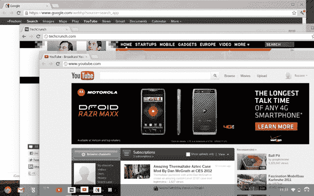

# 谷歌的 Chrome 操作系统将很快看起来更像 Windows，而不是浏览器

> 原文：<https://web.archive.org/web/https://techcrunch.com/2012/04/09/googles-chrome-os-will-soon-look-more-like-windows-than-a-browser/>

# 谷歌的 Chrome 操作系统将很快看起来更像 Windows，而不是浏览器

很难说谷歌以浏览器为中心的操作系统 Chrome OS 真的有多受欢迎。不过，毫无疑问，谷歌对这一举措是相当认真的。今天，谷歌发布了最新的 Chrome 操作系统开发者版本，这是自 2010 年末推出以来该操作系统界面的首次重大重新设计。

在这个新版本中，Chrome OS 看起来几乎像一个传统的操作系统，有一个成熟的桌面和窗口管理器，而不仅仅是一个浏览器和标签。 [Aura](https://web.archive.org/web/20230407013326/https://sites.google.com/a/chromium.org/dev/developers/design-documents/aura/aura-overview) ，这款硬件加速的窗口管理器被称为 Chrome 的下一代用户界面框架，它将在 Chrome OS 的新开发者版本中首次公开亮相。

这次更新与 Chrome OS 的起源大相径庭。到目前为止，Chrome OS 基本上只允许用户一次访问一个浏览器窗口(你可以在单独的虚拟屏幕上打开多个浏览器窗口)，启动新的应用程序意味着你必须首先打开一个新的标签，然后寻找你想要启动的应用程序。现在，Chrome OS 配备了一个类似于[的 Launchpad](https://web.archive.org/web/20230407013326/http://en.wikipedia.org/wiki/Launchpad_(Mac_OS_X)) 的应用程序启动器，以及一个类似于 Windows 的[任务栏](https://web.archive.org/web/20230407013326/http://en.wikipedia.org/wiki/Taskbar)(谷歌称之为“书架”)。值得注意的是，应用程序仍然在浏览器标签中启动，而不是作为独立的窗口。

简而言之，Chrome 操作系统现在的外观和行为更像它试图挑战的桌面操作系统。

在某种程度上，这几乎让人觉得谷歌在这里承认失败了。Chrome 操作系统发布时，谷歌的谢尔盖·布林[认为](https://web.archive.org/web/20230407013326/http://www.networkworld.com/news/2011/051111-chrome-os-first-look.html)传统的个人电脑操作系统正在“折磨用户”Chrome OS 被认为是“速度、简单和安全”的代名词，谷歌希望用它来“重新思考操作系统应该是什么样的”然而，这个新版本摒弃了这种简单性，支持更强大的功能。不过，这未必是一件坏事，可能只是帮助 Chrome OS 获得更多主流接受，因为新用户肯定会发现这是一种更熟悉的体验。

虽然 Aura 显然是这次更新的明星，但值得注意的是，最新版本还引入了对。焦油，。gz 和. bzip2 格式，以及对多显示器设置的更好支持。