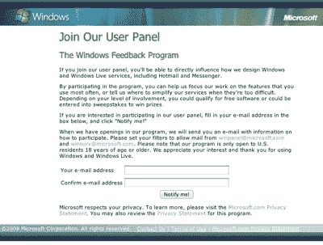

# 微软需要你的帮助:承诺免费软件以换取 Windows 8 反馈 TechCrunch

> 原文：<https://web.archive.org/web/https://techcrunch.com/2012/04/13/microsoft-needs-your-help-promises-free-software-in-return-for-windows-8-feedback/>

# 微软需要你的帮助:承诺免费软件以换取 Windows 8 反馈

随着 Windows 8 的发布日期越来越近，微软今天[宣布](https://web.archive.org/web/20221208111332/http://windowsteamblog.com/windows/b/windowsexperience/archive/2012/04/13/the-windows-feedback-program.aspx)它正在寻找志愿者加入其针对美国活跃的 Windows 7 和 Windows 8 消费者预览版用户的[仅限邀请的反馈计划](https://web.archive.org/web/20221208111332/http://wfp.microsoft.com/signup.aspx)，作为对向微软提供反馈的回报——通过发送公司数据或填写调查问卷——参与该计划超过四个月的参与者将有资格获得“免费软件和 Xbox 游戏，如 Microsoft Office 2012、Kinect 迪士尼乐园和 Forza Motorsport 4”

在今天的声明中，微软通讯经理 Brandon LeBlanc 强调这并不是提交错误报告的一种方式。相反，这里的想法是帮助微软“通过更广泛地了解您对我们产品的看法和体验来构建更好的软件。”

 微软会选择这个时间点来突出这个项目有点奇怪。毕竟，Windows 反馈程序已经运行多年了。事实上，反馈计划的注册是从 2009 年开始的。虽然注册表单特别提到志愿者还将被要求提供关于 Windows Live 的反馈，包括 Hotmail 和 Messenger，但今天的公告将重点放在 Windows 7 和 8 上。

该公司今天发出这一呼吁，很可能是因为它正在寻找更多关于 Windows 8 用户体验的数据(这种用户体验肯定还需要一些工作)。不过，感觉现在在 Windows 8 开发周期中要求这种数据已经相当晚了。