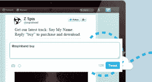
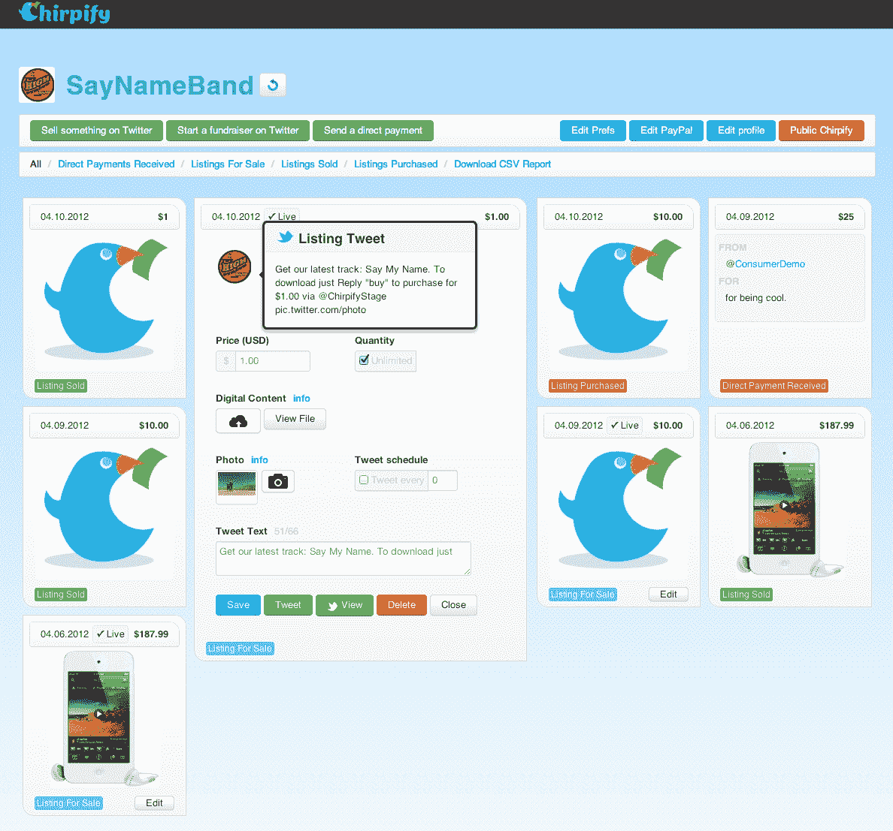

# 凭借来自 Voyager & More 的 130 万美元，Chirpify 为 Twitter TechCrunch 带来了直接音乐和门票销售

> 原文：<https://web.archive.org/web/https://techcrunch.com/2012/04/24/chirpify-series-a/>

当你想到 Twitter 的时候，你可能会想到实时新闻，或者 CRM，或者品牌营销，甚至贾斯汀比伯，但是“电子商务”呢？大概不会。在社交网络领域，脸书通常被认为是最倾向于电子商务的，因为它的[“F-Commerce”](https://web.archive.org/web/20230209125310/http://en.wikipedia.org/wiki/Social_commerce#Facebook_Commerce_.28f-commerce.29)但是到目前为止，消费者还没有真正爱上品牌[在脸书](https://web.archive.org/web/20230209125310/https://techcrunch.com/2012/04/20/facebook-event-marketing/)复制他们的店面的想法。与此同时，Twitter 的重点在其他地方，因此，尽管它在增长，但这家社交网络尚未发挥其自身的电子商务潜力。这就是为什么位于波特兰的 [Chirpify](https://web.archive.org/web/20230209125310/http://chirpify.com/) 开发了一个平台，将 Twitter 从一个广播平台转变为一个交易平台。

今年 2 月，Chirpify [从 SellSimp.ly 更名而来，并推出了一个 Twitter 商务平台](https://web.archive.org/web/20230209125310/https://techcrunch.com/2012/02/15/sell-simp-ly-rebrands-as-chirpify-launches-new-twitter-commerce-platform-for-brands/)，允许品牌和消费者在不离开 Twitter 的情况下通过 Twitter 进行购买、销售、捐赠和交易。自推出以来，Chirpify 的吸引力越来越大，这在一定程度上要归功于 SXSW 推出的一项名为[“Tweet-a-Beer”](https://web.archive.org/web/20230209125310/http://tweet-a-beer.com/)的推广活动，该活动利用这家初创公司的 API，允许人们通过 Twitter 互相购买一品脱啤酒。这场运动极大地提高了 Chirpify 的流量，每秒钟就有两个新用户注册——chirp ify 创始人克里斯·特索告诉我们，这一活动在 SXSW 之后持续了几周。尽管此后速度有所放缓，但这场运动证明，通过 Twitter 进行直接交易不仅是可能的，而且非常容易，一条 Twitter 就能做到。

如今，这家初创公司的 Twitter 直销模式正式得到了进一步的验证——这一次是以资本的形式——因为这家初创公司宣布已获得 130 万美元的 A 轮融资。新一轮投资增加了它从孵化器[新贵实验室](https://web.archive.org/web/20230209125310/http://www.upstartlabs.com/)筹集的 5 万美元种子资金，由[航海家资本](https://web.archive.org/web/20230209125310/http://www.crunchbase.com/financial-organization/voyager-capital)牵头，参与投资的有[杰夫·恩特斯](https://web.archive.org/web/20230209125310/http://www.crunchbase.com/person/geoff-entress)，BuddyTV 首席执行官[安迪·刘](https://web.archive.org/web/20230209125310/http://www.crunchbase.com/person/andy-liu)，前脸书高管[鲁迪·加德勒](https://web.archive.org/web/20230209125310/http://www.crunchbase.com/person/rudy-gadre)，Hootsuite 首席执行官[瑞安·霍姆斯](https://web.archive.org/web/20230209125310/http://www.crunchbase.com/person/ryan-holmes-3)，以及[蒂·俄勒冈天使](https://web.archive.org/web/20230209125310/http://www.crunchbase.com/company/tie-angels)。

 为了防止对 Chirpify 的工作方式有任何混淆，简单来说，当用户注册 Chirpify 时，他们将自己的 Twitter 和 PayPal 账户连接到平台。商家把他们想卖的任何东西上传到他们的仪表板上，并在推特上发布链接。消费者只需回复推文，并附上“购买”。嘭，Chirpify 通过 DM 向您发送安全下载，费用从您的 PayPal 帐户中扣除，资金立即转移到商家的帐户，此时他们会收到收据。

任何人都可以在 Chirpify 上出售、购买或捐赠。即使这个过程听起来很复杂，其实不然。因此，人们越是考虑到这个平台提供了一种将推文转化为交易的简单方式，并且看到人们已经使用 Twitter 来关注他们最喜欢的品牌、音乐人和他们关心的其他人，为什么不让用户通过推文购买最新的产品或下载最新的歌曲呢？除了宣布融资之外，Chirpify 今天还推出了针对数字内容的 Twitter Commerce，让音乐人能够在 Twitter 上直接向粉丝出售歌曲和音乐会门票(副产品是增加了对自己发行的控制)。

虽然 Chirpify 正在与音乐人和唱片公司合作，但 Teso 表示，最初的目标是让这种合作适用于任何品牌、活动、产品或服务。(接下来，Chirpify 计划与电子书供应商合作。)这是因为 Chirpify 很酷的一点是，它可以在 Twitter 的任何地方工作，在移动设备、桌面或平板电脑上，这种直接商业甚至适用于转发推文——这有可能通过允许待售商品到达更多的流，从而获得更多的眼球，从而产生一些严重的放大效应。

但是，如果你的品牌或乐队已经在使用店面来管理交易呢？Chirpify 还提供与现有电子商务商店(例如 Magento)的集成，以便品牌可以利用后端履行、列表和交易管理。商家只需在他们的电子商务或 Chirpify 仪表板上点击“Twitter 上的列表”按钮，就可以设置价格、数量、运输价格和运输时间。

Chirpify 的解决方案一开始是免费的，初创公司从每笔交易中抽取 4%的佣金，但对于那些希望使用 Chirpify 进行更频繁业务的商家，该平台提供了一个企业计划，根据具体情况进行定价。价格通常从每月 500 美元左右开始，但去除了 4%的 Chirpify 佣金，并增加了电子商务平台集成、优先支持、联合品牌等。

目前，Chirpify 的唯一支付系统是 PayPal，但 Teso 表示，他们对几乎所有的支付解决方案都感兴趣，该团队计划在不久的将来增加其他支付选项。

但目前，Teso 表示，该公司专注于扩大规模，并将利用新资本增加招聘，随后将推出其他特定形式的数字内容(如电子书)。这位 solo 创始人已经与 Twitter 的代表进行了交谈，他们正饶有兴趣地关注着这家初创公司的进展。虽然他不会对任何细节发表评论，但如果 Chirpify 能够继续签约大品牌(惠普和雀巢已经在使用该平台)，并回到每秒两个新用户的那种牵引力，我猜测与 Twitter 的对话将会改变语气。很难不将 Chirpify 视为未来重要的收购诱饵。

想了解更多关于 Chirpify 的信息，请点击这里。