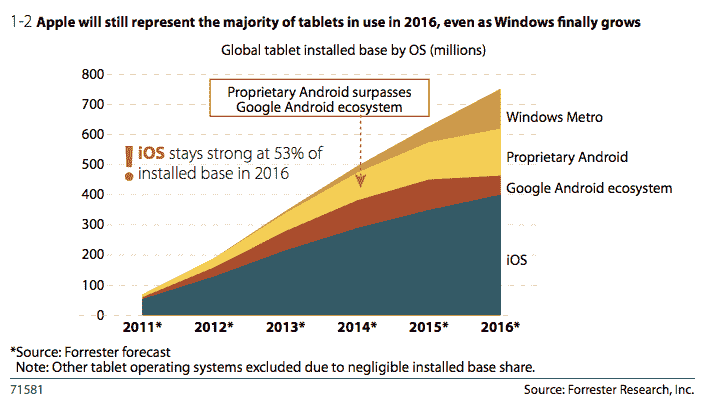
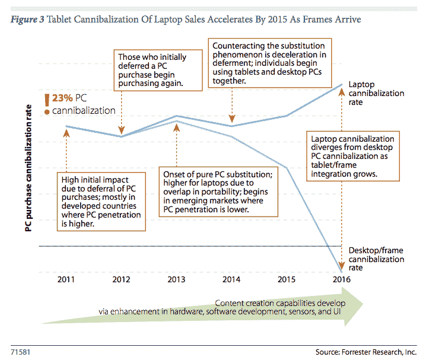

# Forrester:2016 年平板电脑使用量将达到 7.6 亿台，苹果“明显领先”，框架也将进入框架 TechCrunch

> 原文：<https://web.archive.org/web/https://techcrunch.com/2012/04/24/forrester-760m-tablets-in-use-by-2016-apple-clear-leader-frames-also-enter-the-frame/>

为移动革命再添一笔:2011 年，全球购买了 5600 万台平板电脑，但来自 [Forrester Research](https://web.archive.org/web/20221206154506/http://www.forrester.com/) 的[新报告](https://web.archive.org/web/20221206154506/http://www.forrester.com/Tablets+Will+Rule+The+Future+Personal+Computing+Landscape/-/E-RES71581?docid=71581&intcmp=blog:forrlink)预测，这一数字将在未来几年爆炸式增长:其研究人员称，到 2016 年将售出 3.75 亿台平板电脑，复合年增长率为 46%，到 2016 年，将有 7.6 亿台平板电脑投入使用。

这仍将使平板电脑远远落后于个人电脑——2016 年将有 20 亿台个人电脑投入使用。但是，结合像框架这样的新产品(本质上是平板电脑的坞站，以增强其功能)，Forrester 表示，平板电脑将逐渐成为消费者的首选计算设备，特别是在新兴市场，他们的第一台家庭计算设备更有可能是平板电脑，而不是台式机或笔记本电脑。

苹果在两年前发布了 iPad，实际上创造了平板电脑市场，此后一直在为产品设定标杆。过去一两年，随着更多竞争对手推出产品，苹果的平板电脑市场份额有所下降。

但是 Forrester 预测，它将设法保持其作为市场“明确领导者”的领先地位，用 Forrester 研究员 Frank Gillett 的话说，他也写了一篇[博客文章](https://web.archive.org/web/20221206154506/http://blogs.forrester.com/frank_gillett/12-04-23-why_tablets_will_become_our_primary_computing_device)总结了报告中的一些重要观点。

苹果保持领先地位的部分战略是瞄准新兴市场，如企业级市场——到 2016 年将占所有平板电脑购买者的三分之一——以及中国等国家的消费者。与此同时，到 2015 年，Android 平板电脑的安装量将会出现净下降，而微软也在这一过程中取得了进展。

(事实上，另一家分析公司 IDC 在三月份预测到 2016 年 Android 平板电脑的出货量将超过 iPad。然而，出货量不一定是销售额，而且不考虑安装基数的大小。)

特别是，Forrester 表示，谷歌的 Android 设备制造商网络及其周围的生态系统“将很难”在高端价格领域赶上苹果。此外，Forrester 认为迄今为止围绕 Android 的各种问题——其中包括设备碎片化、软件支持和各种 Android 风格——在未来几年不会改善。(有趣的是，Forrester 似乎并不认为这些相同的因素会影响 Android 智能手机的安装基数，后者将继续增长。)

Forrester 指出，Android 面临的另一大挑战是分叉 Android 设备制造商的激增。虽然我们仍然没有亚马逊在美国以外推出 Kindle Fire 产品的消息，但 Forrester 非常看好它和其他制造分叉 Android 平板电脑的公司的表现。

虽然 Forrester 表示，三星和低价平板电脑制造商将与 Android“坚持到底”，但我们将越来越多地看到其他人转向微软的新平板电脑操作系统 Windows 8，以实现他们的平板电脑雄心。然而，这要到 2014 年才会真正开始，因为“微软生态系统需要在 2013 年的大部分时间为客户创造一个完全可用的 Windows Metro 体验。”一旦开始，“微软将是一个重要的参与者，但它将追赶一个领先多年的领导者。”

虽然平板电脑的功能总体上不如普通个人电脑，但 Forrester 表示，我们将看到一种新的消费电子产品类别出现，将填补这一空白:“框架”(实际上是坞站)，Forrester 预测，这将成为一种常见的方式，为平板电脑提供更多功能，更强大的功能，并将其连接到电视等其他设备，以使用它们来消费内容。“框架将成为固定个人电脑的一种新形式，即使在笔记本电脑增长放缓的情况下，其销量也会上升，将台式个人电脑市场重新定义为固定个人电脑市场，”吉列写道。

