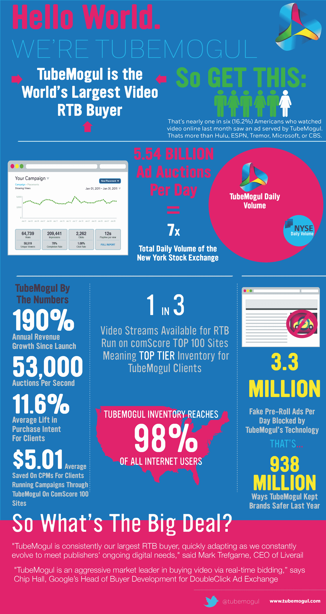

# TubeMogul:我们是实时视频广告领域最大的公司，一年交付了 66 亿条视频流

> 原文：<https://web.archive.org/web/https://techcrunch.com/2012/04/25/tubemogul-totally-the-biggest/>

# TubeMogul:我们是实时视频广告领域最大的公司，一年交付了 66 亿条视频流

TubeMogul 今天发布了一些关于其视频广告购买平台成功的统计数据。最重要的信息是:就实时视频广告而言，TubeMogul 是最大的买家。

该公司最初提供工具来帮助出版商整合和分析他们的视频，但它于去年重新启动，目前专注于广告。该公司表示，自那以来的 12 个月中，它已经提供了 66 亿个视频广告流。(或者更具体地说，从 2011 年 4 月到 2012 年 3 月，它服务了 6，591，981，439 个流。)

至于声称自己是最大的，这并不像指向一张把 TubeMogul 放在首位的图表那么简单。相反，该公司依靠几个独立的数据点来证明自己的观点。首先，它包括视频广告库存卖家的声明，这些卖家称 TubeMogul 是他们最大的买家或最大的买家之一。它们的范围从明确的(“TubeMogul 一直是我们最大的 RTB 买家，”据 LiveRail 报道)到更模糊的(谷歌称，“TubeMogul 是通过实时竞价购买视频的积极的市场领导者。”)该公司还指出[最近的 comScore Video Metrix 报告](https://web.archive.org/web/20230326054328/http://www.comscore.com/Press_Events/Press_Releases/2012/4/comScore_Releases_March_2012_U.S._Online_Video_Rankings)称 TubeMogul 的广告在 3 月份被观看了 5.37 亿次，覆盖了 16%的美国人口。(例如，这比 Hulu 和 ESPN 都要高。)该公司指出，它是榜单上唯一一家完全专注于实时视频广告购买的公司。

TubeMogul 还表示，在过去三年中，其收入每年增长超过 190 %,财富 100 强中的每一家汽车和媒体公司在过去一年中都在其平台上开展了活动。

最后，这是必不可少的信息图。

