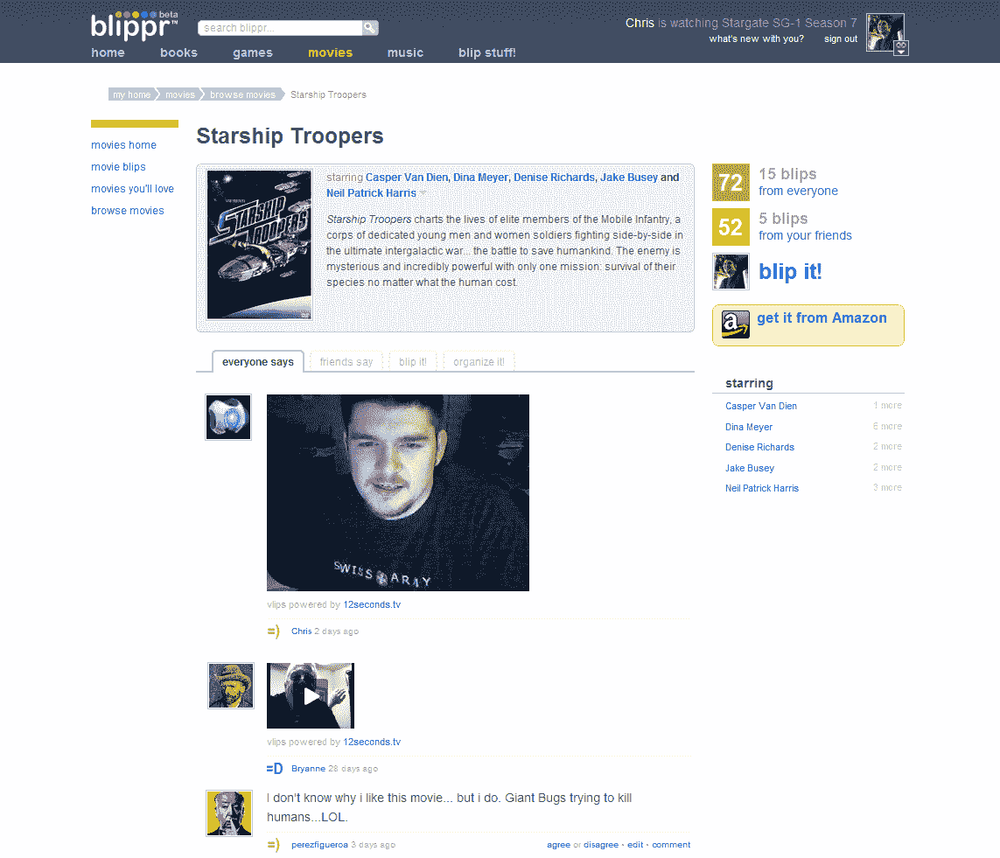
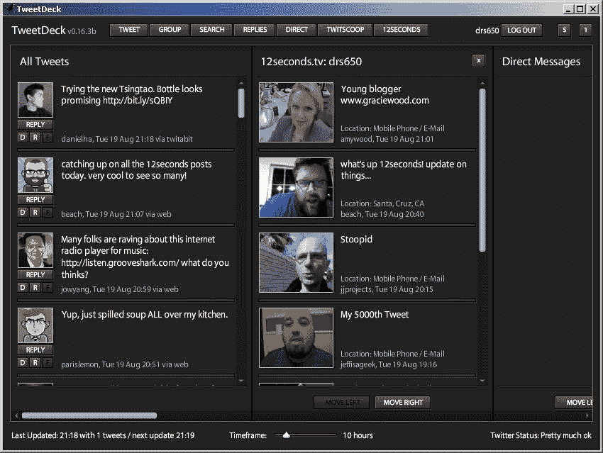

# 12Seconds.tv 发布视频状态 API (500 个邀请)

> 原文：<https://web.archive.org/web/https://techcrunch.com/2008/08/21/12secondstv-releases-video-status-api-plus-500-more-invites/>

# 12Seconds.tv 发布视频状态 API (500 邀请)

 如果你的初创公司的技术仍处于私有的 alpha 阶段，你如何推广它的应用？发布一个 API！这就是 [12seconds.tv](https://web.archive.org/web/20221207191147/http://12seconds.tv/) 今天正在做的事情。正如我在[发布](https://web.archive.org/web/20221207191147/http://www.beta.techcrunch.com/2008/07/24/the-real-video-twitter-12secondstv-500-alpha-invites/)时提到的，12seconds.tv 就像视频的 Twitter。它给你 12 秒来广播一条视频信息。现在，这家初创公司正在为希望将该功能纳入自己应用的开发者提供一个 API。通过这种方式，它希望成为 Twitter set 的标准视频状态平台。(它的雄心与 Seesmic 的有些重叠)。

它已经找到了一些买家。其他创业公司包括微评论网站 [Blippr](https://web.archive.org/web/20221207191147/http://www.blippr.com/) (我称之为评论的[Twitter](https://web.archive.org/web/20221207191147/http://www.beta.techcrunch.com/2008/07/28/blippr-is-twitter-for-micro-reviews/))、 [Phreadz](https://web.archive.org/web/20221207191147/http://phreadz.com/) (另一个[视频微博服务)](https://web.archive.org/web/20221207191147/http://www.beta.techcrunch.com/2008/05/23/phreadz-a-little-like-seesmic-but-trying-to-do-more/)和 [TweetDeck](https://web.archive.org/web/20221207191147/http://www.tweetdeck.com/) (一个 AIR client Twitter 客户端)。下面是 Blippr 和 TweetDeck 集成的屏幕截图。

对于那些只想尝试普通的 12 秒电视的消费者来说，这里有另一个 [500 邀请。](https://web.archive.org/web/20221207191147/http://www.zoomerang.com/Survey/survey.zgi?p=WEB2283BNKRLBN)

 