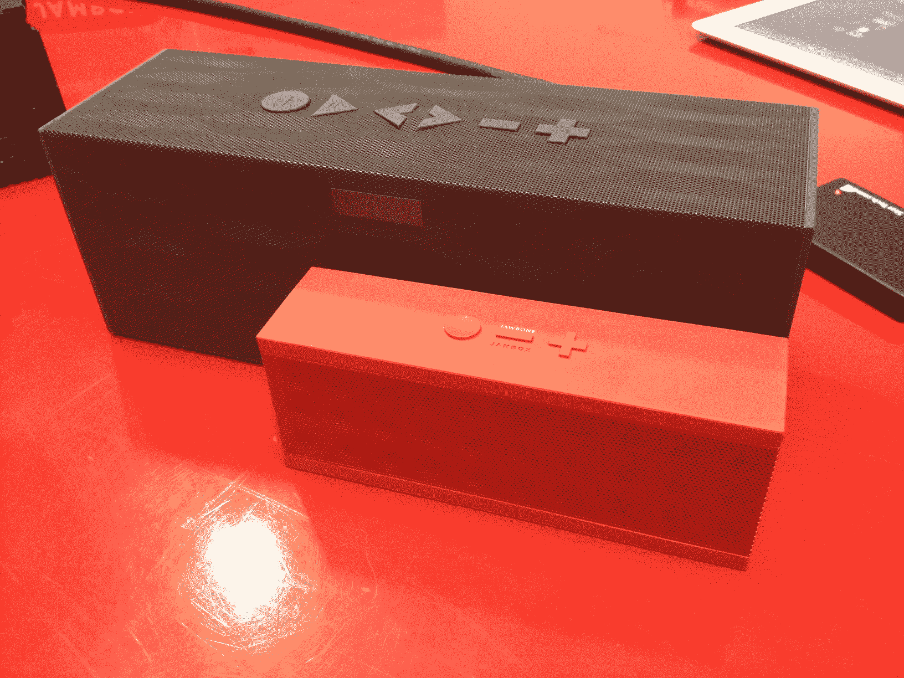
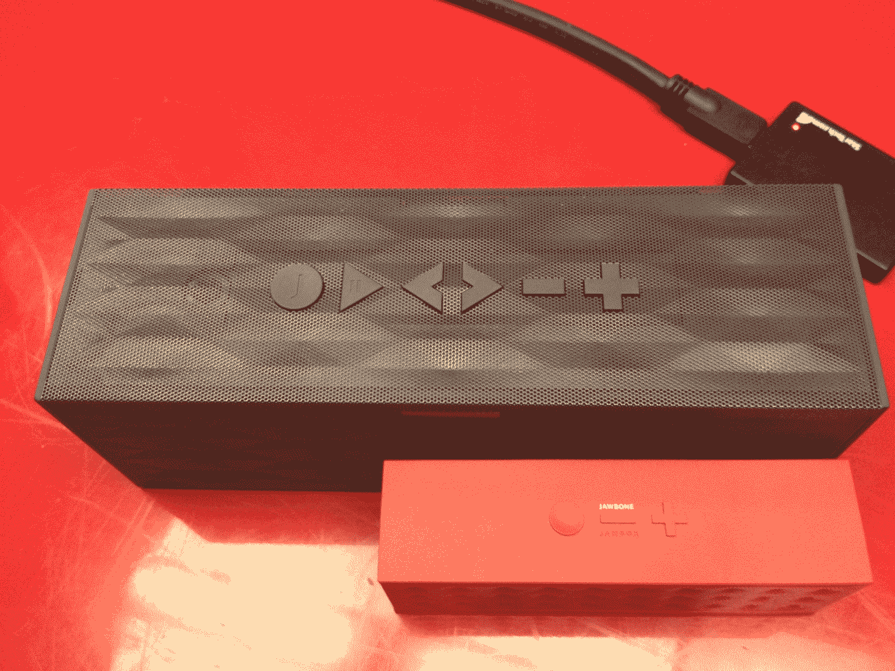

# 体验 Jawbone Big Jambox: 2.7 磅重的 Audio Fury，5 月 15 日发售，售价 299 美元

> 原文：<https://web.archive.org/web/https://techcrunch.com/2012/04/30/hands-on-with-the-jawbone-big-jambox-2-7-pounds-of-audio-fury-available-this-month-for-299/>

# 手把手体验 Jawbone Big Jambox: 2.7 磅重的 Audio Fury，5 月 15 日发售，售价 299 美元

越大不一定越好，但对于 Jawbone 的 Jambox 来说，它可能真的行得通。Jawbone 通常以其蓝牙耳机和[命运多舛但尚未完全消亡的乐队](https://web.archive.org/web/20230331165651/https://techcrunch.com/2011/12/08/jawbone-cancels-all-pending-up-orders-refunds-unhappy-owners-even-if-they-keep-it/)而闻名，它已经发现了他们的“酷孩子”产品是什么，而它恰好是一个微型便携式扬声器。

但是对于第二代版本，简称为 Big Jambox，该公司正在将容量从 10 增加到 11。虽然它保留了一些便携性，但 Big Jambox 实际上是为了那些有 20 个人贴在篝火旁边或者你正在为你的家庭娱乐中心寻找一个简单的微系统的情况。它的重量不到 3 磅——确切地说是 2.7 磅——仍然便于携带，但其他所有东西都是类固醇。Jawbone 表示，内置电池可持续播放 15 小时，待机 500 小时。

【T2

一些新功能增加了交易的趣味性，包括一个专用的配对按钮和一次配对两台设备的能力。换句话说，两个独立的设备可以主动控制音乐，例如，允许你或你的另一半将不同的音乐从两个独立的来源传输到一个大的 Jambox。大 Jambox 最多可以记住八个设备，如果最近的两个设备可以通过蓝牙连接，它会主动与这两个设备配对。

另一个重要的功能是 LiveAudio，它是通过去年的更新提供给 Jambox 的原始用户的。Jawbone 将其解释为三维听觉体验。最简单的解释方式是声音或深度的不同程度，也就是说，你会听到更多的音轨和其他扬声器可能没有注意到的细微差别。LiveAudio 设法消除了[串扰](https://web.archive.org/web/20230331165651/http://en.wikipedia.org/wiki/Crosstalk_(electronics))，所以你会听到左右两边完全不同的声音。

虽然我使用 bigger，badder Jambox 的时间有限，但我离开时对这个特别的功能留下了深刻的印象，因为它提供了一种不同于我从这种外设体验到的任何体验。然而，它是有方向性的，所以你必须被种植在它的直接路径中才能获得完整的体验。如果你碰巧在房间的其他地方，你不会知道 LiveAudio 是开着还是关着。

我们将在未来几天内进行全面审查。

预购从 5 月 1 日开始，到 5 月 15 日，商店中的单位(红色、黑色、白色)价格为 299 美元。

**规格:**

扬声器:两个有源驱动器，两个相对的无源低音辐射器

尺寸:10 英寸 x 3.1 英寸 x 3.6 英寸

连接:3.5 毫米立体声线路输入，蓝牙