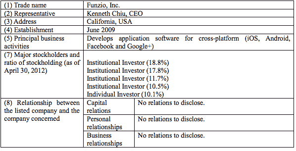

# OMGWHAT？GREE 以 2 . 1 亿美元收购移动社交游戏开发商 Funzio TechCrunch

> 原文：<https://web.archive.org/web/https://techcrunch.com/2012/05/01/gree-acquires-mobile-social-game-developer-funzio-terms-are-undisclosed/?grcc=33333Z98ZtrendingZ0>

日本游戏巨头 GREE 刚刚以 2.1 亿美元的全现金交易收购了 mid-core 手机游戏开发商 Funzio，这应该会提高其为西方观众制作游戏的能力。Funzio 是《犯罪城市》、《现代战争》和《王国时代》的幕后推手，这两款游戏在苹果的 iOS、安卓或脸书平台上的下载量已经超过了 2000 万次。

几周前，我听说 Funzio 正处于融资过程中，融资后估值为 3.5 亿美元，并以拍卖方式与各种买家进行了松散的谈判。显然，筹资努力有助于 Funzio 的出售，但可能不是我最初听说的估值。不过，考虑到[公司迄今已经从 IDG Ventures 和 Playdom 联合创始人 Rick Thompson 那里筹集了大约 2000 万美元，2.1 亿美元一点也不差。相比之下，Draw Something-maker OMGPOP 以 1.8 亿美元现金和未披露的收益收购了 Zynga](https://web.archive.org/web/20221209065313/http://www.crunchbase.com/company/funzio) [。](https://web.archive.org/web/20221209065313/https://beta.techcrunch.com/2012/03/21/done-deal-zynga-gets-draw-something-phenom-by-acquiring-omgpop-were-hearing-210m/)

格力为什么收购 Funzio？GREE 是一家价值数十亿美元的日本手机游戏公司，正试图打入西方市场。它的利润率让 Zynga 自惭形秽，但是随着它的祖国变得饱和，该公司已经没有增长的空间了。作为努力的一部分，GREE 去年以 1 . 04 亿美元收购了游戏网络 OpenFeint。

但是关于 GREE 的事情是，它是一个双平台提供商*和*游戏开发商，所以 OpenFeint 实际上只解决了它的一个方面的需求。OpenFeint 是*平台*而 GREE 需要内部开发能力，为此[它已经在湾区非常积极地招聘人员。在过去的几个月里，GREE 已经物色了许多目标，Funzio 应该会在这方面有所帮助。由于各种原因，与至少两家其他游戏开发商和平台的早期谈判没有成功。他们也考虑过 OMGPOP，但动作不够快，因为 Zynga 的首席执行官马克·平卡斯(Mark Pincus)只用了 9 天就敲定了这笔交易。](https://web.archive.org/web/20221209065313/https://beta.techcrunch.com/2011/12/09/watch-out-zynga-japanese-gaming-company-gree-is-aggressively-hiring-in-silicon-valley/)

不过 GREE 有 Funzio。几乎可以肯定的是，两家公司高管之间的密切联系起到了帮助作用。Funzio 的业务发展副总裁 Jamil Moledina 在 EA 工作时与 GREE 的企业发展高级副总裁 Shanti Bergel 一起工作。两人都是在不到一年前离开 EA 去了格力和 Funzio。

通过这笔交易，GREE 在游戏业务方面带来了一些相当有经验的老手。Funzio 的首席执行官 Ken Chiu 此前曾将一家公司出售给 Zynga，他和 Funzio 的首席运营官 Anil Dharni 还帮助创立了另一家著名的手机游戏开发商 Storm8，之后他们与其他创始人分道扬镳。

与上次不同的是，当 GREE 披露了 OpenFeint 的大部分工资表和它在上一年只赚了 282，500 美元的事实时，该公司是超级秘密的。)关于 Funzio 的细节。它没有说 Funzio 在过去一年赚了多少钱，也没有说收购会对格力的收益产生什么影响。它没有说哪个投资者拥有什么，只是说机构投资者拥有该公司 58.1%的股份。另一个个人投资者，大概是里克·汤普森，拥有该公司 10.1%的股份。剩下的 31.1%，即 6530 万美元，留给了创始人、少数股东和员工。

以下是新闻稿:

> GREE 收购领先的移动开发商 FUNZIO
> 继续发展核心游戏专业技术
> 
> 加利福尼亚州旧金山——2012 年 5 月 1 日——移动社交游戏行业的领导者 GREE 今天宣布收购开发中核心移动游戏的先驱 Funzio，Inc.。此次收购将加强 GREE 为移动社交游戏市场带来高质量游戏的能力。Funzio 的作品也将加入格力全球平台计划的尖端内容名单。
> 
> “Funzio 的团队正在开发当今世界上最好的手机游戏。此次收购使我们能够将他们的才能和专业知识与我们对移动社交游戏生态系统的愿景结合起来。”格力国际首席执行官青柳直树说。“我们非常高兴能够扩大我们的中核心产品组合，并继续展示移动游戏市场是全球游戏玩家不可避免的下一步发展方向。”
> 
> Funzio 是《犯罪之城》、《现代战争》和《王国时代》等成功游戏的创作者，拥有超过 2000 万的游戏下载量，并拥有强大而热情的粉丝群。该公司的官员和创始人，一个有才华的行业资深人士团队，将加入格力，发展格力的旧金山发展工作室。Ken Chiu(首席执行官)和 Anil Dharni(首席运营官)将加入格力国际担任高级副总裁，Ram Gudavalli(首席技术官)和 Andy Keidel(工程副总裁)将担任副总裁。
> 
> Funzio 的创始人兼首席执行官 Ken Chiu 表示:“GREE 与我们一样，希望移动世界中的人们可以随时随地一起玩耍。”。“我们强烈认为，我们在为中端市场开发独特游戏方面的经验和 GREE 在将移动游戏推向全球社区方面的专业知识是完美的结合。”
> 
> GREE 致力于打造全球最好、最大的移动社交游戏生态系统。GREE 对 Funzio 的收购将推动 GREE 实现其在全球范围内获得 10 亿用户的目标，同时为预计将于 2012 年在 Q2 发布的 GREE 社交移动游戏平台引入新的类型专业知识和卓越的游戏。新的 GREE 平台将提供高质量的内容，为游戏玩家带来强大的社交游戏体验，并为开发者提供与不断增长的、积极参与的全球观众接触的机会。
> 
> 欲了解更多关于格力的信息，请访问 www.gree-corp.com。