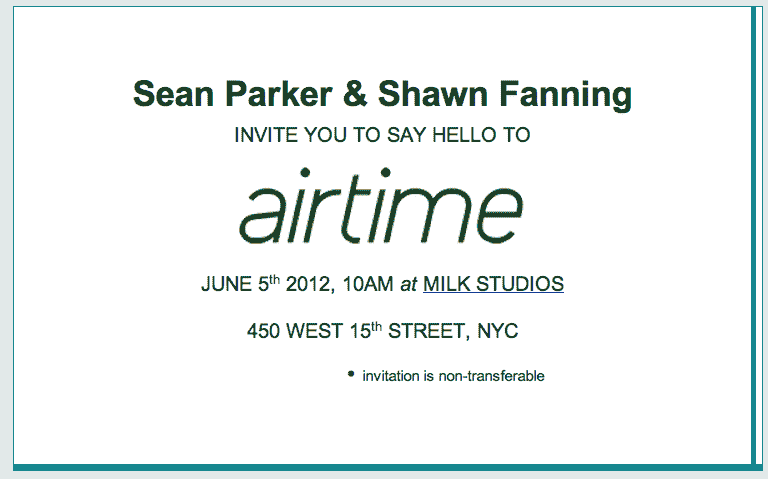
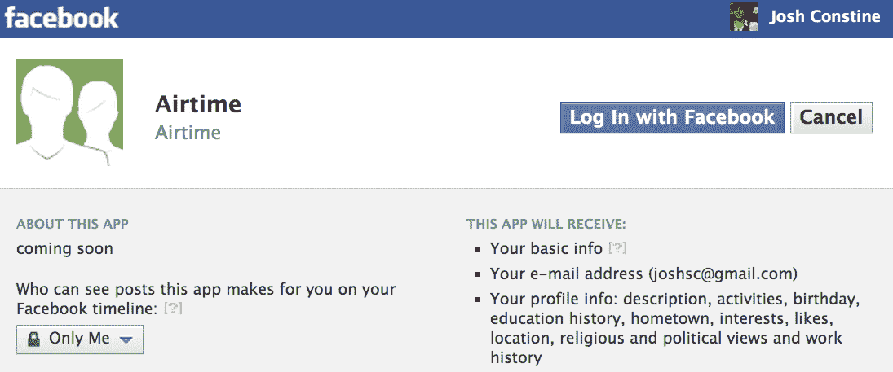
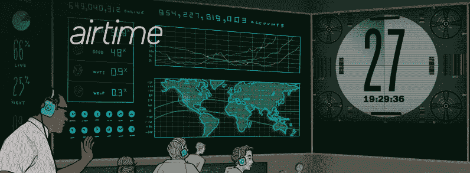

# 肖恩·帕克隐形视频初创公司 Airtime 准备在 6 月 5 日的新闻发布会上发布 TechCrunch

> 原文：<https://web.archive.org/web/https://techcrunch.com/2012/05/08/airtime-june-5th/>

# 肖恩·帕克的隐形视频初创公司 Airtime 准备在 6 月 5 日的新闻发布会上推出

肖恩·帕克和肖恩·范宁的秘密视频初创公司[刚刚在博客上写道](https://web.archive.org/web/20221231012341/http://blog.airtime.com/)“我们期待 6 月 5 日的问候。报名排在第一位。”上个月【Airtime 在[进行了一轮有限的预注册，但是现在允许人们](https://web.archive.org/web/20221231012341/https://techcrunch.com/2012/04/20/video-social-network-runfaces-takes-on-sean-parkers-airtime/)[注册](https://web.archive.org/web/20221231012341/https://www.airtime.com/)进行早期测试。

没有人知道这家初创公司到底是做什么的，尽管许多人认为它将帮助人们通过直播视频相互认识。让我们来看看隐藏在 Airtime 网站上的所有线索，它现在像发射航天飞机一样倒数到 6 月 5 日。

不幸的是，我收到的参加 6 月 5 日纽约新闻发布会的邀请不会有太大帮助。这可能是为了阻止猜测，只是一张通过电子邮件发送的基本卡片。

到目前为止，关于该产品用途的唯一官方细节来自该网站的主页简介，其中还提到了投资 850 万美元的投资者:

> *“我们的小团队位于旧金山，他们都热衷于使用最新的视频技术将人们聚集在一起。我们的投资者包括 Founders Fund、Accel Partners、Andreessen Horowitz、Google Ventures、SV Angel、尤里·米尔纳、阿什顿·库彻、will.i.am、Scott Braun 和迈克尔·阿灵顿。”*

Airtime 正在通过脸书进行预注册，申请包括你的简历和兴趣数据在内的应用许可。因此，尽管 Airtime 似乎不会建立自己的成熟社交网络，但它可以通过根据地理位置、教育历史、最喜欢的乐队甚至政治观点来匹配他们，从而“将人们聚集在一起”。

【T2

网站的隐私政策和它列出的职位空缺中也隐藏着一些线索。配对将是半匿名的，因为“当你与一个陌生人配对时，你的名字不会被分享”，你还可以与 Airtime 和脸书的朋友进行视频通话。

该公司[想要一名网络用户界面工程师](https://web.archive.org/web/20221231012341/https://www.airtime.com/jobs/web-ui-engineer)“2 年以上的 Javascript 黑客经验”,这表明视频流界面可以在其上运行。哦，它计划会非常受欢迎。该公司正在寻找一名运营工程师“在一家主要流量网站有 2 年以上的工作经验——月浏览量超过 10 亿次，月访问量超过 1000 万次”。目前，它的封闭测试版只有 4000 名用户，所以它还有很长的路要走。

鉴于肖恩和肖恩过去的产品，如 Napster、脸书和 Spotify，已经大受欢迎，每月 10 亿的页面浏览量可能不会太疯狂。还好奇？下面是我们播出时间报道的[部分，包括对帕克和投资者细节的采访。](https://web.archive.org/web/20221231012341/https://techcrunch.com/tag/airtime/)

