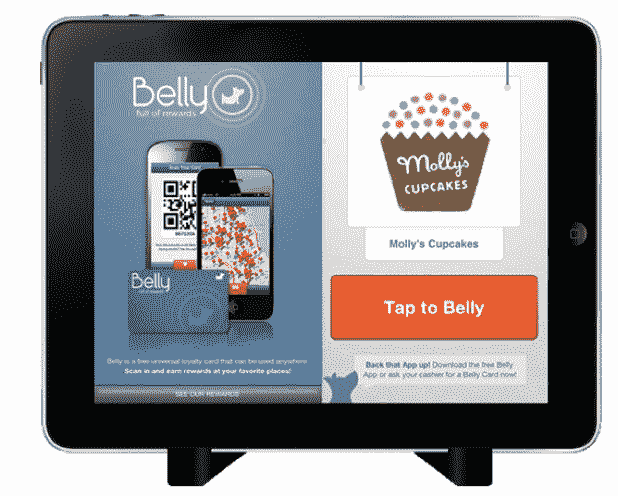
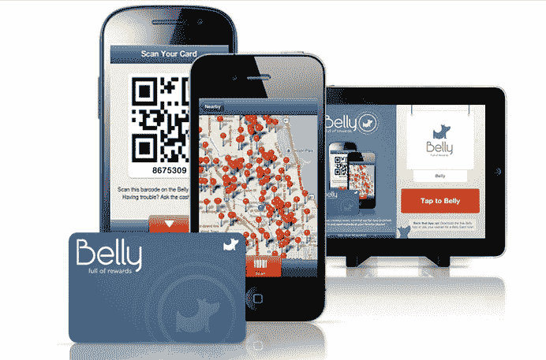

# 面向本地企业的客户忠诚度和奖励平台 Belly 从 Andreessen Horowitz 获得 1000 万美元

> 原文：<https://web.archive.org/web/https://techcrunch.com/2012/05/08/customer-loyalty-and-rewards-platform-for-local-businesses-belly-raises-10m-from-andreessen-horowitz/>

总部位于芝加哥的初创公司 [Belly](https://web.archive.org/web/20230328160028/http://www.bellycard.com/) 是当地商业客户忠诚度和奖励领域的一个快速增长的竞争者，已经从安德森·霍洛维茨获得了 1000 万美元的 B 轮融资。该公司还宣布，Andreessen Horowitz 合伙人、OpenTable 前董事长兼首席执行官、PayPal 前总裁杰夫·乔丹(Jeff Jordan)将加入董事会。最近一轮融资是对由 Groupon 联合创始人埃里克·莱夫科夫斯基和布拉德·基威尔创办的风险投资公司 Lightbank 融资的七位数融资[的补充。](https://web.archive.org/web/20230328160028/https://techcrunch.com/2011/12/14/lightbank-backs-belly-a-customer-loyalty-and-rewards-platform-for-local-businesses/)

贝利希望通过游戏化、数字签到和企业 iPad 设置来重塑客户忠诚度奖励。但这家初创公司对如何实现这一目标有着略微不同的看法。Belly 为商家提供了一个快速设置、即插即用的奖励平台。其中一部分是店内 iPad(由 Belly 提供)，用于在销售点验证付费客户，并作为一个登记点。Belly 还将培训员工，鼓励他们参与该计划。

商家按月支付无限量腹卡的订阅费，以分发给客户、店内营销材料和对客户数据的安全访问，这些数据揭示了销售、积分和兑换数据，以及对客流量和卡使用模式的洞察。企业甚至可以利用腹部数据向腹部消费者发送独家促销和其他奖励的推送通知。

在消费者方面，为了签到，顾客可以在店内的 iPad POS 上扫描他们的智能手机，每次签到，你都更接近一个特定的里程碑，并获得奖励(根据企业的规定)。你只需扫描一张 Belly 卡(由商家提供)，或者在商家的 Belly iPad 应用程序(位于收银台旁边)上使用 Belly 的 iPhone 或 Android 应用程序。一旦您登记入住，您就可以累积积分，并开始赢取奖励。

在 Belly 移动应用程序上，你只需打开应用程序，就可以看到你所在位置的 Belly 用户的商家列表。在所有这些业务中，该应用程序完全取代了商户卡。有了肚皮卡，您就有了一张通用奖励卡(附在您的电子邮件中)，可以在所有参与的肚皮商家使用。

联合创始人兼首席执行官洛根·拉希夫(Logan LaHive)表示，前提是消费者不想携带几种不同的卡，企业需要一个人人都可以使用的忠诚度系统。“我们正在消除过度充盈的钱包，”拉希夫说。

乔丹对贝利寄予厚望，“我们乐观地认为，这家初创公司有巨大的潜力来彻底改变企业的忠诚度，”他说。“现在，客户忠诚度计划可以通过网络、数据分析和智能手机实现数字化。这曾经是一个效率低下的系统，但 Belly 使这个系统变得非常高效，并为商家提供了关于谁是他们最好的客户的大量信息。”

他还补充说，才华横溢的团队、对 iPad 优雅的产品执行，以及来自 Lightbank 的支持，都对安德森·霍洛维茨的投资具有吸引力。特别是，Jordan 认为忠诚度市场是分散的，而 Belly 处于扩大其业务的最佳位置。

当然，作为 OpenTable 的首席执行官，Jordan 对如何扩大面向小餐馆和商户的业务有着深刻的见解。他说贝利需要尽快建立一个销售团队。“关键是尽快进入尽可能多的城市，”他说。

即使在过去的 9 个月里，Belly 的发展速度也相当快。Belly 于 2011 年 8 月推出，拥有超过 20 万名活跃用户，入住次数超过 80 万次。Belly 目前与 1400 家商家合作，每周增加 100 多家新商家。从今天开始，Belly 除了在芝加哥、奥斯汀、密尔沃基、麦迪逊、威斯康星州、华盛顿特区和凤凰城的现有业务外，还在纽约和波士顿提供服务。

LaHive 说，Belly 与其众多竞争对手(包括 [LevelUp](https://web.archive.org/web/20230328160028/https://techcrunch.com/2011/12/08/scvngrs-new-mobile-payment-solution-levelup-goes-device-agnostic-with-a-web-app/) 、[、Perka](https://web.archive.org/web/20230328160028/https://techcrunch.com/2011/10/05/bringing-punch-cards-online-perka-launches-a-nifty-loyalty-platform-for-small-businesses/)、PerkVille 和 [PunchTab](https://web.archive.org/web/20230328160028/https://techcrunch.com/2011/11/08/social-loyalty-platform-punchtab-raises-4-4-million/) )的区别因素之一是，企业能够定制他们的奖励计划。

目前，商业奖励的范围很广，从为顾客提供一次打店主肚子的机会的漫画店，到奖励顾客 10 分钟吃不完的蛋糕的面包店。你可以和一家三明治餐馆的老板掰手腕，或者坐在一辆食品卡车里，让它最好的顾客在卡车经过时“鸡蛋”。爱狗人士会在我们的墙上贴一张“你和你的狗的画像”,红 7 沙龙允许顾客“用一对一的主人寸头剃光头”。“Belly 与每家企业密切合作，确保奖励是独特的，并符合该企业的品牌和文化。

对商家来说，另一个额外的好处是他们可以看到每个顾客什么时候入住，多久一次，等等。企业可以清楚地了解他们最忠诚和最有价值的客户。Belly 可能扩展的另一个数据领域是事务数据。目前，该应用程序不跟踪客户实际购买了什么，但希望在未来与销售点系统集成。

“我们正在超越买十送一的计划，与每个商家密切合作，努力以独特的方式吸引他们的客户，”LaHive 说。“企业希望建立个人关系，将线下的东西放到线上，关于如何管理客户行为、通信工具、电子邮件和社交媒体的分析使这些企业能够与客户建立持续的关系。

新的资金将用于建立和配备一个更大的销售团队，以扩展到其他市场。虽然这些销售人员中的许多人将在芝加哥工作，但其他人也将在当地市场工作。

LaHive 还专注于产品开发，并将寻求将所有初创公司的应用程序转移到 HTML5。该公司还将进行一些速度和用户界面的改进，以及重新设计体验。

至于地点，拉希夫计划留在芝加哥。“对于芝加哥的早期创业公司来说，从安德森·霍洛维茨这样的公司筹集资金是有效的，”他说。“我们认为，我们最适合为企业推出高质量的忠诚度计划。”

[YouTube http://www.youtube.com/watch?v=oMqfpVX8MrM&w=560&h=315]