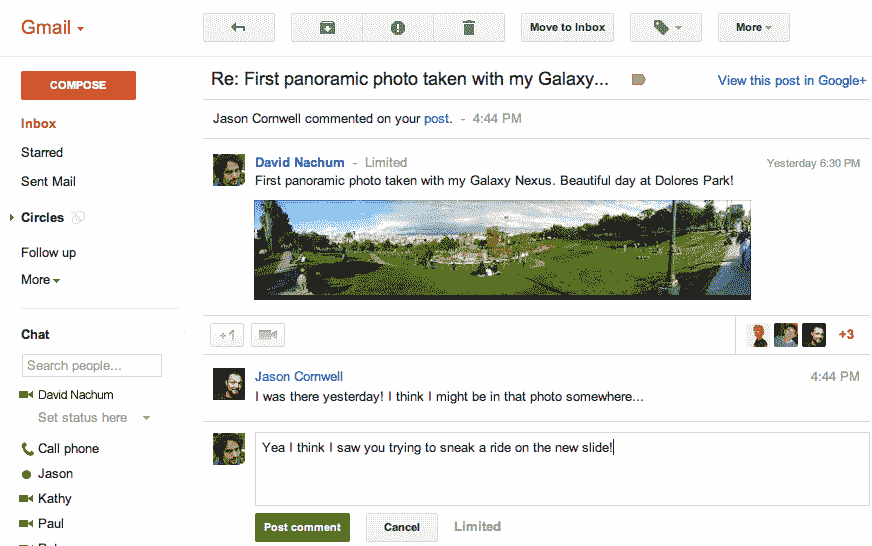

# 谷歌使 Gmail 中的 Google+通知更具互动性 TechCrunch

> 原文：<https://web.archive.org/web/http://techcrunch.com/2012/05/08/google-makes-google-notifications-in-gmail-more-interactive/>

# 谷歌让 Gmail 中的 Google+通知更具互动性

电子邮件通常是静态的。例如，出于安全考虑，几乎没有标准的基于网络和桌面的电子邮件客户端允许你在 HTML 电子邮件中运行 JavaScript 代码。微软的 Hotmail [在 2010 年向这个方向做了一点小小的推动，当时它开始将来自一些可信的第三方的电子邮件列入白名单，包括 Orbitz、网飞和 LinkedIn。现在，看起来谷歌也在朝着这个方向前进(至少对于来自其自身产品的电子邮件来说)，因为从今天开始，](https://web.archive.org/web/20230209124932/https://techcrunch.com/2010/12/16/hotmail-active-views-look-to-make-email-interactive/)[Gmail 中的 Google+通知将变得更加互动](https://web.archive.org/web/20230209124932/http://gmailblog.blogspot.com/2012/05/better-google-notification-experience.html)。

这其实是谷歌在这个方向上的第二步。从三月份开始，Google+用户已经能够[在 Google+通知邮件里添加好友到他们的圈子里](https://web.archive.org/web/20230209124932/https://plus.google.com/103345707817934461425/posts/RCKComUrxc9)。

然而，随着今天的更新，谷歌基本上为这些消息带来了完整的交互式 Google+体验。用户现在可以从他们的收件箱中查看、评论和+1 帖子。他们朋友的回复也会实时出现在消息中。

这些功能将在下周向所有 Google+用户推出(如果你不想收到 Google+通知邮件，你也可以在这里关闭它们)。

顺便说一句，值得注意的是，许多创业公司，包括[power inbox](https://web.archive.org/web/20230209124932/http://powerinbox.com/)——我们[在今年早些时候写了关于](https://web.archive.org/web/20230209124932/https://techcrunch.com/2012/02/08/powerinbox-the-service-that-turns-emails-into-apps-launches-api/)的文章——也在试图让电子邮件更具互动性，并把它变成一个平台。例如，PowerInbox 浏览器插件可以与 Gmail、Hotmail、Yahoo Mail 和 Outlook 配合使用，其 API 已经被许多其他电子邮件客户端使用，包括统一收件箱。