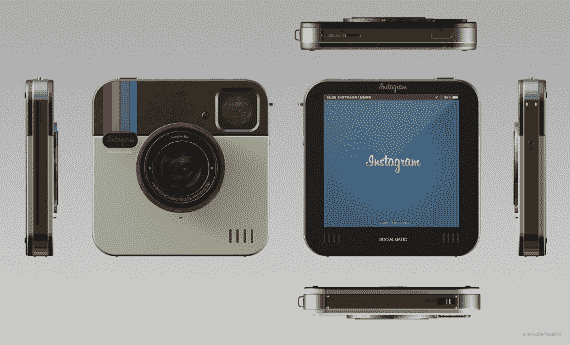

# Instagram Socialmatic 相机概念将照片分享应用带入现实生活 TechCrunch

> 原文：<https://web.archive.org/web/https://techcrunch.com/2012/05/10/the-instagram-socialmatic-camera-concept-would-bring-the-photo-sharing-app-to-real-life/>

# Instagram Socialmatic 相机概念将把照片分享应用带到现实生活中

从前有一家公司开创了简单的照片分享。通过允许消费者轻松拍摄和分享照片，摄影成为了日常生活的一部分。

现在，几代人过去了，宝丽来本质上是曾经的标志性品牌的一个空壳。Instagram Socialmatic 相机目前只是一个概念，但它试图在每个潮人最喜欢的移动应用 Instagram 的帮助下重振宝丽来运动。

这款大型概念相机由 ADR 工作室提供，该工作室模仿了 Instagram 的标志(该标志本身就是对宝丽来的模仿)。相机背面有一台打印机，可以在胶带上打印照片，方便快捷地分享。这款相机还具有 16GB 的存储空间，4:3 英寸的大触摸屏，可更换镜头，WiFi 和蓝牙连接——理想的移动 Instagram 机器所需的所有商品。

这个想法其实并不新奇。宝丽来和奥林巴斯在 2001 年推出了一款非常相似的设备，当然没有触摸屏和 Instagram 集成。那台相机， [C-211](https://web.archive.org/web/20230123111600/http://www.olympusamerica.com/cpg_section/cpg_archived_product_details.asp?id=634) 拍照片，打印照片，而且外形也很糟糕。

同样，这只是一个概念，但是[正如 Freshness Mag 指出的](https://web.archive.org/web/20230123111600/http://www.freshnessmag.com/2012/05/10/instagram-socialmatic-camera-concept-by-adr-studio/)，无论有没有 Instagram(和脸书)的许可，在不久的将来看到非常类似的东西在 Kickstarter 上出现都不会令人惊讶。

