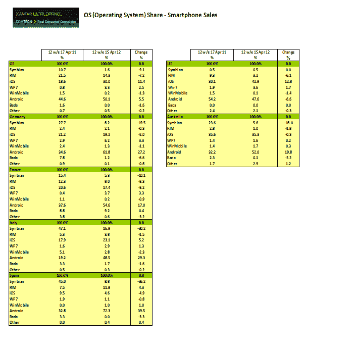

# Kantar Worldpanel: Android 主导智能手机整体销量；美国 iOS 关闭| TechCrunch

> 原文：<https://web.archive.org/web/https://techcrunch.com/2012/05/15/kaiser-worldpanel-android-dominates-smartphone-sales-overall-in-u-s-ios-closing-in/>

# Kantar Worldpanel: Android 主导智能手机整体销量；在美国，iOS 正在接近

WPP 的市场研究部门 Kantar Worldpanel ComTech 今天发布的新数据显示，总体而言，Android 在智能手机市场继续大幅增长，在截至 3 月 18 日的 12 周内占据了大部分销售额。

往下钻，Android 在某些地方做得特别好。在西班牙，Android 是一个可以击败的平台。它占同期智能手机销量的 72.3%，是 Kantar 分析的市场中最高的比例。但安卓的统治地位并不是全面的:在美国，基于谷歌平台的设备销量实际上比去年下降了约 6.6%，占该国智能手机总销量的 47.6%。与此同时，苹果在美国的销售额增长了 12.8%，占总销售额的 43%。Kantar 还表示，虽然现在英国和澳大利亚的大多数消费者都拥有智能手机，但在它分析的其他市场，临界点尚未达到。

Kantar 指出，在澳大利亚，57%的手机消费者现在拥有智能手机；在英国，53.1%的人拥有智能手机。但是在德国，这个比例是 32 %;法国为 40 %;意大利为 39 %;西班牙为 37 %;美国为 38%。

不过，这些数字是一个移动的目标。例如，在英国，Kantar 的分析师 Dominic Sunnebo 指出，明年将有 2200 万 13 岁以上的消费者购买移动设备，其中约 80%的人预计会购买智能手机。

在西班牙，Android 在过去 12 周的销量增长也是最大的:其 72.3%的销量份额比一年前大幅增长了近 40%。该平台在德国也有类似的大幅增长(增长 27.2%，占销售额的 61.8%)；法国(从 17%上升到 54.6%)；意大利(增长 29.3%，占总销售额的 48.5%)和澳大利亚(增长近 20%，占总销售额的 52%)。

Kantar 指出，在上一季度的顶级 Android 制造商中，三星和 HTC 的销售最为强劲，例如，在英国的总销售额中占 86%。他指出，HTC One X 自上市以来销售尤其良好。相比之下，索尼在过去 12 周内仅占安卓销量的 10.4%，LG 在英国的份额不到 1%。

在其他平台中，塞班的份额全面下降:诺基亚的传统智能手机平台在 Kantar Worldpanel 覆盖的国家损失了 9%至 36%的销售市场份额。Windows Phone 是诺基亚目前使用的主要智能手机平台，其销量尚未弥补这一缺口。在微软操作系统有所增长的市场中(西班牙是个例外)，所有情况下的增长都是低的一位数——这也是该平台销售的总份额。Windows Phone 在德国的销售份额最高，占智能手机销售的 6.2%:这包括所有基于 Windows Phone 的制造商，而不仅仅是诺基亚。

