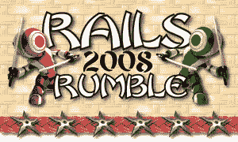

# 上周末推出了 131 款 Rails 应用；你可以投票选出最佳 

> 原文：<https://web.archive.org/web/https://techcrunch.com/2008/10/23/131-web-apps-launched-this-past-weekend-vote-for-the-best/>

# 上周末推出了 131 款 Rails 应用；你可以投票选出最好的

2008 年 [Rails 隆隆](https://web.archive.org/web/20230113204334/http://www.railsrumble.com/)，一个 Ruby on Rails 程序员的竞赛，在上周末见证了 131 个 web 应用程序的发布。今年，应用程序的质量大幅提高，将竞争变成了一种创业超级孵化器，目标是生产不仅能赢得选票，还能成为可持续产品的应用程序。

[规则](https://web.archive.org/web/20230113204334/http://www.railsrumble.com/rules)很简单:你和最多三个黑客朋友在周五午夜之前不能开始编程，你必须在周日午夜之前完成。所有代码都被加载到私有的 [GitHub](https://web.archive.org/web/20230113204334/http://www.github.com/) 存储库中，所有应用都被部署到 [Linode](https://web.archive.org/web/20230113204334/http://www.linode.com/) 虚拟服务器上(这两个服务器都是由赞助商免费提供的)。随着周末接近尾声，你的(希望)功能应用程序将被冻结，供网络上的任何人测试和投票。

与去年相比，主导今年(有史以来第二次举办)的应用程序对开发自己的“网络效应”的依赖要少得多。许多都是围绕 Twitter 构建的，也有许多项目协作应用。参与者也明显更加专业，并在获得实际产品的压力下茁壮成长。2007 年比赛的 90 个应用程序中，大约有 5 个仍然存在，包括去年的冠军 [Tasty Planner](https://web.archive.org/web/20230113204334/http://tastyplanner.com/) 。由尼克·普朗泰和达西·莱考克领导的志愿者组织委员会“铁轨轰鸣队”预计今年这个数字会大幅增长。

虽然 2008 年的隆隆声是铁路专用的，普朗泰希望举办更多的活动和潜在的不同类型的比赛。他说，今年完成的幕后工作主要涉及构建“举办编码竞赛的交钥匙解决方案”，包括注册和投票基础设施。今年的比赛也大推 OpenID 它不仅是注册和投票所必需的，大约 95%的竞赛应用程序也集成了该标准。

以下是这次活动的一些统计数据:

*   去年:140 个团队的 324 名参与者。90 个团队合格(成功创建一个 app)。
*   今年:231 个团队的 529 名参与者。131 支队伍合格。
*   22 个单人团队，28 个两人团队，27 个三人团队，54 个四人团队
*   共有 14355 个提交到 GitHub(平均每个团队 112 个)。
*   总共 245257 行代码(不包括 Rails)

想参与进来吗？【2008 年铁路隆隆投票现在开始。它是这样工作的:注册投票并获得 10 个随机的应用程序邀请。如果你投了票，你会多得到 10 票，以此类推。今年这场喧嚣的获胜者将获得(在[次等奖](https://web.archive.org/web/20230113204334/http://blog.railsrumble.com/prizes)中)一个全新的 1986 年查克·诺里斯[卧底行动人偶](https://web.archive.org/web/20230113204334/http://blog.railsrumble.com/2008/10/23/chuck-norris-does-not-sleep)(“查克·诺里斯不睡觉……他在等待”)。所以，看看这些应用，投票，让我们知道你在评论中的想法。