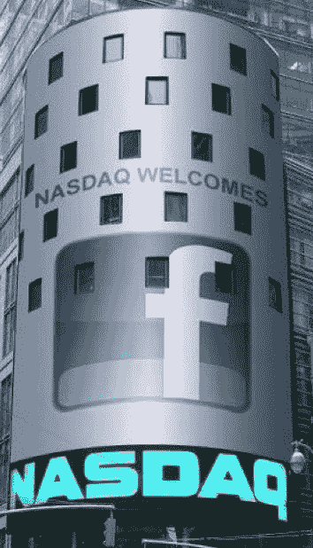

# 这里没有 IPO 热潮:脸书股价略高，约为 40 美元

> 原文：<https://web.archive.org/web/https://techcrunch.com/2012/05/18/facebook-share-open-10-5-higher-at-42/>

# 这里没有 IPO 热潮:脸书股价略高，约为 40 美元

脸书股票以 42.05 美元开盘，比昨晚 38 美元的最终价格上涨了 10.5%。股票目前实际上几乎持平于 39.16 美元，比承销商昨晚确定的 38 美元高出 3.6%。虽然这可能不是一个有趣的故事，但这是一个信号，表明脸书的 IPO 定价相当有效，该公司没有留下太多资金。

眼下，散户投资者正在染指这些股票。该公司在纳斯达克的第一笔交易[实际上推迟了 30 分钟](https://web.archive.org/web/20230326145636/https://techcrunch.com/2012/05/18/facebooks-opening-trade-has-been-delayed-by-nasdaq/)，因为做市商在确定开盘价方面存在问题。根据我们今天早些时候与纳斯达克执行副总裁兼全球企业客户集团负责人 Bruce Aust 的谈话，他们一直以 5 分钟为增量推迟开盘，这在受欢迎的股票发行中并不罕见。

虽然今天价格将大幅波动*，但[FacebookIPOClosingPrice.com](https://web.archive.org/web/20230326145636/http://www.facebookipodayclosingprice.com/)的 Twitter 用户众包打赌，该公司将以 54 美元的价格收盘，估值为 1357 亿美元。*

昨天，社交网络巨头[将其首次公开募股定价为每股 38 美元](https://web.archive.org/web/20230326145636/https://techcrunch.com/2012/05/17/facebook-confirms-ipo-share-price/)，这是其修订后的 34 美元至 38 美元价格区间的最高端。这使得它成为历史上最大的科技 IPO。脸书在发行中提供了 1.8 亿股股票，而包括彼得·泰尔和 Accel Partners 在内的早期股东正在出售超过 2 亿股股票。这是自 Zynga 以来最近最大的一次 IPO，Zynga 的股票在开盘价 11 美元时上涨了 10%，使该公司的估值达到 77 亿美元。

不过，脸书的开放已经影响了市场的其他部分。Zynga 的股价下跌了 13.3%。我们不知道为什么，但也许有人猜测，脸书的股票会在首次公开募股时上涨，但当它们没有上涨时，Zynga 又跌回了现实。

今天早些时候，首席执行官马克·扎克伯格与产品副总裁克里斯·考克斯、首席运营官雪莉·桑德伯格和首席财务官大卫·埃博斯曼从位于加利福尼亚州门洛帕克市哈克路 1 号的脸书总部远程敲响了纳斯达克开盘钟。

*~ TechCrunch 关于脸书 IPO 的最佳报道~*

**[视频&照片:脸书 CEO 马克·扎克伯格在纳斯达克敲响钟声](https://web.archive.org/web/20230326145636/https://techcrunch.com/2012/05/18/photos-facebook-ceo-mark-zuckerberg-rings-in-the-nasdaq-bell/)**

这里没有首次公开募股:脸书交易价格略高，约为 40 美元

**[脸书的主要高管和股东:每个人都值多少钱？](https://web.archive.org/web/20230326145636/https://techcrunch.com/2012/05/18/facebook-what-are-the-main-players-shares-worth/)**

**[扎克伯格收到帽衫，在 IPO 前的讲话中说“我们的使命不是成为一家上市公司”](https://web.archive.org/web/20230326145636/https://techcrunch.com/2012/05/18/zuckerberg-opening-remarks/)**

**[脸书如何黑掉纳斯达克按钮](https://web.archive.org/web/20230326145636/https://techcrunch.com/2012/05/18/how-facebook-hacked-the-nasdaq-button/)**

**[Zynga 股票在脸书 IPO 期间狂飙——大跌，然后回升](https://web.archive.org/web/20230326145636/https://techcrunch.com/2012/05/18/zynga-share-price-facebook-ipo/)**

[**脸书说讨厌的人会讨厌，喜欢的人会喜欢**](Facebook%20Says%20Haters%20Gonna%20Hate,%20Likers%20Gonna%20Like)