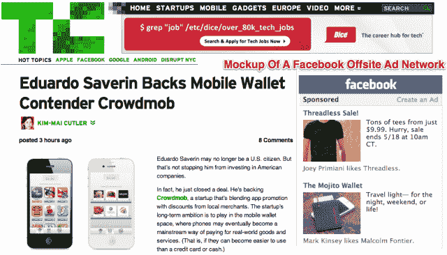

# 《脸书效应》作者 David Kirkpatrick 谈论脸书的广告网络潜力、未来收购目标 TechCrunch

> 原文：<https://web.archive.org/web/http://techcrunch.com/2012/05/23/the-facebook-effect-author-david-kirkpatrick-talks-facebooks-ad-network-potential-future-acquisition-targets/>

今天下午，在 TechCrunch Disrupt NY 2012 上，我们的 Josh Constine 与《脸书效应》的作者 David Kirkpatrick 坐在一起，讨论他们对新上市的社交网络的未来的看法。具体来说，两人重点讨论了脸书广告平台的潜力、其相对于现有公司和竞争对手的竞争优势，以及可能有助于其平台扩张的潜在收购目标。

##### 脸书上市后的战略是什么？

乔什首先问柯克帕特里克，他认为脸书今后应该做的最重要的事情是什么。大卫回应说，脸书不应该做任何不同的事情，甚至说这样做将是“他们可能犯下的最危险的错误”然而，就 IPO 可能如何影响公司的重点，特别是首席执行官马克·扎克伯格对产品的重点而言，扎克伯格现在必须“出售大量广告”这一事实。

柯克帕特里克说，作为一家上市公司，分析师将做出季度收益预测，扎克伯格将不得不浪费大量时间来考虑这个问题。无论扎克伯格喜欢与否，他现在都必须考虑钱的问题，柯克帕特里克哀叹道，这位首席执行官过去一直将这个角色献给[首席运营官·雪莉·桑德伯格](https://web.archive.org/web/20230209125057/http://www.crunchbase.com/person/sheryl-sandberg)。然而，乔希指出，这种转变可能不是一件坏事——扎克伯格还没有“将他的大脑袋应用到货币化上，”他指出。

##### 脸书的优步-精确的广告定位

然后两人开始分享他们对脸书广告平台的想法，乔希问柯克帕特里克认为脸书在广告中做了什么真正特别的事情。作者回应道，“创造一个可以如此准确定位广告的环境本身就是一种创新。”

他补充说，目前这也是一项有效的非网络化创新，他相信未来也会有很多创收机会。Kirkpatrick 说，他觉得即使像在你的新闻提要中放广告这样简单的事情也是一种创新。

##### 脸书如何变得身价超过 1000 亿美元

在讨论网络的新盈利流时，有一天可以与谷歌的 AdSense 竞争的场外广告网络的潜力是巨大的。Kirkpatrick 说，如今脸书广告平台上已经有 900 万商家和广告商。但乔希指出，高度针对性的广告——你会在脸书看到的那种——当它们出现在更广泛的互联网上时，可能会吓到人们。

Kirkpatrick 同意这一点，但他说大多数人，包括普通的脸书用户，似乎并不在乎。柯克帕特里克说，有一股“反目标思维”的潮流，特别是在欧洲，但它似乎主要存在于新闻界、政府和“有影响力的人”(他称之为“权威人士”)。“很多人不太了解脸书，也不太了解广告，”他在谈到这群人时，用一把相当大的画笔描绘他们。Kirkpatrick 还说，不仅普通脸书用户不关心广告，在脸书一些最大的市场，这根本不是一个问题。例如，脸书第四大国家印尼对脸书的广告没有意见。

##### 脸书应该买谁

最后，关于脸书下一步应该收购哪些公司，两人都认为进入实物支付对公司来说是有意义的。

至于最近对 Instagram 和 Karma 的收购，柯克帕特里克称之为“出乎意料和令人惊讶”，称它们确实与应用程序相关，他认为这很奇怪。“对脸书来说，真正重要的是成为一个平台，”他说。他认为最大的投资将是“增强他们的平台能力，而不是他们的应用程序能力。”但他总结说，有些东西，比如照片，对这个平台来说可能太重要了，以至于他们觉得需要在上面花 10 亿美元。

“Tumblr 是脸书值得考虑的一家有趣的公司，”柯克帕特里克说。他还认为脸书现在忍不住对 Pinterest 着迷，但乔希强烈反对。相反，乔希选择了像 Venmo 这样的点对点支付公司，以及一种异地广告网络技术，这种技术将使脸书能够从其围墙花园之外的网站收集数据，让脸书向没有登录的访问者提供相关广告。