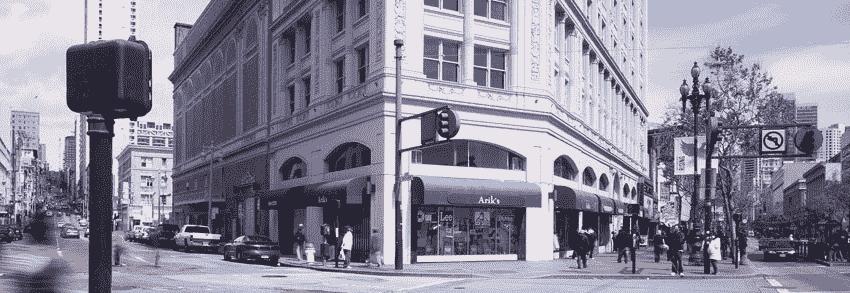

# 旧金山基准| TechCrunch

> 原文：<https://web.archive.org/web/https://techcrunch.com/2012/05/25/benchmark-in-san-francisco/>

***编者按** : [彼得·芬顿](https://web.archive.org/web/20230327090500/http://www.crunchbase.com/person/peter-fenton)自 2006 年起成为[基准资本](https://web.archive.org/web/20230327090500/http://www.benchmark.com/)的普通合伙人，并在 [DotCloud](https://web.archive.org/web/20230327090500/https://www.dotcloud.com/) 、 [EngineYard](https://web.archive.org/web/20230327090500/http://www.engineyard.com/) 、 [HortonWorks](https://web.archive.org/web/20230327090500/http://hortonworks.com/) 、 [Lithium](https://web.archive.org/web/20230327090500/http://www.lithium.com/) 、 [Minted](https://web.archive.org/web/20230327090500/http://www.minted.com/) 、[New relief](https://web.archive.org/web/20230327090500/http://newrelic.com/)、 [Pentaho](https://web.archive.org/web/20230327090500/http://www.pentaho.com/) 、[polyvor 董事会任职](https://web.archive.org/web/20230327090500/http://www.polyvore.com/)*

今天，Benchmark Capital 与市长 Ed Lee 共同宣布了我们对三藩市的长期承诺，在田德隆区中心的沃菲尔德剧院顶楼开设了一个新办公室。

我们打算在门洛帕克的 Sand Hill Road 上创建一个与我们现有的办公室相对应的办公室，以符合这座城市新的创业精神。

**跟踪客户**

我们搬到城市说明了这种创业格局的变化。自 2009 年以来，我们新投资的三分之二都在旧金山。我们的合作伙伴目前在旧金山的 20 多个董事会任职，包括 Twitter、Yelp、Instagram、优步、NewRelic、Zendesk、Dotcloud、Asana、OpenTable、DemandForce、NextDoor、ServiceSource、Lithium、Marin Software、1Life、Second Life、Coverity、EngineYard、Couchsurfing、Grockit 和 Pipewise。

Benchmark 与渴望改变世界的企业家并肩工作的模式要求我们贴近我们的客户，即企业家。我们的方法要求我们能够全天候为我们的企业家服务。在过去的十年里，这种承诺越来越意味着在城市里。我们的重心不再局限于斯坦福周围 5 英里的半径，现在基本上包括芳草地花园周围 3 英里的半径。

**什么变了？**

那么，过去十年发生了什么变化？我们看到了推动旧金山崛起的几个主要因素。

*1。交互设计的首要地位*

企业家经营的新数字环境不再由销售驱动的文化或部署和维护基础设施的需求所主导。相反，令人惊叹的产品，那些经常被购买而不是出售的产品，主宰了这个新的景观。这些产品的设计者越来越多地直接接触他们的用户。[我们已经讨论过](https://web.archive.org/web/20230327090500/http://onforb.es/Kqyn81)这种由产品和销售驱动的变化，它影响着我们投资的每个领域。设计向中心移动。我们相信设计师们选择了城市的都市生活，而不是其他地方的郊区生活。

*2。更深的人才库*

谷歌开创了公交服务，到 2007 年[其公司](https://web.archive.org/web/20230327090500/http://nyti.ms/ynAQyZ)的 25%被运送去上班。其他公司纷纷效仿。年轻的工程毕业生现在可以生活在城市环境中，在通勤途中完成工作，并在晚上和周末享受城市生活的乐趣。这扩大了旧金山优秀工程师的数量，其中许多人要么创办了自己的公司，要么加入了成长型创业公司。总部位于旧金山的新一波公司正在培养一代与城市生活有着真正联系的工程领袖。

*3。一种新的生产模式*

随着云的出现和分布式工作工具的激增，工程师可以在世界任何地方进行创新。编码变得更加社会化，更加城市化；毫不奇怪，该计划中的两家领先公司都位于旧金山(Atlassian 和 Github)。这种生产模式消除了对“立方体之湾”的需求，这是许多南湾工程团队的标准。

*4。美国的再城市化运动*

几年前,《纽约客》有一篇关于我国再城市化的精彩文章。经过几十年向郊区的迁移，美国工人开始意识到城市生活的好处，他们放弃了长途通勤和更大的房子，转而选择了在城市中养育家庭的活力和多样性。

*5。旧金山政府政策*

对于所有的积极因素，旧金山显然有一长串需要改进的地方。交通、犯罪、疫病、税法和教育，不一而足。进入罗恩·康韦。罗恩在 2000 年中期搬到了这座城市，并对将旧金山重新打造为创业之都产生了兴趣。他帮助确定并促成了对李爱德担任市长的大力支持，吸引了包括 Benchmark 在内的许多公司的支持。埃德带来了务实、前瞻性的观点——在这个因自私自利和任人唯亲而臭名昭著的城市，他以一种可爱、无私的方式行事。随着年初 [sfCITI](https://web.archive.org/web/20230327090500/http://sfciti.com/) (@ [sfciti](https://web.archive.org/web/20230327090500/https://twitter.com/#!/sfciti) 在 Twitter 上发布，[开始持续努力](https://web.archive.org/web/20230327090500/https://techcrunch.com/2012/01/13/ron-conway-mayor-lee-and-heather-harde-launch-sfciti-want-to-keep-sf-at-the-forefront-of-tech/)抓住机会，成为世界创新之都，Ron 的领导形成了组织形式。

**挑战&机遇**

尽管势头良好，但如果不发生重大变化，旧金山的崛起可能会很容易回落和瓦解。基于城市的创业公司面临的最大挑战之一是城市生活中潜在的干扰。我们发现，开放、连续的地板空间在物质上有助于实现集体使命感和更深层次的承诺，避免这种分心。不幸的是，索玛的许多办公室都很拥挤，与年轻公司的这些文化目标背道而驰。但是，如果你沿着市场街向西走，到田德隆区和市政中心区，会有很多奇妙的露天场地。然而，这是城市衰败的起点。

**沃菲尔德**

我们在沃菲尔德选址的灵感来自餐馆老板兼 OpenTable 董事会成员 Danny Meyer。丹尼教导我们，在开设新餐馆时，要在“那里”之前寻找位置，并在改造被遗弃或不受欢迎的城市地区时履行公民义务:

“我们喜欢做的一件事是在世界其他地方到来之前来到一个社区。我们在联合广场就是这么做的。我们在熨斗区的格拉梅西酒馆做到了这一点。我们来到巴特利公园市，这里真的缺少餐馆。”

所以，就像去年的 Twitter 一样，我们看到了一个进入艰难社区的机会，成为变革的一部分。Twitter 的新总部位于第 10 街/市场(80 英尺+地板)，沃菲尔德位于第 6 街/市场。

我们期待在沃菲尔德见到你。只是不要去左边的门或右边的门…

*【沃菲尔德图片经由 [AGI 首都](https://web.archive.org/web/20230327090500/http://sf.agicapital.com/projects/warfield/)。]*